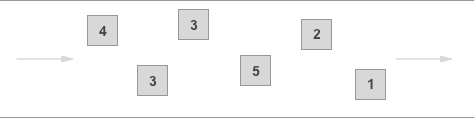
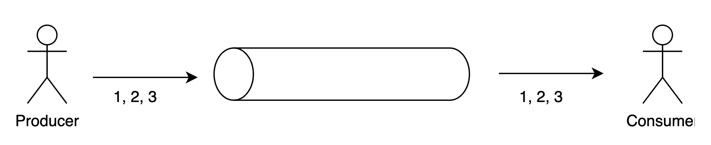
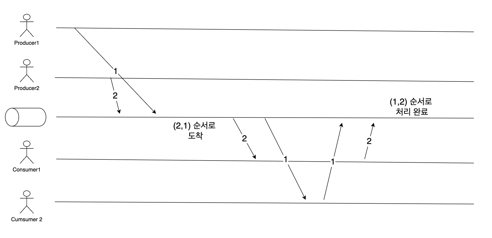
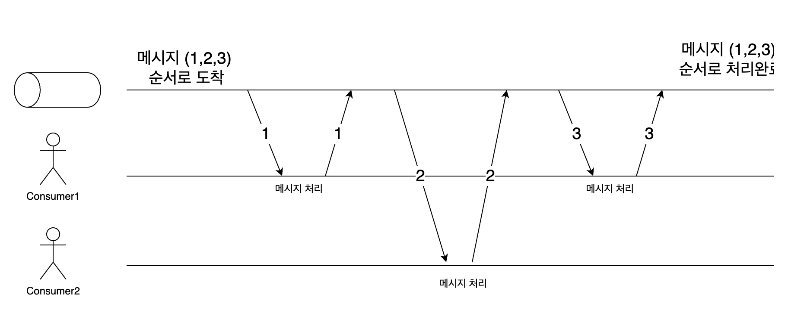
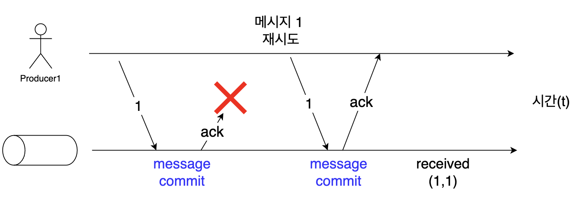
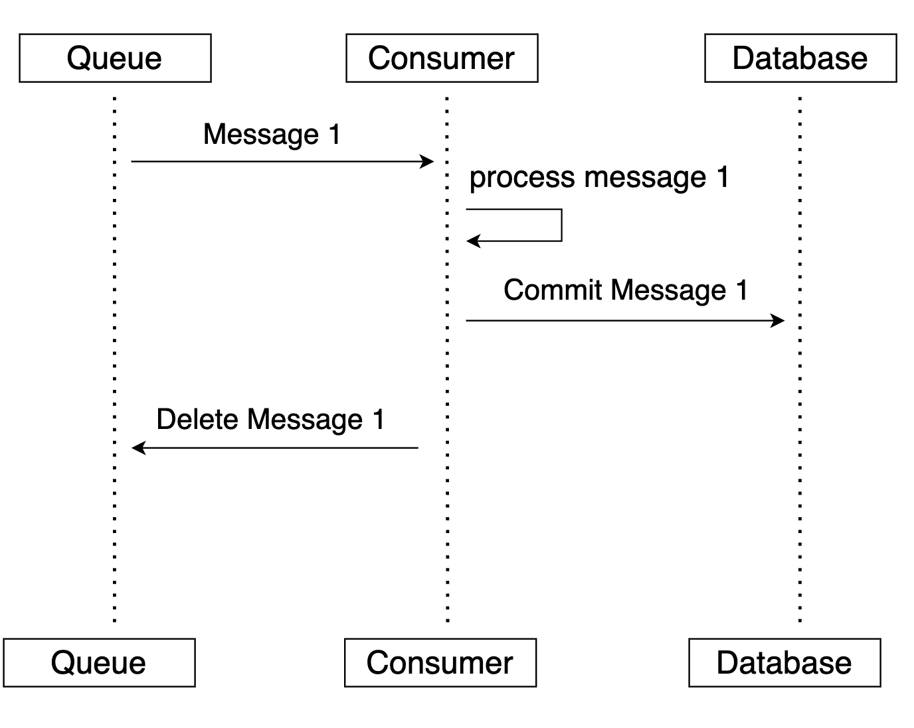
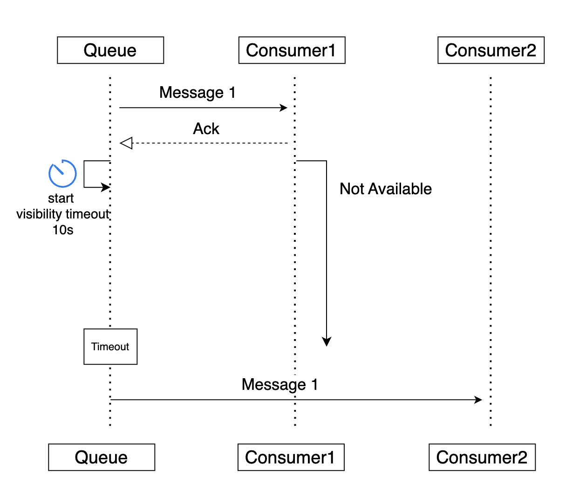
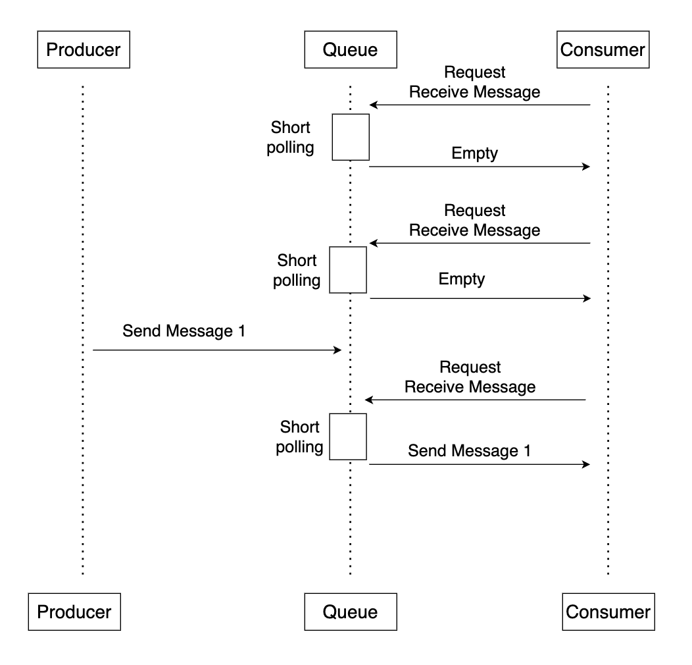
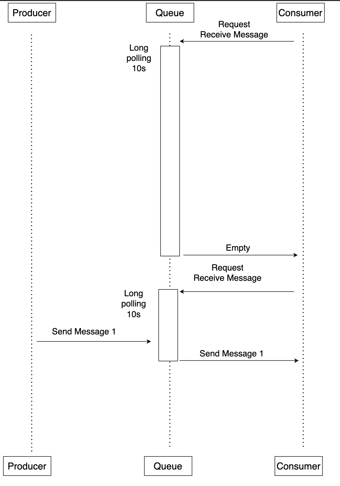

## 대기열 유형

### 표준 대기열(Standard)

- **무제한 처리량** : API 작업당 거의 무제한의 TPS를 지원
- **최소한 한 번 전달(At-least-once delivery)** : 메시가 최소한 한 번 전달되고, 가끔 2개 이상의 메시지 복사본이 전달될 수 있다.
- **순서 보장을 위해 최선의 노력** : 가끔 메시지가 전송된 순서와 다르게 전달될 수 있음.

<!-- more -->

### FIFO 대기열

- **높은 처리량**: 기본적으로 FIFO 대기열은 초당 최대 300개의 메시지(초당 300개의 전송, 수신 또는 삭제 작업)를 지원합니다. 작업당 최대 10개 메시지를 일괄 처리할 경우, FIFO 대기열은 초당 3000개의 메시지까지 지원할 수 있습니다.
- **정확히 한 번 처리(Exactly One Processing)** : 메시지가 한 번 전달되고 소비자가 이를 처리 및 삭제할 때까지 유지됩니다. 중복 메시지는 대기열에 올라가지 않습니다.
- **선입선출 전달**: 메시지가 전송되고 수신되는 순서가 엄격하게 지켜집니다.

---

## FIFO 큐란 무엇인가?
### 일반적인 Queue

- Queue에서 선입선출 방식으로 enqueue, dequeue할 수 있다.

### 멀티 스레드 환경에서의 문제점

- Producer와 Consumer가 다수(멀티스레드)인 환경에서는 FIFO(First In First Out)동작의 큐는 아무런 의미가 없다.
    - Producer → Queue 에서의 네트워크 지연 시간
    - Queue → Consumer 에서의 네트워크 지연 시간
    - Consumer 에서 실제 메시지를 처리하는 시간
- 클라이언트가 원하는것은 메시지를 (1,2,3) 을 보내면 (1,2,3) 순서대로 처리하고 싶은 것

### Producer → Queue 로의 순서보장

- Producer 에서 메시지를 전송할 때, Timestamp 를 찍어서 메시지를 전송한다.
- Queue 에서는 FIFO 큐가 아니라 Timestamp 기준의 우선순위 큐를 구성한다.

### Queue → Consumer 로의 순서보장

- 가장 단순한 방법은 큐에서 Serializable하게 동기식으로 컨슈머에게 메시지를 전달하고 처리한다.

- 하지만, 이 방식의 문제점은 컨슈머가 다수더라도 단일 스레드 환경처럼 동작하여 처리량이 낮다.

### SQS FIFO 큐에서 해결한 방식

- SQS에서는 MessageGroup 이라는 개념을 적용하여 메시지를 논리적으로 하나의 그룹으로 묶는다.
- 같은 그룹에 속하는 메시지는 앞에 메시지가 처리될 때까지 뒤에 들어온 메시지가 Blocking 되어 메시지 처리의 정확한 순서를 보장한다.
- 같은 그룹이 아닌 메시지는 Blocking 되지 않으며, Consumer에게 큐잉된다.
- 순서가 상관 없는 메시지는 서로 다른 그룹으로(A,B)로 지정한다.
- 순서가 상관있는 메시지들끼리는 같은 그룹으로 지정한다.

---

## 분산 시스템에서 메시지 동기화 문제

- 시나리오
    - Producer 가 Queue 메시지를 전송한다.
    - 큐는 수신된 메시지를 저장하고 확인응답(ack)를 Producer에게 응답한다.
    - 확인응답(ack)가 유실되어, Producer1는 메시지를 재전송한다.
    - 결과적으로 메시지 1이 중복되서 큐에 저장이 된다.
- Producer 에게 Ack 응답을 받으면 Message Commit하면 되지 않을까?
    - 1. Producer → Queue 메시지 1 전달
    - 2. Queue → Producer Ack 응답
    - 3. Producer → Queue Ack 응답
    - 4. Queue Message Commit
        - 여기서 장애가 나면?
            - Producer는 큐가 메시지를 정상적으로 받은 것으로 알고 있지만, 실제 Queue 에는 메시지가 정상적으로 저장되지 않았다. 즉 불일치가 발생한다.
            - 정확한 동기화를 위해서 무한대의 ack 가 필요하다.

---

## SQS가 메시지 처리를 하는 방법

- Consumer 가 메시지를 수신하고 처리완료 후 큐에게 DeleteMessage 호출해야만 큐에서 메시지를 완전히 제거한다.
- 하지만, 큐에 입장에서 Consumer가 메시지를 수신하고 정상적으로 처리해서 DeleteMessage를 호출한다는 보장이 없기 때문에, SQS는 메시지에 처리 시간 제한을 두었다.
- 이 시간 제한을 Visibility Timeout 이라고 하며, Consumer가 메시지를 수신 후 Visibility Timeout 시간 동안 Delete Message를 하지 않으면 자동으로 롤백된다.
    - Consumer 가 메시지를 정상적으로 수신하면, SQS는 메시지를 바로 삭제하는 것이 아니라, 또 다른 Consumer가 해당 메시지를 수신하지 못하도록 막는다.
    - Consumer 가 메시지를 수신하여, DeleteMessage 까지 한다면 큐에서 완전히 삭제한다.
    - Consumer 가 Visibility Timeout 동안 DeleteMessage 하지 못한다면 메시지를 다른 컨슈머가 수신받을 수 있도록 원복시킨다.

---

## At-least-once delivery

- Standard 대기열의 경우 최소한 한 번 전달(At-least-once delivery)를 지원한다.
- 분산 시스템에서 메시지 동기화 문제 에서도 보았듯이 네트워크 문제로 아래와 같은 경우에 메시지가 두 번 이상 중복 발행될 수 있다.
    - Producer 가 Queue로 메시지를 전송했지만, Producer가 Ack 응답을 받지 못하여 메시지 전송실패로 알고 재전송 하는 경우
        - → 큐에 중복된 메시지가 저장되므로 같은 메시지가 두번 발행될 수 있다.
    - Consumer 가 메시지를 처리하고 DeleteMessage 를 호출하였지만, **SQS 내부의 분산된 저장구조 특성 탓에 몇몇 메시지 복사본이 삭제되지 않고** Consumer에게 재전송되는 경우

## Exactly One Processing

- FIFO 대기열의 경우 정확히 한 번 처리(Exactly One Procession)을 지원한다.
- FIFO 대기열은 At-least-once delivery 에 엣지 케이스를 어떻게 해결했나?

### Producer 가 Queue로 메시지를 전송했지만, Producer가 Ack 응답을 받지 못하여 메시지 전송실패로 알고 재전송 하는 경우
- FIFO 대기열은 ContentBasedDeduplication 또는 MessageDeduplicationId 기반으로 메시지 중복 제거를 지원
- ContentBasedDeduplication 은 메시지 컨텐츠를 SHA-256 으로 해쉬
- MessageDeduplicationId 은 Producer 가 직접 지정하여 메시지를 전송한다.
- 둘 중 하나의 방식으로 FIFO 대기열은 전송 중복 제거를 구현한다. 중복된 메시지의 경우 큐에 저장하지 않는다.
- 중복값은 SQS에서 5분 동안 기억하고 있으며, 5분이 지나면 같은 메시지를 보낼 수 있다.

### Consumer 가 메시지를 처리하고 DeleteMessage 를 호출하였지만, SQS 내부의 분산된 저장구조 특성 탓에 몇몇 메시지 복사본이 삭제되지 않고 Consumer에게 재전송되는 경우
- 정확한 방법에 대한 이야기는 없지만 해당 케이스는 표준 대기열에서만 발생하는 케이스라고 [공식 문서](https://docs.aws.amazon.com/AWSSimpleQueueService/latest/SQSDeveloperGuide/standard-queues.html)는 말한다.

---

## Polling

### Short Polling (짧은 폴링)

### Long Poliing (긴 폴링)

---

## FIFO 큐의 한계

- Producer의 부정확한 시계문제
- 메시지 중복 5분 시간 제한 문제
- Visibility Timeout 엣지 케이스

## 참고자료

- [SQS FIFO Queues: Message Ordering and Exactly-Once Processing Guaranteed? | Ably Blog: Data in Motion](https://ably.com/blog/sqs-fifo-queues-message-ordering-and-exactly-once-processing-guaranteed)
- [https://awstip.com/how-to-efficiently-scale-aws-sqs-to-process-millions-of-messages-concurrently-in-spring-cloud-aws-c2431ed9e828](https://awstip.com/how-to-efficiently-scale-aws-sqs-to-process-millions-of-messages-concurrently-in-spring-cloud-aws-c2431ed9e828)
- [Dissecting SQS FIFO Queues — Does Ordered and Exactly Once Messaging Really Exist?](https://sookocheff.com/post/messaging/dissecting-sqs-fifo-queues/) 
- [3 surprising facts about AWS SQS FIFO queues](https://tomgregory.com/3-surprising-facts-about-aws-sqs-fifo-queues/)
- [https://aws.amazon.com/ko/blogs/developer/how-the-amazon-sqs-fifo-api-works/](https://aws.amazon.com/ko/blogs/developer/how-the-amazon-sqs-fifo-api-works/)
- [What is Amazon Simple Queue Service? - Amazon Simple Queue Service](https://docs.aws.amazon.com/AWSSimpleQueueService/latest/SQSDeveloperGuide/welcome.html)