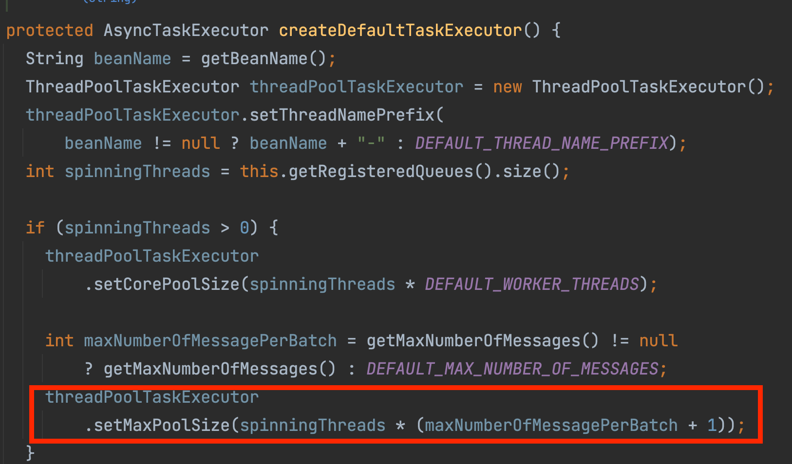
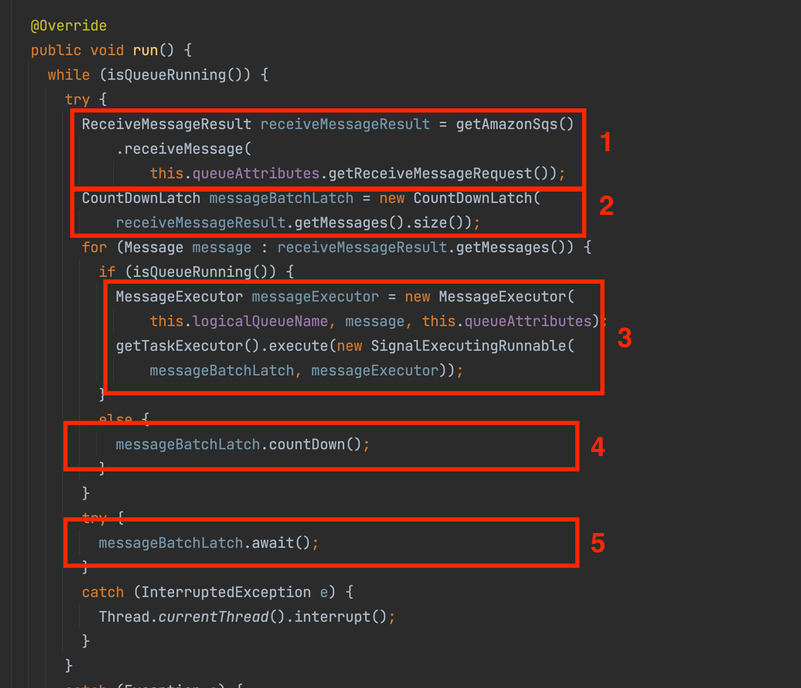
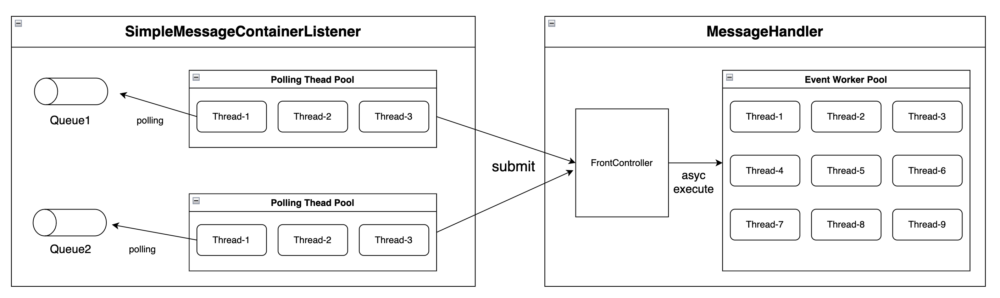
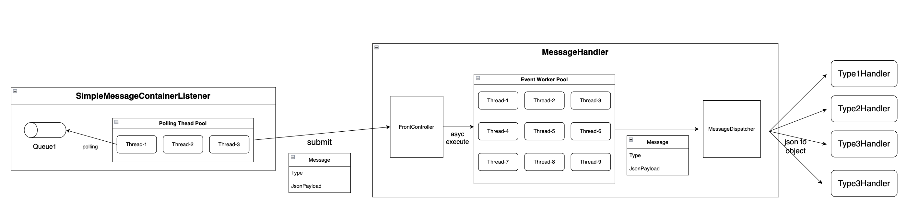
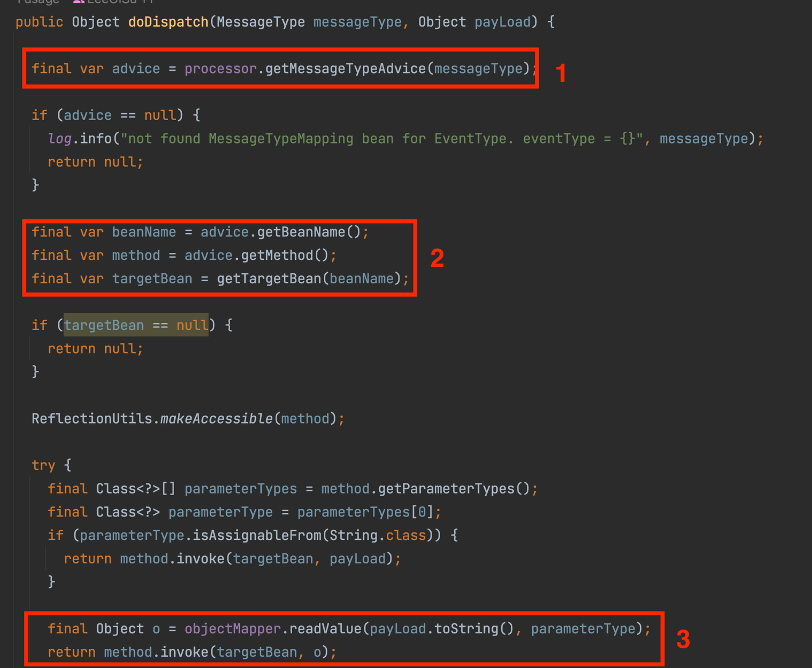
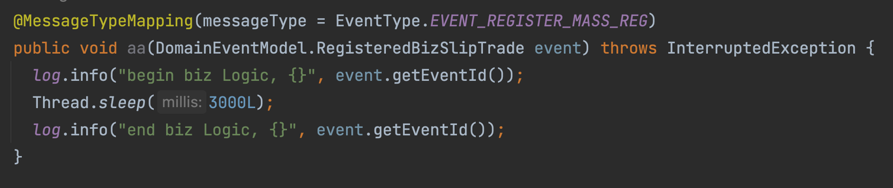

# **1. 개요**

- 일반적으로 Spring 환경에서 Amazon SQS 라이브러리로 `spring-cloud-aws-messaging` 모듈을 사용합니다.
- `spring-cloud-aws-messaging` 을 분석하고, 단점을 보완한 모듈을 설계하는 것을 목표로 합니다.

<!-- more -->
# **2. Spring Cloud AWS Messaging 모듈**

- `spring-cloud-aws-messaging` 모듈을 사용하면 `Amazon SQS SDK`를 추상화한 API를 사용해 쉽게 `Producer`와 `Consumer`를 구현할 수 있습니다.
- 아래와 같이 간단한 설정만으로 Consumer의 경우 Polling Thread Pool을 자동으로 만들어주고, `@SqsListener` 어노테이션을 통해 특정 큐를 구독하여 메시지를 처리할 수 있습니다.

```groovy
# build.gradle
dependencies {
    implementation 'org.springframework.cloud:spring-cloud-aws-autoconfigure:2.2.1.RELEASE'
    implementation 'org.springframework.cloud:spring-cloud-aws-messaging:2.2.1.RELEASE'
}
```

```java
@Configuration
@RequiredArgsConstructor
public class SqsConfig {

	private final AWSCredentialsProvider awsCredentialsProvider;

	@Value("${cloud.aws.region.static}")
	private String region;

	@Bean
	@Primary
	public AmazonSQSAsync amazonSQSAsync() {
		return AmazonSQSAsyncClientBuilder.standard().withCredentials(awsCredentialsProvider)
				.withRegion(region)
				.build();
	}

}
```

```java
/**
* Consumer 설정 클래스
*/
@Configration
@RequiredArgsConstructor
public class SqsConsumeConfig {

	private final AmazonSQSAsync amazonSQSAsync;

    /**
    *  Consumer 에서 SQS Queue로 폴링하는 컨테이너를 설정합니다.
    **/
	@Bean
	public SimpleMessageListenerContainerFactory simpleMessageListenerContainerFactory() {
		final SimpleMessageListenerContainerFactory factory = new SimpleMessageListenerContainerFactory();
		factory.setAmazonSqs(amazonSQSAsync);
        factory.setMaxNumberOfMessages(10);
        factory.setWaitTimeOut(10);
        factory.setBackOffTime(Long.valueOf(60000));
		return factory;
	}

}
```

SQS 큐를 Polling 하는 핵심 매커니즘을 `SimpleMessageListenerContainer`를 정의할 수 있습니다.

- **WaitTimeOut** :- 현재 대기열에 메시지가 없는 경우 폴링 요청이 새 메시지가 도착할 때까지 기다리는 대기 시간 제한을 구성합니다. 값이 높을수록 시스템에 대한 폴링 요청이 크게 줄어듭니다.
- **MaxNumberOfMessage :** Amazon SQS 시스템에 대한 한 번의 폴링 중에 검색해야 하는 최대 메시지 수를 구성합니다. 최대 메시지 수(1–10)
- **BackOffTime:-** 폴링 스레드가 오류 발생 시 복구를 시도하기 전에 대기해야 하는 밀리초 수입니다. 이렇게 하면 작업자가 용량을 초과하는 요청에 압도당하는 것을 방지할 수 있습니다.

```java

@Component
public class SqsMessageListener {

    /**
    * 폴링 스레드에서 핸들링한 메시지가 @SqsListener 로 넘어옵니다.
    **/
	@SqsListener(value = "QueueName", deletionPolicy = SqsMessageDeletionPolicy.NEVER)
	public void handle(@Payload ApplicationEventMessage message, MessageHeaders messageHeaders, Acknowledgment acknowledgment) {
        log.info(" received Message from SQS queue");
	}

}

```

```java
/**
* Producer 설정 클래스
*/
@Configuration
@RequiredArgsConstructor
public class SqsPublishConfig {

	private final AmazonSQSAsync amazonSQSAsync;
	private final ObjectMapper objectMapper;

	@Bean
	public QueueMessagingTemplate queueMessagingTemplate() {
		return new QueueMessagingTemplate(amazonSQSAsync);
	}

	@Bean
	public StringHttpMessageConverter stringHttpMessageConverter() {
		return new StringHttpMessageConverter(StandardCharsets.UTF_8);
	}
}

```

```java
@Service
public class FooService {

  private final QueueMessagingTemplate queueMessagingTemplate;

  public void publih(String message){
    queueMessageTemplate("queueName", message);
  }

}
```

## **1. SimpleMessageListenerContainer**

- `spring-cloud-aws-messaging` 모듈을 사용하면 `SimpleMessageListenerContainer` 라는 클래스가 SQS 큐에서 메시지를 폴링하여 `@SqsHandler` 에게 넘깁니다.
- `SimpleMessageListenerContainer` 는 Polling 을 위한 스레드풀을 별도로 생성하여 동작합니다.
- Polling 스레드풀의 스레드 갯수는 아래 공식으로 결정됩니다.
    - **등록된 큐의 개수 * ( 폴링 시 한번에 받을 수 있는 최대 메시지 수 + 1)**
        - ex) 등록된 큐의 개수가 1개이고, 폴링 시 한번에 받을 수 있는 최대 메시지 수가 10개이면 `1 * (10 + 1) = 11개`의 폴링 스레드가 생성됩니다.



## **2. SimpleMessageListenerContainer 의 문제**



- `SimpleMessageListnerContainer` 가 동작되는 방식은 아래 코드를 보면 알 수 있습니다.
- 1번 : `AmazonSQS Client`를 통해 큐로 `Polling Request`를 전송하여 메시지를 응답 받습니다.
- 2번 : 응답받은 메시지 수 만큼 `CountDownLatch` 객체를 생성합니다.
- 3번 : 응답받은 각 메시지를 For문으로 돌면서 할당받은 스레드풀에 작업을 등록합니다.
    - 스레드풀에 전달하는 `SignalExecutingRunnable`객체는 각 메시지가 처리되면 `CountDownLatch` 값을 Down 시킵니다.
- 5번 : `CountDownLatch` 가 0이 될때 까지 대기합니다.

### 낮은 처리량 문제

`SimpleMessageContainerListener` 의 구현에서의 문제점은 최대 10개 메시지를 수신하여 처리할 수 있고, 이 메시지 모두가 처리되면 다음 `Poilling` 을 시작합니다.  대부분의 스레드가 DB Blocking I/O 작업으로 인해 비효율적인 CPU 사용을 초래할 수 있고, 10개 메시지 중에 처리가 오래걸리는 메시지가 존재한다면 그 메시지가 처리될 때까지 다른  모든 스레드가 대기하게 되므로 Consumer의 처리량이 낮아지게 됩니다.

### 단일 Payload Handling

```java

	@SqsListener(value = "async_ff.fifo", deletionPolicy = SqsMessageDeletionPolicy.NEVER)
	public void handle1(@Payload ApplicationEventMessage message){
		log.info("receieved Message {} " , message);
	}

	@SqsListener(value = "async_ff.fifo", deletionPolicy = SqsMessageDeletionPolicy.NEVER)
	public void handle2(@Payload Message message, MessageHeaders messageHeaders, Acknowledgment acknowledgment) throws InterruptedException {
		log.info("receieved Message {} " , message);
	}

```

- `async_ff.fifo` 큐에 대해서 `@SqsListener`로 메시지를 구독합니다.
- 첫번쨰 핸들러의 페이로드 타입은 `ApplicationEventMessage` 이고, 두번째 핸들러 페이로드 타입은 `Message`입니다.
- 위 코드를 돌려보면 아래와 같이 async_ff_fifo 큐에 중복된 핸들러로 맵핑할 수 없는 예외가 발생합니다.

```
Ambiguous handler methods mapped for destination 'async_ff.fifo': {public void com.example.awssqspilot.springboot.listener.SqsMessageListener.handle1(com.example.awssqspilot.domain.model.ApplicationEventMessage,org.springframework.messaging.MessageHeaders,org.springframework.cloud.aws.messaging.listener.Acknowledgment) throws java.lang.InterruptedException, public void com.example.awssqspilot.springboot.listener.SqsMessageListener.handle2(org.springframework.messaging.Message,org.springframework.messaging.MessageHeaders,org.springframework.cloud.aws.messaging.listener.Acknowledgment) throws java.lang.InterruptedException}
```


# **3. Solution**

## **1. 처리량 극복**



- 폴링 스레드에서 메시지를 처리하는 것이 아니라 `MessageHandler`로 메시지 처리를 위임합니다.
- 폴링 스레드는 `MessageHandler` 에 작업만 전달하고 결과를 기다리지 않고, SQS Queue 로 다음 폴링 요청만 받습니다.
- MessageHandler는 `EventWorkThreadPool`을 구성하고, 비동기처리로 CPU burst time 을 높입니다.

## **2. 단일 페이로드 극복**



# **4. Implementation**

## **1. EventWorkPool 설정**

```java
@Bean(name = "eventWorkerPool")
public ThreadPoolTaskExecutor eventWorkerPool() {
	ThreadPoolTaskExecutor executor = new ThreadPoolTaskExecutor();
	executor.setMaxPoolSize(100);  // 스레드풀 개수를 설정합니다.
	executor.setQueueCapacity(0);  // 스레드풀 대기큐에 과도한 요청이 들어오는걸 방지하기 위해 대기큐 사이즈를 0으로 설정합니다.
	return executor;
}
```

## **2. SqsMessageHandler 구현**

```java
public class SqsMessageHandler {

	private final AsyncTaskExecutor eventWorkerPool;
	private final MessageTypeDispatcher messageTypeDispatcher;
	private static final Long backOffTime = 5000L;

	public void handle(
			final SqsMessage message,
			final MessageHeaders messageHeaders,
			final Acknowledgment acknowledgment
	) {
		try {

			eventWorkerPool.submit(() -> {

				try {
					final Object result = messageTypeDispatcher.doDispatch(getMessageType(messageHeaders), message.getPayload());

				} catch (Exception e) {

					log.error("EventWorkerPool Exception occurred", e);

					try {
						// noinspection BusyWait
						Thread.sleep(backOffTime);
					} catch (InterruptedException ie) {
						Thread.currentThread().interrupt();
					}

					throw new RuntimeException(e);
				}

			});

		} catch (RejectedExecutionException e) {
			log.error("eventThreadPool Queue is full. {}", e.getMessage());
			throw e;
		}

	}

	private MessageType getMessageType(final MessageHeaders messageHeaders) {
		return new MessageType(messageHeaders.get(SqsMessageHeaders.SQS_EVENT_TYPE).toString());
	}

}
```

## **3. MessageDispatcher 구현**



- JAVA Reflection 과 Spring Component 스캔을 이용해서 `dynamic dispatch`로 구현
1. `processor` 객체로 `messageType` 에 해당하는 `advice` 객체를 `get` 합니다.
2. 반환받은 advice 객체 정보를 이용해서 `target bean` 과 `method`를 가져옵니다.
3. `target method` 파라미터 타입에 맞게 ObjectMapper로 `json -> Object` 로 맵핑 후, `target method` 를 실행합니다.

## 4. 사용

