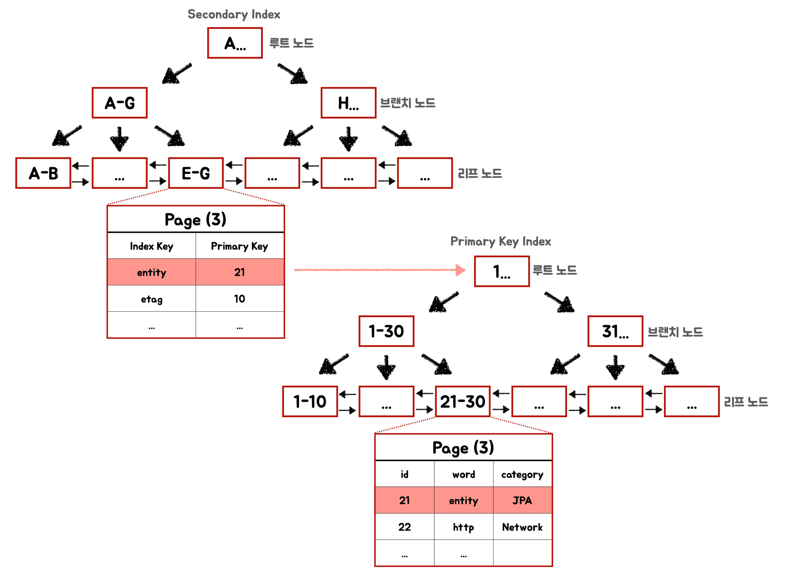
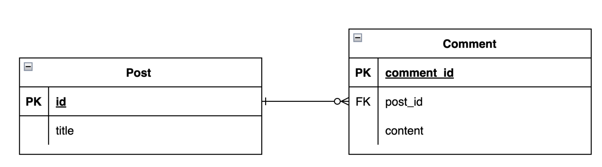
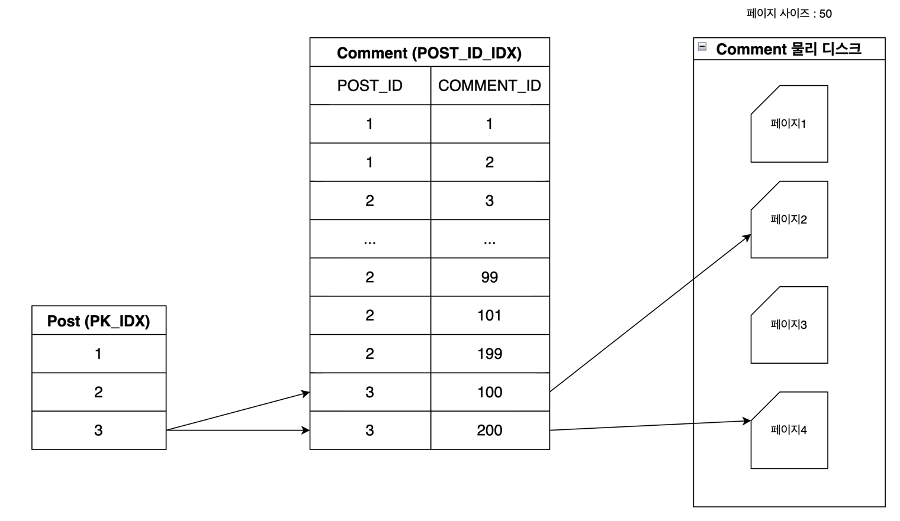
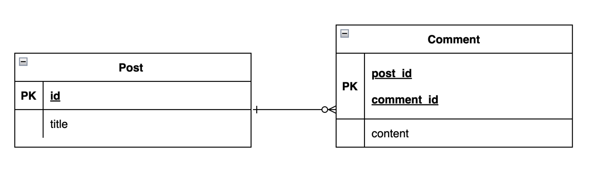
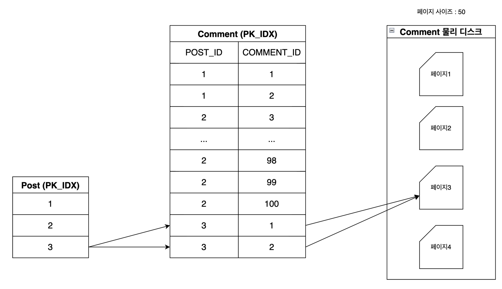

## Primary Key 설계의 중요성

InnoDB 기준으로 MySQL은 Primary Key를 기준으로 데이터를 클러스터링한다. 
클러스터링이라는 용어는 인접한 키 값이 있는 레코드가 물리적으로도 인접하게 저장된다는 것을 말한다.
즉, 논리적인 PK 값에 의해 레코드의 물리적인 위치가 결정된다.
PK값이 변경된다면 해당 레코드의 물리적인 위치도 변경된다는 얘기다.   

모든 데이터베이스가 마찬가지겠지만 MySQL의 PK 설계는 다른 데이터베이스보다 더 중요하다고 볼 수 있다.
왜냐하면, 일부 데이터베이스에서는 클러스터링할 인덱스를 선택할 수 있지만 MySQL은 기본키로 고정되어 변경할 수 없다. (MySQL 8.x 기준)   
또한, MySQL은 Secondary Index의 Leaf Node에 오라클과 같이 물리적 위치에 대한 참조(ROWID)가 아닌 PK 값을 저장하고, PK 인덱스를 통해 실제 디스크 블록에 접근한다. 따라서, MySQL에서 PK 는 단순히 데이터를 식별하기 위한 식별자 역할뿐만 아니라 내부 구현에도 관여하기 때문에 그 중요성은 매우 크다고 볼 수 있다.


## 클러스터형 인덱스

고성능을 위한 Primary Key 를 설계하기 위해서는 Primary Key 의 저장 구조인 클러스터형 인덱스에 대한 이해가 필요하다.
아래의 그림은 Secondary Index **(Non-Clusted Index)** 와 Primary Key Index **(Clusted Index)** 의 저장 구조를 나타낸다.   

Secondary Index **(Non-Clusted Index)** 그림의 리프 노드를 보면 Index Key 값에 해당 하는 Primary Key 값을 저장하고 있는 것을 볼 수 있다.
Index Key 값은 정렬되어 있지만 Index Key 값에 맵핑되는 Primary Key들 사이에는 아무런 순서관계가 없다.

Primary Key Index **(Clusted Index)** 그림의 리프 노드는 Index Key 값 기준으로 정렬되어 있고,
참조가 아닌 실제 레코드를 저장하는 페이지가 리프노드에 위치해 있다. 페이지 내에서도 Primary Index Key 값 기준으로 레코드가 물리적으로 정렬되어 있다.

<!-- more -->


Clusted Index는 구조적인 이유로 순차적인 Key 값을 넣을 때, 오버헤드가 가정 적고 가장 빠르다. 단순히 Index 트리 오른쪽 맨끝에 새로운 레코드를 삽입해주기만 하면 된다.    
반면에 비순차적인 Key 값이 들어오게 되면 상황이 복잡해진다. Key 값이 기존 데이터 중간에 삽입될 수 있으므로 트리 구조를 변경사항에 맞게 갱신해야 한다.   
또한, 리프 노드의 페이지 안에 있는 데이터의 순서도 조정이 필요하다. 기존 데이터 사이에 새 레코드의 적절한 위치를 찾고 공간을 확보해야 한다. 이로 인해 많은 데이터의 이동이 필요할 수 있고 페이지 분할로 단편화 문제가 발생할 수 있다.

따라서 INSERT 속도가 중요한 테이블이라면 순차적인 값을 Primary Key로 선정하는 것이 유리하다.


## Primary Key 유형
### 자동 증가 (Auto Increment) Primary Key
**장점**
- Primary Key 채번을 DB에 위임하므로 관리 포인트가 줄어든다.

**단점**
- 테이블의 대량 INSERT 작업 시, Auto Increament 에서 병목현상이 발생할 수 있다.


### UID
클러스터형 인덱스 구조를 이해하면, UUID와 같은 랜덤 값이 Primary Key로 선정될 경우, 레코드 클러스터링에 필요한 오버헤드만 발생하고 크게 이점이 없음을 알 수 있다. 
그러나 랜덤 UID가 아닌 순차적인 UID를 생성하면 Auto Increment의 병목현상과 클러스터링 오버헤드를 모두 피할 수 있다.
순차적인 UID는 (현재시각 + 일련번호) 또는 (epoch time + 일련번호)와 같은 조합으로 순서를 유지하는 UID를 만들 수 있다.

**장점 (Sequential UID)**
- 대량 INSERT 작업을 매우 빠르게 처리할 수 있다.

**단점 (Sequential UID)**
- 클라이언트에서 순차적인 UID를 만들기 위해 관리가 필요하다.


### Composite key
논리 모델링과 물리 모델링의 격차가 적고, 사람이 이해하기 쉽다. 중복키 값이 들어올 수 있으므로 동시성 관리가 필요하다.

**장점**
- 공간적 지역성(Spatial Locality) 를 활용할 수 있다.

**단점**
- 클라이언트에서 채번에 대한 동시성 관리가 필요하다.


## 대리키와 복합키 비교
Auto increament 와 UID 를 이용한 기본키 유형은 대리키로 일반화할 수 있다. Primary Key를 대리키로 구성한 방식과 복합키로 구성한 방식의 차이점을 비교해본다.


### 부모테이블의 기본키를 자식 테이블의 기본키로 쓰지 않고, 외래키로 사용하는 경우 (비식별관계)



Post, Comment 테이블 둘 다 Auto Increament 기본키를 사용하고, Comment 테이블에 post_id FK 를 두어 Post와 연관관계를 맺는 방식이다.
Post 테이블이 Driving Table이고 Comment 테이블이 Driven Table 인 경우 두 테이블을 조인하게 되면 아래 그림와 같은 방식으로 데이터를 탐색하게 된다.



조인 연산을 수행하기 위해, Post 테이블의 기본키와 연결된 Comment 테이블의 Post_id 값으로 조인이 이루어진다. Comment 테이블의 post_id에는 이미 인덱스가 생성되어 있기 때문에, Index Range Scan을 사용하여 Post 테이블과 Comment 테이블을 맵핑할 수 있다.

그 다음 단계에서는 SELECT 결과를 가져오기 위해 Comment 테이블의 레코드를 검색한다. 이 과정에서 Comment 레코드의 탐색을 위해 Random I/O가 발생하게 된다. Comment 테이블의 POST_ID_IDX 인덱스는 POST_ID별로 정렬되어 있어 같은 POST_ID를 가지더라도 COMMENT_ID는 멀리 떨어져있는 값을 가질 수 있다.

예를 들어 위의 그림에서, Post 테이블에서 id=3인 레코드를 조회하면, Comment 테이블의 post_id와의 조인 결과로 Comment id (100, 200)이 반환된다. 페이지 당 50개 레코드가 저장된다고 가정하면 2개의 Comment 레코드를 가져오기 위해 총 2개의 페이지 읽기 작업이 필요하게 된다.


### 부모테이블의 기본키를 자식 테이블 기본키에 포함하는 경우 (식별관계)



두번째 예에서는 Comment가 POST의 ID를 자신의 기본키에 포함시킨 Composite Key로 PK를 구성한 예이다. 마찬가지로 아래는 Post 테이블이 Driving Table이고 Comment 테이블이 Driven Table 인 경우 두 테이블을 조인할 때, 데이터 탐색 방식이다.



첫번째 방식과 유사하게, 조인이 발생했을 때 Comment 레코드를 읽어오기 위해 페이지 3을 두 번 참조하게 되지만, 이 경우 페이지 3은 이미 캐싱되어 있으므로 두 번째 참조는 추가적인 I/O를 발생시키지 않는다.

두 방식에서 논리적 페이지 I/O는 2로 동일하지만, 물리적 페이지 I/O(캐시 적용 시)는 각각 2와 1로 다르다. 조인되는 데이터가 많아질수록 두 방식 사이의 물리적 I/O 차이는 더욱 커지게 된다.

이러한 결과는 두 번째 케이스에서 식별관계를 사용해 기본키를 복합키로 구성했기 때문에 발생한다. POST_ID를 기준으로 조인을 수행할 때, 공간적 지역성(Spatial Locality)의 원리가 적용되었다고 볼 수 있다. 특정 Post에 속한 Comment 집합은 같은 논리적 영역에 속하는 인스턴스라고 볼 수 있다. POST_ID와 COMMENT_ID로 클러스터링하면, 물리적으로도 POST_ID에 속한 COMMENT 집합이 유사한 영역에 위치하게 되므로 캐싱 확률이 높아지게 된다.

실제로 같은 페이지 번호에 저장되어 있는 레코드를 탐색하기 위해서 몇번의 I/O가 발생했는지 확인하기 위해서는 MySQL에서 제공하는 상태 변수 중 Innodb_buffer_pool_reads 값을 확인하여 물리적 I/O 발생량을 확인할 수 있다. 해당 상태변수는 버퍼풀에서 읽지못하고 디스크에서 직접 읽은 수를 의미하는 변수이다.


#### 데이터를 읽기 전에 Innodb_buffer_pool_reads 값
```shell
mysql> SHOW SESSION STATUS LIKE 'Innodb_buffer_pool_reads%';
+--------------------------+-------+
| Variable_name            | Value |
+--------------------------+-------+
| Innodb_buffer_pool_reads | 1652  |
+--------------------------+-------+
1 row in set (0.03 sec)
```


#### 멀리 떨어진 두 개의 Record를 두 건 읽는 경우 (레코드의 페이지가 다른 경우)
```shell
mysql> select *
-> from `MARKETBOM2_SCHM`.BIZ_SLIP_TRADE
-> where BIZ_SLIP_TRADE.TRADE_SLIP_NO in (2000,3000);

SHOW SESSION STATUS LIKE 'Innodb_buffer_pool_reads%';
+--------------------------+-------+
| Variable_name            | Value |
+--------------------------+-------+
| Innodb_buffer_pool_reads | 1654  |
+--------------------------+-------+
1 row in set (0.04 sec)
```
PK가 2000, 3000 인 레코드 두 건을 읽었을 떄 Innodb_buffer_pool_reads 변수가 1652 → 1654 로 증가된 것을 확인할 수 있다. 2번의 Disk I/O가 발생하였다.


#### 클러스터링으로 인접한 Record를 두 건 읽는 경우 (레코드 페이지가 같은 경우)

```shell
mysql> select *
-> from `MARKETBOM2_SCHM`.BIZ_SLIP_TRADE
-> where BIZ_SLIP_TRADE.TRADE_SLIP_NO in (5000,5001);

mysql> SHOW SESSION STATUS LIKE 'Innodb_buffer_pool_reads%';
+--------------------------+-------+
| Variable_name            | Value |
+--------------------------+-------+
| Innodb_buffer_pool_reads | 1655  |
+--------------------------+-------+
1 row in set (0.01 sec)
```

PK가 5000, 5001 인 레코드를 두 건 읽었을 때 Innodb_buffer_pool_read 변수가 1654 → 1655 로 증가된 것을 확인할 수 있다. 아까와 같이 레코드를 두 건 읽었지만 실제 Disk I/O 발생량은 1번인 것을 확인할 수 있다.


## 정리
MySQL의 고성능 Primary Key 설계를 위해서는 클러스터링 인덱스의 특성을 이해하고 테이블의 주 용도 및 액세스 패턴을 정확히 파악해야 한다.

쓰기 중심의 작업에서는 순차적 ID를 사용하여 성능을 최적화할 수 있다. 이는 쓰기 작업 시 디스크 I/O를 효율적으로 하기 위함이다.

읽기 중심의 작업에서는 Random I/O가 주로 발생한다면 대리키를, Join 많이 걸리거나 업무적으로 연관된 데이터 중심으로 조회가 많이 되는 경우라면 물리적으로 인접할 수 있도록 업무적인 복합키를 구성하는게 유리할 것 이다.

실제 업무 시스템에서는 중요한 테이블(예: 이커머스의 주문 테이블)에 대해서는 쓰기와 읽기 작업 모두 빈번하게 발생한다. 이런 상황에서는 쓰기와 읽기 간의 트레이드 오프를 고려하여 결정해야한다. 대다수의 시스템에서 쓰기 대비 읽기의 비율이 8:2 또는 9:1로 나타나기 때문에, 읽기 작업에 최적화된 설계를 택하는 것이 대체로 유리할 것 이다.

중요한것은 MySQL의 클러스터 인덱스와 세컨더리 인덱스 구조를 이해하고, 그 이해를 바탕으로 시스템 요구 사항에 가장 적합한  Primary Key를 선택할 수 있어야 한다.