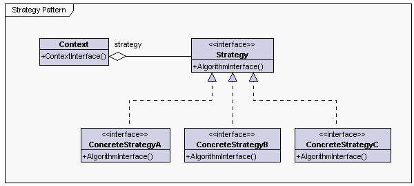
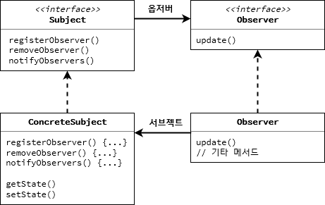

## 디자인 패턴- 행동 패턴

- 어떤 처리의 책임을 어느 객체에 할당하는 것이 좋은지, 알고리즘은 어느 객체에 정의하는 것이 좋은지 다룹니다.
- 객체들 간의 교류 방법에 대하여 정의한다.
- **행동 클래스 패턴** 은 클래스 사이에 행동 책임을 분산하기 위해서 상속을 사용합니다.
- **행동 객체 패턴** 은 상속보다는 복합을 통해서 객체 사이에 행동처리의 책임을 분산합니다.


<!-- more -->

## 전략 패턴



- 전략 패턴(Strategy Pattern)은 알고리즘군을 정의하고 캡슐화해서 각각의 알고리즘군을 수정해서 쓸 수 있게 해준다.
- 전략 패턴을 사용하면 클라이언트로부터 알고리즘을 분리해서 독립적으로 변경할 수 있다.

### 디자인 원칙

- 애플리케이션에서 달라지는 부분을 찾아내고 달라지지 않는 부분과 분리한다.
    - 달라지는 부분을 찾아서 나머지 코드에 영향을 주지 않도록 캡슐화한다.
    - Context 달라지지 않는 부분, Strategy 달라지는 부분ㅔ
- 구현보다는 인터페이스 맞춰서 프로그래밍 한다.
    - Context의 행동은 인터페이스로 정의되어 구체적으로 구현하지 않는다.
- 상속보다는 구성을 활용한다.
    - 전략 패턴을 쓰지 않는다면 상속을 통해 서브 클래스에서 메서드를 오버라이딩 하여 행동을 바꿀 수 있다.
    - Super 클래스에 의존성이 발생하고 필요하지 않은 부분도 상속해야 되는 문제점이 있다.
    - 구성(Composition)을 활용하면 시스템의 유연성을 크게 향상시킬 수 있다.
    - 알고리즘군을 별도의 클래스 집합으로 캡슐화할 수 있으며 구성 요소로 사용하는 객체에서 올바른 행동 인터페이스를 구현하기만 하면 실행 시에 행동을 바꿀 수 있다.

## 옵저버 패턴

- 옵저버 패턴(Observer Pattern)은 한 객체의 상태가 바뀌면 그 객체에 의존하는 다른 객체에게 연락이 가고 자동으로 내용이 갱신되는 방식으로 일대다(One To Many) 의존성을 정의합니다.



- Publish-Subscribe 패턴과는 다르다. Publish-Subscribe 패턴은 구독자가 서로 다른 유형의 메시지에 관심을 가질 수 있고 출판사와 구독자가 더 세세하게 분리할 수 있는 복잡한 패턴이다.

### 느슨한 결합의 위력

- 느슨한 결합(Loose Coupling)은 객체들이 상호작용할 수는 있지만, 서로를 잘 모르는 관계를 의미한다.
- 주제(Subject)클래스는 옵저버가 특정 인터페이스(Observer 인터페이스)를 구현한다는 사실만 안다.
  - 옵저버의 구상 클래스가 무엇인지, 옵저버가 무엇을 하는지는 알 필요가 업삳.
- 옵저버는 언제든지 새로 추가할 수 있다.
  - 주제는 Observer 인터페이스에만 의존하므로 언제든지 새로운 옵저버를 추가할 수 있다.
- 새로운 형식의 옵저버를 추가할 때도 변경할 필요가 없다.
  - 옵저버의 구상 클래스가 새로 생기더라도 주제 클래스는 그것을 신경 쓸 필요가 없다. Observer 인터페이스만 구현한다면 어떤 객체와도 상호작용이 가능하다.
- 주제와 옵저버는 서로 독립적으로 재사용할 수 있다.
  - 둘이 서로 단단하게 결합되지 않기 때문이다.
- 주제나 업저버가 달라져도 서로에게 영향을 미치지 않는다.
  - 구현에 의존하지 않고 인터페이스 의존하기 때문이다.

<aside>
💡 디자인 원칙   
상호작용하는 객체 사이에는 가능하면 느슨한 결합을 사용한다.

</aside>

### 푸시 방식에서 풀 방식으로 바꾸기

- 주제가 옵저버에게 상태를 알리는 방식(푸시)는 Observer의 `update()` 메서드의 파라미터가 변경된다면 모든 구상 옵저버 클래스의 변경이 발생한다.
- 옵저버가 주제로부터 상태를 끌어오는 방식(풀)로 바꾼다면 옵저버가 필요한 데이터를 골라서 가져올 수 있고 쉽게 확장할 수 있다.

#### 주제에서 알림 보내기

- 옵저버의 update 메서드를 인자없이 호출하도록 주제 클래스의 `notifyObservers()` 메서드를 수정한다.

```java
public void nofifyObservers(){
	for (Observer observer : observers) {
		observer.update() // 파라미터 없이 호출
	}
}
```

#### 옵저버에서 알림 받기

- Observer 인터페이스에서 update() 메서드의 매개변수 제거

```java
public interface Observer {
	void update();
}
```

- Concreate Observer 클래스의 update 메서드를 주제의 데이터를 가져오도록 수정

```java
public void update(){
	this.temperature = weatherData.getTeperature();
	this.humidity = weaterData.getHumidity();
	display();
}
```

### 디자인 원칙

- 애플리케이션에서 달리지는 부분을 찾아내고 달라지지 않는 부븐과 분리한다.
  - 옵저버 패턴에서 변하는 것은 주제의 상태와 옵저버의 개수와 형식이다.
  - 주제를 바꾸지 않고도 주제의 상태에 의존하는 객체들을 바꿀 수 있음
- 구현보다는 인터페이스에 맞춰서 프로그래밍 한다.
  - 주제는 Subject 인터페이스로 Observer 인터페이스를 구현하는 객체들의 등록과 탈퇴를 관리하고 그런 객체들에게 상태를 알린다.
- 상속보다는 구성을 사용한다.
  - 주제와 옵저버 사이의 관계는 상속이 아니라 구성으로 이루어진다.