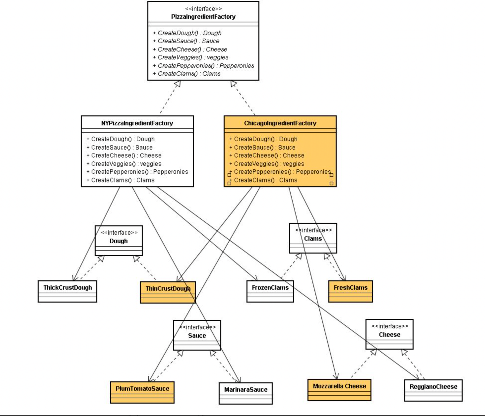

## 팩토리 패턴

### 구상 클래스의 인스턴스 생성 부분을 캡슐화하기

```java
Pizza orderPizza(String type){
	Pizza pizz;

	if(type.equlas("cheese"){
		pizza = new CheesePizza();
	} else if(type.equlas("greek"){
		pizza = new GreekPizza();
  } else 	if(type.equlas("veggie"){
		pizza = new VeggiePizza();
	}

	return pizza;
}
```

- 피자 인스턴스를 만드는 구상 클래스를 선택하는 부분이 상황이 변하면 코드를 변경해야 한다.

<!-- more -->

### 객체 생성 부분 캡슐화 하기

```java
public class SimplePizzaFactory {

	public Pizza createPizza(String type){
		if(type.equlas("cheese"){
			pizza = new CheesePizza();
		} else if(type.equlas("greek"){
			pizza = new GreekPizza();
	  } else 	if(type.equlas("veggie"){
			pizza = new VeggiePizza();
		}
	
		return pizza;
	}
}
```

- 피자 인스턴스 생성 부분을 SimplePizzaFactory로 넘겼을 때의 장점은?
  - 팩토리를 사용하지 않으면 피자 인스턴스를 생성하는 부분이 많아 생성하는 작업이 변경되었을 때 생성하는 모든 부분을 고쳐줘야 한다.

### 클라이언트 코드 수정

```java
public class PizzaStore {

	SimplePizzaFactory factory;

	// 생성자
  ...

	public Pizza orderPizza(String type){
		Pizza pizza;

		pizza = factory.createPizza(type);

		pizza.prepare();
		pizza.bake();
		pizza.cut();
		pizza.box();

		return pizza;
	}
}
```

### 팩토리 메서드 패턴

- 요구사항이 바뀌어 피자를 각 지점마다 그 지역의 특성과 입맛을 반영한 다양한 스타일의 피자를 만들어야 된다면?
- PizzaStore 클래스를 추상 클래스로 변경

```java
public abstract class PizzaStore {

	public Pizza orderPizza(String type){
		Pizza pizza;

		pizza = createPizza(type);

		pizza.prepare();
		pizza.bake();
		pizza.cut();
		pizza.box();

		return pizza;
	}

abstract Pizza createPizza(String type);

}
```

- 각 지점에 맞는 서브클래스를 생성(`NYPizzaStore`, `ChicagoPizzastore`, `CaliforniaPizzaStore`)

```java
public class NYPizzaSotre extends PizzaStore {
	
	public Pizza createPizza(String type){
		if(type.equlas("cheese"){
			pizza = new NYStyleCheesePizza();
		} else if(type.equlas("greek"){
			pizza = new NYStyleGreekPizza();
	  } else 	if(type.equlas("veggie"){
			pizza = new NYStyleVeggiePizza();
		}
	
		return pizza;
	}
}
```

### 팩토리 메서드 패턴의 정의

- 팩토리 메서드 패턴에서는 객체를 생성할 때 필요한 인터페이스를 만든다.
- 어떤 클래스의 인서턴스를 만들지는 서브클래스에서 결정한다.
- 팩토리 메서드 패턴을 사용하면 클래스 인스턴스 만드는 일을 서브 클래스에게 맡기게 된다.


- **Product - 생성될 객체의 인터페이스**
- **ConcreteProduct - Product 인터페이스를 구현한 구상 클래스.**
- **Creator - 객체를 생성하는 팩토리 메소드를 가진 인터페이스**
- **ConcreteCreator - Creator 인터페이스를 구현한 구상 클래스.**

### 의존성 역전 원칙

<aside>
💡 추상화된 것에 의존하게 만들고 구상 클래스에 의존하지 않게 만든다.

</aside>

- 고수준 구성 요소가 저수준 구성 요소에 의존하면 안되며, 항상 추상화에 의존하게 만들어야 한다.
  - 변수에 구상 클래스의 레퍼런스를 저장하지 않는다.
    - new 연산자는 구상 클래스를 사용하게 되므로 팩토리를 써서 방지
  - 구상 클래스에서 유도된 클래스를 만들지 맙시다.
    - 인터페이스나 추상 클래스처럼 추상화된 것으로부터 클래스를 만들어야 된다.
  - 베이스 클래스에 이미 구현되어 있는 메소드를 오버라이드하지 않는다.
    - 이미 구현되어 있는 메서드를 오버라이드 한다면 베이스 클래스가 제대로 추상화되지 않았다.
    - 베이스 클래스에서 메서드를 정의할 때는 모든 서브클래스에서 공유할 수 있는 것만 정의해야한다.


### 추상 팩토리 패턴의 정의

- 추상 팩토리 패턴은 구상 클래스에 의존하지 않고도 서로 연관되거나 의존적인 객체로 이루어진 제품군을 생산하는 인터페이스를 제공합니다. 구상 클래스는 서브 클래스에서 만듭니다.



### 팩토리 메서드 패턴과 추상 팩토리 패턴의 차이

- 팩터리 메서드 패턴은 하나의 메서드가 여러 객체를 생성한다
- 추상 팩토리 패턴은 팩터리 자체가 인터페이고 서브 클래스가 여러 객체를 생성한다.
- 팩터리 메서드 패턴은 클라이언트와 구상 클래스를 분리시켜야할 때 사용한다.
- 추상 팩터리 패턴은 하나의 제품군을 생성할 때 사용한다.
  - 뉴욕지점의 제품군(Dough, Sauce, Cheese, Vaggies 등)
  - 제품군을 합치는 부분은 클라이언트의 책임


## 싱글톤 패턴

- 싱글턴 패턴은 클래스 인스턴스를 하나만 만들고, 그 인스턴스로의 전역 접근을 제공

### 고전적인 구현 방식

```java
public class Singleton {
	private static Singleton instance;

	private Singleton() {}

	public static Singleton getInstance() {
		if(instance == null)
			instance = new Singleton();

		return instance;
	}
}
```

- 멀티스레드 환경에서 두 스레드가 동시에 getInstance를 호출할 때 인스턴스가 2개 만들어질 가능성이 있다.

### 동기화를 이용한 구현

```java
public class Singleton {
	private static Singleton instance;

	private Singleton() {}

	public static synchronized Singleton getInstance() {
		if(instance == null)
			instance = new Singleton();

		return instance;
	}
}
```

- synchronized 키워드를 추가하면 한 스레드가 메소드 사용을 끝내기 전까지 다른 스레드는 기다리게 된다.
- 하지만 synchronized 키워드를 사용하면 성능이 저하되고, 객체가 생성할 시점에만 동기화가 필요한데 자원을 낭비하게 된다.

### static initializer 를 이용한 구현

```java
public class Singleton {
	private static Singleton instance = new Singleton;

	private Singleton() {}

	public static Singleton getInstance() {
		return instance;
	}
}
```

- 클래스가 로딩될 때 JVM에서 Singleton이 하나뿐인 인서턴스를 생성해준다.
- 하지만 생성시점을 JVM에서 관리하기 때문에 lazy loading 처럼 생성시점을 컨트롤할 수가 없다.

### DCL을 이용한 구현

- DCL(Double-Checked Locking)을 사용하면 인스턴스가 생성되어 있는지 확인 한 다음 생성되어 있지 않을 때만 동기화할 수 있다.

```java
public class Singleton {
	private volaile static Singleton instance;

	private Singleton() {}

	public static Singleton getInstance() {
		if(instance == null){
				synchronized (Singleton.class) {
					if (instance == null) {
						instance = new Singleton();
					}
				}
		}
		return instance;
	}
}
```

### enum 을 사용한 구현

```java
public enum Singleton {
	UNIQUE_INSTACE;
}

public class SinlegonClient {
		public static void main(String[] args){
				Singleton singleton = Singleton.UNIQUE.INSTANCE;
		}
}
```