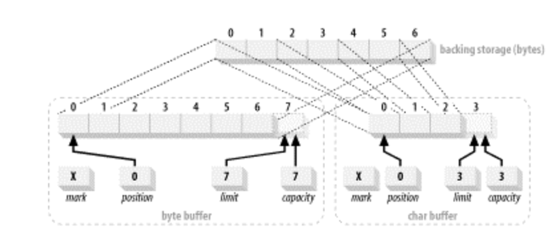

## 버퍼 I/O
운영체제의 I/O는 모두 버퍼를 통해 이루어진다. 프로세스는 버퍼에서 데이터를 채우는 (쓰기) 또는 버퍼에 데이터를 비우는 (읽기) 작업을 운영 체제에 요청함으로써 I/O를 수행한다.
모든 데이터는 이 메커니즘을 통해 프로세스 내부로 이동하거나 나간다.


위 그림에서 사용자 공간(user space)과 커널 공간(kernel space)의 개념에 주목하자.
사용자 공간은 일반 프로세스가 실행되는 곳이다. JVM도 사용자 공간에서 실행된다. 사용자 공간은 특권이 없어 하드웨어에 직접 접근할 수 없다.
커널 공간은 운영 체제가 위치하는 곳으로 특별한 권한을 가진다. 모든 I/O는 커널 공간을 통해 이루어진다.

프로세스가 I/O 작업을 요청하면 시스템 호출을 수행하여 커널로 제어권을 전달한다.
커널은 필요한 데이터를 찾아 사용자 공간의 지정된 버퍼로 전송한다.
커널은 데이터를 캐시하거나 미리 가져오려고 시도하기 때문에 프로세스가 요청하는 데이터는 이미 커널 공간에 있을 수 있다.

기존 java.io 라이브러리와 NIO 간의 가장 중요한 차이점은 데이터를 패키지하고 전송하는 방법과 관련이 있다.
운영 체제는 데이터를 큰 덩어리(버퍼)로 이동시키려고 하는 반면, 스트림 기반 I/O 클래스는 작은 단위(단일 바이트나 텍스트의 줄)로 데이터를 처리하려고 한다.
Java의 NIO는 이러한 불일치를 해결하기 위해 도입되었다. 
NIO는 한 번에 여러 바이트의 데이터 블록을 처리하고 운영 체제의 native I/O 를 더욱 활용하여 기존 I/O의 한계를 극복한다.


## Buffer
Buffer 객체는 고정된 양의 데이터를 관리하는 컨테이너이다. 버퍼는 채워지고 비워진다.
버퍼는 채널과 밀접하게 작동한다. 채널은 I/O 전송이 이루어지는 포털이며, 버퍼는 그 데이터 전송의 출발지나 대상이다. 나가는 전송의 경우, 전송하고 싶은 데이터는 버퍼에 넣어져 채널로 전달된다.
들어오는 전송의 경우, 채널은 제공하는 버퍼에 데이터를 저장한다.
버퍼 사이의 협력하는 객체 사이의 이러한 핸드오프는 데이터 처리의 효율성을 향상시키는 핵심이다


### Buffer 속성
Buffer 에는 4가지 속성이 있다.
```JAVA
public abstract class Buffer {

	// Invariants: mark <= position <= limit <= capacity
	private int mark = -1;
	private int position = 0;
	private int limit;
	private int capacity;
}
```

- mark : 기억된 위치. mark() 호출시 mark = position으로 설정된다. reset() 호출시 position = mark로 설정된다. 설정되기 전까지 mark는 정의되지 않는다.
- position: 다음에 읽거나 쓸 요소의 인덱스. 상대적인 get() 및 put() 메서드에 의해 자동으로 업데이트 된다.
- limit: 버퍼에서 읽거나 쓸 수 있는 첫 번째 요소가 아닌 요소. 즉, 버퍼 내의 활성 요소의 수를 나타낸다.
- capacity: 버퍼가 가질 수 있는 데이터 요소의 최대 개수. 버퍼가 생성될 때 설정되며 변경할 수 없다.

이 네 가지 속성 간의 관계는 항상 다음을 만족한다.    
0 ≤ mark ≤ position ≤ limit ≤ capacity


예를 들어, 10의 용량을 가진 Buffer는 위의 그림과 같이 속성이 초기화된다.
mark는 mark()가 호출되기 전까지 정의되지 않고, postition은 0으로 설정되고, capcatity와 limit은 10으로 설정된다.
이 상태에서 데이터를 5개만 쓴 후에 버퍼를 읽기 모드로 전환한다면(flip()을 호출), limit는 5로 설정된다.
즉, 처음 5개의 데이터 요소만 읽을 수 있다는 얘기이다.


### Buffer 접근
ByteBuffer와 같은 Buffer 클래스의 서브클래스에는 get(), put() 연산이 존재한다.
이 연산은 상대적 연산과 절대적 연산으로 수행된다.

```JAVA
public abstract class ByteBuffer extends Buffer implements Comparable {
	
  public abstract byte get();
  public abstract byte get(int index);
  public abstract ByteBuffer put (byte b);
  public abstract ByteBuffer put (int index, byte b);
}
```
버퍼는 데이터 요소를 일정한 크기로 저장하는데 필요에 따라 버퍼를 완전히 채우지 않고 일부분만 채우고 버퍼를 다른 곳으로 전송하거나 읽을 수 있어야 할 것 이다.
이때, 어디까지 데이터가 채워졌는지, 다음 데이터가 어디에 위치해야 하는지 등을 알아야 되는데 이를 위해 position 이 있다.
ByteBuffer 클래스의 index 인수를 받지 않는 get()과 put() 메서드는 이 position을 이용한 상대적 연산이다.

상대적 연산은 position 값을 기준으로 데이터를 읽거나 쓰고, get(), put()을 호출하면 position 값이 1 증가한다.
만약, put()을 호출할 때 position >= limit 이 되면 BufferOverflowException 발생하고
마찬가지로 get()을 호출할 때 position >= limit 이라면 BufferUnderflowException 이 발생한다.

절대적 연산은 특정 버퍼 위치(index)에 직접 데이터를 읽거나 쓴다.
이 연산은 position의 값을 변경하지 않고, 버퍼의 인덱스 범위를 벗어나면 IndexOutOfBoundsException이 발생한다.

### Buffer 채우기
아래 코드는 capacity가 10인 ByteBuffer를 할당하고, 'hello' 라는 문자를 바이트로 버퍼에 채우는 코드이다.
```JAVA
ByteBuffer byteBuffer = ByteBuffer.allocate(10);
byte[] bytes = "hello".getBytes();
byteBuffer.put(bytes);
```


### Flipping
Buffer를 채우기 버퍼의 데이터를 읽기 위해서는 Flipping 을 통해 Buffer의 동작을 전환해야한다.
Buffer에 'hello'가 채워진 상태에서(position=5)에서 get()을 하게 되면 빈 값을 가져올 것 이다.
따라서, Buffer에 채워진 데이터를 읽기 위해서는 아래와 같은 작업이 필요하다.
```JAVA
buffer.limit(buffer.position()).position(0);
```
buffer의 읽을 수 있는 값을 현재 buffer의 position으로 설정하고, 현재 position을 읽기 작업을 위해 0으로 설정한다.
이 작업은 buffer.flip() 메서드와 같은 동작을 한다.


### Draining
Draining 이란 Buffer에서 데이터를 읽어 오는 것을 의미한다. 위에서 Buffer에 데이터를 읽기 전에 Flipping 이라는 작업이 필요하다는 것을 설명했다.
Flipping후 Buffer의 읽기모드로 바꿔 position 에서 시작하여 limit 전까지의 데이터를 읽어야 한다.

이 때, 사용되는 메서드가 hasRemaining() 과 remaining() 이다.
hasRemaining() 는 현재 position과 limit을 비교하여 읽을 수 있는 데이터 있는지 여부를 반환한다.
remaining()은 현재 position에서 limit 까지 남아있는 데이터의 수를 반환한다.
```JAVA
for (int i = 0; buffer.hasRemaining(), i++) {
	byteArray[i] = buffer.get();
}
```

### Marking
mark()메서드는 호출될 때 Buffer 클래스의 mark 속성을 현재 position 값으로 변경한다.
이는 위리를 기억하고 있다가 나중에 해당 위치로 돌아갈 수 있도록 하기 위함이다.
reset() 메서드는 position을 현재 mark 값으로 설정한다. mark 값이 정의되어 있지 않다면 Exception이 발생한다.

밑에 코드를 실행하면 Buffer는 아래 그림과 같은 상태가 된다. 
```JAVA
buffer.position(2).mark().position(4);
```


mark=2 이고, 현재 position이 4이므로 이 상태에서 read를 하게 되면 'ow' 를 읽을 것 이다.
여기서 reset()을 하면 현재 position 값을 2로 설정된다.


### Comparing
버퍼 두개가 동일하다는 것은 다음 조건을 만족해야 한다.
- 두 객체가 같은 타입이어야 한다.
- 두 버퍼에 남아있는 요소의 수가 같아야 한다. (즉, position에서 limit까지 요소 수)
- 남아있는 데이터 요소의 순서가 각 버퍼에서 동일해야 한다.

compare 는 다음과 같은 기준으로 비교된다. 여기서 크다 작다는 버퍼의 남아있는 요소의 수가 많냐 적냐를 말한다.
- 음수: 메서드를 호출한 버퍼가 전달된 버퍼보다 작다.
- 0: 두 버퍼가 동일하다.
- 양수: 메서드를 호출한 버퍼가 전달된 버퍼보다 크다.

### Buffer의 생성
Buffer는 생성자를 통해 직접 생성할 수 없다. 인스턴스를 생성하기 위해서는 각 클래스의 정적 팩토리 메서드를 사용해야 한다.

```JAVA
// 사이즈 100인 char형 buffer 
CharBuffer charBuffer = CharBuffer.allocate(100);

// wrap 을 사용한 버퍼 생성
char [] myArray = new char [100];
CharBuffer charbuffer = CharBuffer.wrap (myArray);

// CharSequence를 입력받는 wrap
CharBuffer.wrap ("Hello World");
```
wrap을 이용한 Buffer는 읽기/쓰기 작업 시, 실제 myArray를 참조하게 된다. 이렇게 생성한 Buffer를 non-direct buffer라고 한다.
non-direct buffer는 실제 데이터를 저장하기 위해 내부적으로 배열을 사용한다. 이 배열이 바로 backing arrays 라고 한다. wrap 의 예에서는 myArray가 backing array가 된다.
이와 반대로, direct Buffer 는 JVM 밖의 위치하는 네이티브 메모리 영역에 직접 할당되어 GC에 영향받지 않는다.


### ByteBuffer
기본 원시 타입(int, long, char 등)에 대한 버퍼가 있지만 그 중에서도 ByteBuffer 는 특별하다.
기본 원시 타입은 연손적인 바이트 시퀀스로 메모리에 저장된다.
또한, JVM과 운영 체제 간에 데이터를 이동할 때 바이트 중심으로 이루어지기 때문이다. 때문에 다른 원시 타입에는 없는 ByteBuffer 만의 고유 API를 가진다.

| Data Type | Size (bytes) |
|-----------|--------------|
| Byte      | 1            |
| Char      | 2            |
| Short     | 2            |
| Int       | 4            |
| Long      | 8            |
| Float     | 4            |
| Double    | 8            |

> HTTP 에서는 8비트로 구성된 바이트를 옥텟(octet)이라고 한다. 이는 초기 컴퓨터에서 바이트가 꼭 8비트를 의미하는 것은 아니였기 때문이다.

ByteBuffer 는 다른 버퍼 유형과 다르게 채널에 의한 I/O 작업의 대상이 될 수 있다. 채널은 ByteBuffer만을 인자로 받기 때문이다.
운영제제의 I/O는 연속된 바이트 메모리 영역에서 수행되는데, JVM 내에서의 바이트 배열은 연속적으로 메모리에 저장되지 않을 수 있으며, 가비지 컬렉터에 의해 언제든지 이동될 수 있다.
그래서 바이트 배열이 연속적인 메모리 공간에 저장되는지는 JVM의 구현에 따라 달라질 수 있다.

이런 문제점을 해결하기 위해 direct buffer가 있다. direct buffer는 채널 및 네이티브 I/O 함수와 상호작용하기 위해 설계되었다.
direct buffer는 네이티브 메모리 영역에 직접 할당되어 데이터를 JVM의 메모리에서 운영 체제의 메모리로 복사할 필요 없이 바로 네이티브 I/O 연산에 사용할 수 있다.
그래서 일반적으로 I/O 작업 시에는 direct buffer를 사용하는데, non-direct buffer를 채널로 전달하게 되면 채널은 내부적으로 다음과 같은 작업을 수행한다.
1. 임시 direct buffer 를 생성한다.
2. non-direct buffer의 데이터를 direct buffer로 복사한다.
3. direct buffer를 사용하여 I/O 작업을 수행한다.
4. 작업이 끝나면, 임시 direct buffer는 GC된다.

대신 일반적으로 direct buffer 생성 비용은 non-direct buffer 생성 비용보다 클 수 있다. direct 버퍼는 운영체제 코드를 통해 할당되기 때문이다. 
direct buffer는 ByteBuffer 클래스의 allocateDirect() 정적 팩토리 메서드로 생성할 수 있다.


### View Buffer
뷰 버퍼는 원본 버퍼와 데이터를 공유하지만, 자체적인 속성 (예: position, limit, capacity 등)을 가진다.
이는 뷰 버퍼를 통해 데이터를 읽거나 쓸 때 원본 버퍼의 데이터가 변경되며, 반대의 경우도 마찬가지이다.
위에서 나온 duplicate()와 wrap() 메서드로 만든 버퍼도 뷰 버퍼의 일종으로 볼 수 있다.

뷰 버퍼의 주요 사용 사례는 ByteBuffer의 바이트 데이터를 다른 원시 타입으로 해석할 필요가 있을 때이다.
이 때, ByteBuffer의 asIntBuffer(), asCharBuffer() 등의 팩토리 메서드를 통해 원하는 원시 타입의 뷰 버퍼를 생성할 수 있다.

```JAVA
public abstract class ByteBuffer extends Buffer implements Comparable {
  
  public abstract CharBuffer asCharBuffer();
  public abstract ShortBuffer asShortBuffer();
  public abstract IntBuffer asIntBuffer();
  public abstract LongBuffer asLongBuffer();
  public abstract FloatBuffer asFloatBuffer();
  public abstract DoubleBuffer asDoubleBuffer();
}    
```



## 정리
**버퍼 기반 I/O**
- 운영체제의 모든 I/O 작업은 버퍼를 통해 이루어진다.
- 프로세스는 데이터를 버퍼에 쓰거나 버퍼에서 데이터를 읽음으로써 I/O를 수행한다.
- 사용자 공간에서는 하드웨어에 직접 접근할 수 없으며, 모든 I/O는 커널 공간을 통해 이루어진다.   

**Java NIO**
- 기존 java.io 라이브러리와 NIO의 주요 차이는 데이터 처리 방식에 있다.
- 운영 체제는 데이터를 큰 덩어리(버퍼)로 처리하는 반면, 스트림 기반 I/O는 작은 단위로 데이터를 처리한다.
- NIO는 이러한 불일치를 해결하며, 한 번에 여러 바이트의 데이터 블록을 처리한다.   

**Buffer**
- Buffer는 고정된 양의 데이터를 관리하는 컨테이너로, 데이터 전송의 출발지나 대상이 된다.
- Buffer는 채워지고 비워지며, 주요 속성으로는 mark, position, limit, capacity가 있다.
- Buffer는 데이터를 읽고 쓸 때 상대적 연산과 절대적 연산을 제공한다.   

**ByteBuffer**
- ByteBuffer는 특별하며, 바이트 중심의 I/O 작업의 대상이 될 수 있다.
- ByteBuffer는 direct buffer와 non-direct buffer 두 종류가 있으며, direct buffer는 네이티브 메모리 영역에 직접 할당된다.
- 뷰 버퍼는 원본 버퍼와 데이터를 공유하지만, 자체적인 속성을 가진다.


