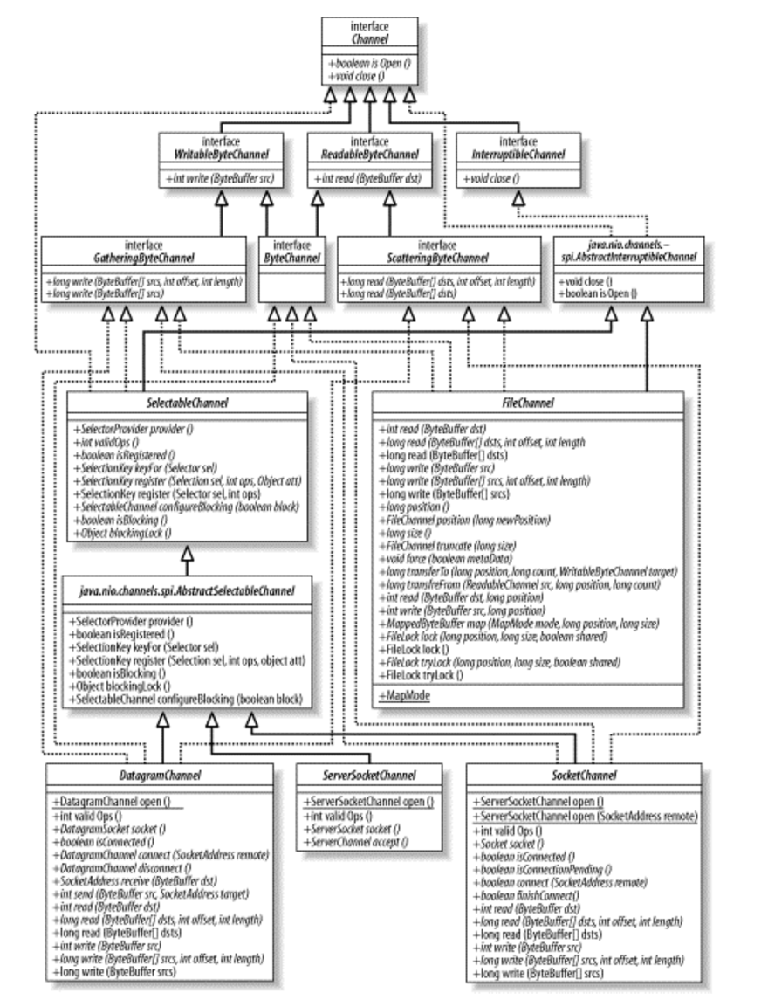
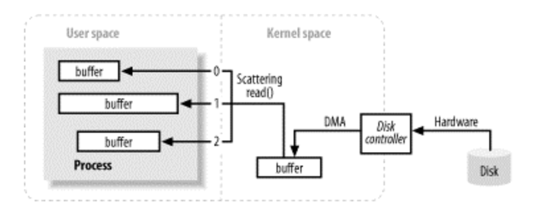
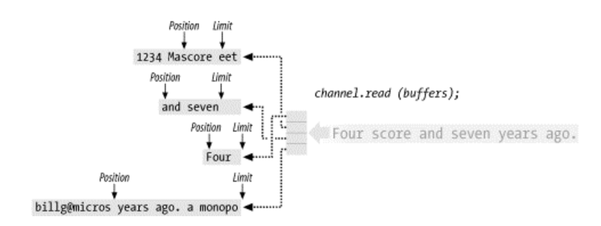

## Channel

Channel은 파일이나 소켓과 같은 엔티티 간에 데이터를 효율적으로 전송하는 통로이다.
채널은 일반적으로 운영체제의 파일 디스크립터나 핸들러와 일대일 관계를 가진다.
채널은 Java의 플랫폼 독립성을 유지하면서도 운영 체제의 네이티브 I/O 기능에 대한 추상화를 제공한다.

아래 그림은 Channel 클래스의 상속관계를 나타낸다.



계층구조 상단에 WritableByteChannel과 ReadableByteChannel 인터페이스를 보게 되면 채널은 바이트 버퍼에 대해서만
작동한다는 것을 짐작할 수 있다. 이는 운영체제의 저수준 I/O가 바이트 단위로 수행하기 때문이다.

InterruptibleChannel 인터페이스는 채널이 안전하게 중단되고 닫힐 수 있도록 하는 메커니즘을 제공한다.
스레드가 interruptible 채널에서 I/O 작업에 차단되어 있을 때, 해당 스레드의 interrupt 메서드를 호출하면 채널이 닫히고, 스레드의 중단 상태가 설정되며, 채널에서 ClosedByInterruptException이 발생한다.

아래는 Channcel 인터페이스의 전체 소스이다.

```JAVA
public interface Channel {

	public boolean isOpen();

	public void close() throws IOException;
}
```

### Channel Open

I/O는 크게 파일 I/O와 스트림(또는 소켓) I/O로 구분된다.
**Channel 상속 관계** 이미지에서 확인할 수 있듯이 하나의 FileChannel과 세 개의 소켓 채널(SocketChannel, ServerSocketChannel, DatagramChannel)이 있음을 알 수 있다.

FileChannel은 RandomAccessFile, FileInputStream, FileOutputStream 와 같은 객체에서 getChannel 메서드를 호출해야만 얻을 수 있다.

```JAVA
// 파일 채널 생성
RandomAccessFile raf = new RandomAccessFile("somefile","r");
FileChannel fc = raf.getChannel();
```

나머지 소켓 채널들은 팩토리 메서드를 통해 생성할 수 있다.

```JAVA
SocketChannel sc = SocketChannel.open();
sc.connect(new InetSocketAddress("somehost",someport));

ServerSocketChannel ssc = ServerSocketChannel.open();
ssc.socket().bind(new InetSocketAddress(somelocalport));

DatagramChannel dc = DatagramChannel.open();
```

### 채널 사용

채널은 단방향(unidirectional) 또는 양방향(bidirectional)일 수 있다.

```JAVA
public interface ReadableByteChannel extends Channel {

	public int read(ByteBuffer dst) throws IOException;
}
```

```JAVA
public interface WritableByteChannel extends Channel {

	public int write(ByteBuffer src) throws IOException;
}
```

ReadableByteChannel 인터페이스는 read() 메서드를 정의하므로, 이를 구현하는 채널은 데이터를 읽을 수 있다.
반대로 WritableByteChannel 인터페이스는 write() 메서드를 제공하므로, 이를 구현하는 채널은 데이터를 쓸 수 있다.
어떤 채널 클래스가 두 인터페이스 중 하나만 구현하면 그 채널은 단방향이고, 두 인터페이스 모두를 구현하면 양방향 채널이 된다.

ByteChannel 인터페이스는 ReadableByteChannel와 WritableByteChannel를 모두 확장하는데, 모든 File 채널과 소켓 채널이 ByteChannel을 확장하므로 양방향 채널이 된다.
소켓은 항상 양방향이지만, 파일은 항상 그렇지 않다. 예를 들면 FileInputStream 객체에서 getChannel() 메서드로 얻는 FileChannel은 읽기 전용 채널이 된다.
만약 해당 채널에 write를 하게 되면 NonWritableChannelException이 발생한다.

아래는 System.in 채널에서 System.out 채널로 데이터를 복사하는 예제 코드이다.

```JAVA
public class ChannelCopy {

	public static void main(String[] args) throws IOException {
		ReadableByteChannel source = Channels.newChannel(System.in);
		WritableByteChannel dest = Channels.newChannel(System.out);
		channelCopy1(source, dest);
		source.close();
		dest.close();
	}


	private static void channelCopy1(ReadableByteChannel src, WritableByteChannel dest) throws IOException {

		ByteBuffer buffer = ByteBuffer.allocateDirect(16 * 1024);
		while (src.read(buffer) != -1) {
			buffer.flip();
			dest.write(buffer);
			buffer.compact();
		}
		buffer.flip();
		while (buffer.hasRemaining()) {
			dest.write(buffer);
		}
	}

}
```

### Scatter/Gather

Scatter/Gather 는 운영 체제에서 I/O 작업을 최적화하는 방법 중 하나이다.

- Scatter: 데이터를 여러 버퍼로 분산하여 읽는 것을 의미한다.
- Gather: 여러 버퍼에서 데이터를 모아서 쓰는 것을 의미한다.

Scatter/Gather를 사용하면 여러 버퍼의 주소 목록을 한 번의 시스템 호출로 전달할 수 있다.
이렇게 하면 사용자 프로세스가 여러 시스템 호출을 하는 것을 피할 수 있다.   



아래는 Scatter/Gather I/O를 지원하는 인터페이스이다. read, write 메서드에 ByteBuffer 배열을 인자로 받는 것을 확인할 수 있다.
```JAVA
public interface ScatteringByteChannel extends ReadableByteChannel {

    public long read(ByteBuffer[] dsts, int offset, int length)
        throws IOException;
 
    public long read(ByteBuffer[] dsts) throws IOException;

}
```

```JAVA
public interface GatheringByteChannel extends WritableByteChannel {
	
    public long write(ByteBuffer[] srcs, int offset, int length)
        throws IOException;
			
    public long write(ByteBuffer[] srcs) throws IOException;

}

```

아래는 Scatter로 두 개의 버퍼에 분산 저장하는 코드이다.
```JAVA
ByteBuffer header = ByteBuffer.allocateDirect (10);
ByteBuffer body = ByteBuffer.allocateDirect (80);
ByteBuffer[] buffers = { header, body };
int bytesRead = channel.read (buffers);
```
채널에 38byte가 준비되어 있다면 header에 10byte, body에 28byte가 저장된다.
아래는 4개의 버퍼에 Scatter read를 사용한 모습이다.


Scatter/Gather 적절하게 사용하면 읽은 데이터를 여러 버킷으로 분리하거나 서로 다른 데이터 덩어리를 전체 데이터로 모으는
번거로운 작업을 운영체제에 위임하여, 시스템 호출을 줄이고 데이터 이동 작업을 줄일 수 있다.


## File Channel
FileChannel은 항상 블로킹 모드로 동작하며, 논블로킹 모드로 변경할 수 없다.
논블러킹 모드가 파일 I/O에는 적용되지 않는 이유는 다음과 같다.
- 캐싱과 최적화: 운영 체제의 캐싱과 최적화로 인해, 파일 I/O는 대부분의 경우 빠르게 처리된다. 따라서 논블로킹의 이점이 크게 나타나지 않을 수 있다.
- 예측 가능한 데이터: 파일의 크기와 위치는 알려져 있기 때문에, 논블로킹 방식의 필요성이 상대적으로 줄어든다.
- 구조화된 데이터: 파일의 구조화된 특성으로 인해, 스트림 지향 I/O와 같은 연속적인 데이터 흐름을 처리하는 논블로킹 방식이 필요하지 않을 수 있다.

버퍼의 get()과 put() 메서드처럼, read()나 write()로 바이트를 전송할 때 파일의 위치도 자동으로 업데이트된다.
파일의 위치가 size() 메서드로 반환되는 파일 크기에 도달하면, read()는 파일의 끝(end-of-file)을 나타내는 -1을 반환한다.   

파일 크기를 넘어서 write()를 수행하면, 새로 쓰는 바이트를 수용하기 위해 파일 크기가 커진다. 이전 파일의 끝과 새로 추가된 바이트 사이의 바이트 값은 FileChannel 클래스에 의해 지정되지 않지만, 대부분의 경우 기본 파일 시스템의 동작을 반영한다.
운영 체제나 파일 시스템 유형에 따라 파일에 구멍이 생길 수 있다.   

파일 크기를 줄이려면, truncate()를 사용해 지정한 새 크기를 넘어서는 모든 데이터를 잘라낸다. 현재 크기가 새 크기보다 크면, 새 크기를 넘어서는 모든 바이트는 버려진다. 제공된 새 크기가 현재 파일 크기보다 크거나 같으면 파일은 수정되지 않는다. 어느 경우에든 truncate()의 부수 효과는 파일 위치를 제공된 새 크기로 설정하는 것이다.   

파일이 로컬 파일 시스템에 있으면, force()에서 반환될 때 채널이 생성된 이후 (또는 마지막으로 force()가 호출된 이후) 파일에 대한 모든 수정 사항이 디스크에 기록되었음이 보장된다.
이러한 동기화는 데이터 무결성과 신뢰할 수 있는 복구를 위해 중요하다. 예를 들어, 트랜잭션 처리와 같은 중요한 작업에서 이것은 필수적이다.   

그러나 파일이 NFS와 같은 원격 파일 시스템에 있으면 이러한 동기화를 보장할 수 없다. 다른 파일 시스템에서도 구현에 따라 동일한 문제가 발생할 수 있다.
JVM은 운영 체제나 파일 시스템이 지키지 않는 약속을 할 수 없다. 시스템 실패에도 데이터 무결성을 유지해야 하는 애플리케이션의 경우, 사용 중인 운영 체제나 파일 시스템이 그러한 측면에서 신뢰할 수 있는지 확인해야 한다.

아래는 FileChannel로 파일을 Copy 하는 예제 코드이다.

```JAVA
public class FileCopyExample {
	public static void main(String[] args) {
		String sourceFilePath = "원본파일경로/원본파일.txt";
		String destinationFilePath = "대상파일경로/대상파일.txt";

		try {
			FileInputStream sourceStream = new FileInputStream(sourceFilePath);
			FileOutputStream destinationStream = new FileOutputStream(destinationFilePath);

			FileChannel sourceChannel = sourceStream.getChannel();
			FileChannel destinationChannel = destinationStream.getChannel();

			ByteBuffer buffer = ByteBuffer.allocate(1024);
			int bytesRead;

			while ((bytesRead = sourceChannel.read(buffer)) != -1) {
				buffer.flip(); // 버퍼를 읽기 모드로 전환
				destinationChannel.write(buffer); // 버퍼의 내용을 대상 파일로 복사
				buffer.clear(); // 버퍼를 초기화하여 다시 쓰기 모드로 전환
			}

			sourceStream.close();
			destinationStream.close();
			sourceChannel.close();
			destinationChannel.close();

			System.out.println("파일이 복사되었습니다.");
		} catch (IOException e) {
			e.printStackTrace();
		}
	}
}
```


## Memory-Mapped Files
FileChannel 클래스의 map() 메서드를 사용하면, 파일과 특별한 유형의 ByteBuffer 사이에 가상 메모리 매핑을 설정할 수 있다. 이렇게 하면 디스크 파일을 기반으로 한 가상 메모리 매핑이 생성되고, 해당 가상 메모리 공간 주위에 MappedByteBuffer 객체가 감싸진다.   

map()에서 반환된 MappedByteBuffer 객체는 대부분의 면에서 메모리 기반 버퍼처럼 동작한다. 그러나 그 데이터 요소는 디스크에 있는 파일에 저장된다. get()을 호출하면 디스크 파일에서 데이터를 가져오며, 매핑이 설정된 이후에 외부 프로세스에 의해 파일이 수정되었더라도 현재 파일의 내용을 반영한다.    

메모리 매핑 메커니즘을 통해 파일에 접근하는 것은 채널을 사용할 때조차도 전통적인 방법으로 데이터를 읽거나 쓰는 것보다 훨씬 효율적일 수 있다. 명시적인 시스템 호출을 할 필요가 없기 때문이다. 더 중요한 것은 운영 체제의 가상 메모리 시스템이 자동으로 메모리 페이지를 캐시한다는 것이다.   

유효한 메모리 페이지가 한 번 생성되면, 다른 시스템 호출을 하지 않고도 전체 하드웨어 속도로 다시 접근할 수 있다. 메모리 매핑을 활용하면, 자주 참조되거나 업데이트되는 인덱스나 다른 섹션이 포함된 큰 구조화된 파일에서 큰 이점을 얻을 수 있다.

```JAVA
public abstract class FileChannel extends AbstractChannel
		implements ByteChannel, GatheringByteChannel, ScatteringByteChannel {
  
	public abstract MappedByteBuffer map (MapMode mode, long position, long size);

	public static class MapMode {

		public static final MapMode READ_ONLY = new MapMode("READ_ONLY");

		public static final MapMode READ_WRITE = new MapMode("READ_WRITE");

		public static final MapMode PRIVATE = new MapMode("PRIVATE");

	}
 
}
```

아래 코드는 FileChannel의 전체 파일 데이터에 대해서 MappedByteBuffer를 생성하는 예이다.
```JAVA
buffer = fileChannel.map(FileChannel.MapMode.READ_ONLY, 0, fileChannel.size());
```

맵핑 모드는 읽기 전용(MapMode.READ_ONLY) 또는 읽기/쓰기(MapMode.READ_WRITE)를 나타낼 수 있다. 요청한 매핑 모드는 map() 메서드가 호출되는 FileChannel 객체의 액세스 권한에 따라 제한될 수 있다.   

MapMode.PRIVATE 모드는 복사 후 쓰기 매핑을 원한다는 것을 나타낸다. 이는 put()을 통해 만든 모든 수정 사항이 MappedByteBuffer 인스턴스만 볼 수 있는 개인 데이터 복사본을 생성한다는 것을 의미한다. 기본 파일에는 변경 사항이 적용되지 않으며, 버퍼가 가비지 컬렉션될 때 변경 사항은 손실된다.   

복사 후 쓰기는 운영 체제에서 프로세스가 다른 프로세스를 생성할 때 가상 주소 공간을 관리하는 데 일반적으로 사용되는 기술이다. 복사 후 쓰기를 사용하면 부모 프로세스와 자식 프로세스가 메모리 페이지를 공유할 수 있게 되며, 이로 인해 동일한 파일의 여러 매핑에 대한 많은 이점이 생길 수 있다.

그런데 여기서 중요한 점은, 버퍼가 해당 파일 영역을 아직 수정하지 않았을 때, 실제 파일의 해당 영역에 다른 방법(다른 프로세스나 애플리케이션)으로 변경이 발생하면, MapMode.PRIVATE 모드로 생성된 버퍼는 그 변경 사항을 볼수 있다. 즉, 파일의 원본 데이터가 변경되면, 해당 변경은 버퍼에도 반영된다.

하지만, 버퍼가 이미 해당 파일 영역을 수정한 경우, 버퍼는 그 영역의 복사본을 가지고 있게 된다. 따라서, 이후에 실제 파일의 해당 영역에 변경이 발생하더라도, 버퍼는 그 변경을 반영하지 않고, 본인이 수정한 복사본의 데이터를 유지한다.   

예를 들어, 파일에 "Hello"라는 문자열이 있고, 이를 MapMode.PRIVATE 모드로 매핑하여 버퍼를 생성했다고 가정하자.
이후, 다른 프로세스에서 파일의 "Hello"를 "World"로 변경하면, 버퍼는 "World"를 볼 수 있다.
그러나, 버퍼가 먼저 "Hello"를 "Java"로 변경한 후에 파일이 "World"로 바뀌면, 버퍼는 여전히 "Java"를 보게 된다.

MappedByteBuffer의 isLoaded 메서드는 매핑된 파일이 완전히 메모리에 로드되어 있는지 확인하는 데 사용된다.
true를 반환하면 매핑된 버퍼에 접근할 때 지연이 거의 없거나 전혀 없을 가능성이 높다. false를 반환해도 파일이 메모리에 완전히 로드되지 않았다는 것을 의미하지는 않는다.
이 메서드는 보증이 아닌 힌트를 제공한다.   

force 메서드는 MappedByteBuffer에서의 변경 사항을 디스크에 flush한다.
MappedByteBuffer를 통해 파일을 업데이트할 때는 FileChannel.force() 대신 MappedByteBuffer.force()를 사용해야 한다.

## Socket Channel
java.nio 의 Socket Channel은 네트워크 소켓을 모델링한 클래스이다. 파일 채널과는 다르게 nonblocking 모드가 가능하며,
소켓 연결을 위해 스레드를 할당할 필요가 없으며 하나의 스레드로도 수천 개의 소켓 연결을 관리할 수 있다.

소켓 채널은 기존의 java.net에 있는 소켓이 프로토콜 연산 대부분에 재사용된다.

다음 메서드는 채널의 차단 모드와 관련된 메서드이다. 모든 소켓 채널(SocketChannel, ServerSocketChannel, DatagramChannel)이 생성될 때는 그에 대응하는 피어 소켓 객체가 함께 생성된다.
이 피어 소켓은 Socket, ServerSocket, DatagramSocket 클래스 중 하나이다.

소켓 채널은 프로토콜 연산을 해당 피어 소켓 객체에 위임한다.
채널 클래스에서 소켓 메서드가 중복되어 보이는 경우, 그 메서드에는 채널 클래스에만 해당하는 다른 연산이 있다는 의미이다.

```JAVA
public abstract class SelectableChannel extends AbstractInterruptibleChannel implements Channel {
	
	public abstract void configureBlocking (boolean block) throws IOException;
	public abstract boolean isBlocking();
	public abstract Object blockingLock();				
}
```

채널의 블로킹 모드로 설정하려면 configureBlocking() 메서드에 true를 인수로 전달하고, 논블로킹 모드로 설정하려면 false를 인수로 전달하면 된다.

채널이 현재 어떤 모드에 있는지 확인하려면 isBlocking() 메서드로 알 수 있다.

blockingLock()으로 반환된 객체는 채널이 블로킹 모드에 변경을 할 때 내부적으로 사용하는 모니터 객체이다.
이 객체에 잠금을 보유한 스레드만 채널의 블로킹 모드를 변경할 수 있다.
코드의 중요한 부분 동안 소켓의 블로킹 모드가 변경되지 않도록 하거나, 다른 스레드에 영향을 주지 않고 일시적으로 모드를 변경하는 데 사용할 수 있다.

```JAVA
Object lockObj = serverChannel.blockingLock();
synchronize (lockObj){
  boolean prevState = serverChannel.isBlocking();
  serverChannel.configureBlocking (false);
  socket = serverChannel.accept();
  serverChannel.configureBlocking (prevState); 
}
```

### ServerSocketChannel
ServerSocketChannel 객체는 내부적으로 ServerSocket 객체(피어 소켓)와 연관되어 있으며,
이를 통해 일반적인 소켓 연산, 포트 바인딩 등의 작업을 수행할 수 있다.
```JAVA
ServerSocketChannel ssc = ServerSocketChannel.open();
ServerSocket serverSocket = ssc.socket();
serverSocket.bind(new InetSocketAddress(1234));
```

ServerSocketChannel와 기존 ServerSocket 모두 accept() 라는 메서드를 가지고 있다.
이 메서드는 들어오는 클라이언트 연결을 수락하기 위해 사용된다.

ServerSocket의 accept() 메서드는 항상 blocking 모드로 동작한다.  즉, 서버는 새로운 연결이 수락될 때까지 대기하게 된다.   

ServerSocketChannel의 accept() 메서드는 nonblocking 모드로 동작할 수 있다. 즉, 호출 시점에 수락할 연결이 없다면 null을 반환하게 된다.
따라서, 서버는 새 연결을 기다리는 동안 다른 작업을 계속 수행할 수 있다.   

ServerSocketChannel은 Selector와 함께 사용했을 때, 새 연결이 도착했을 때 이벤트를 받을 수 있다.


### SocketChannel
모든 SocketChannel 객체는 피어 객체인 Socket과 함께 생성된다.
SocketChannel의 static 메서드인 open() 메서드는 새로운 SocketChannel 객체를 생성한다.
새 SocketChannel에서 socket()을 호출하면 해당 피어 Socket 객체가 반환딘다.
해당 Socket에서 getChannel()을 호출하면 원래 SocketChannel이 반환된다.

SocketChannel의 연결은 open() 이나 connect() 메서드를 통해 이루어진다.
아래는 SocketChannel 연결의 예이다.
```JAVA
SocketChannel socketChannel = SocketChannel.open(new InetSocketAddress("localhost", "8080"));
```
```JAVA
SocketChannel socketChannel = SocketChannel.open();
socketChannel.connect(new InetSocketAddress("localhost", "8080"));
```

nonblocking 모드에서 connect()를 호출해서 반환값이 true이면 연결이 즉시 성립되었다는 것이고, 연결이 즉시 성립되지 않으면 connect()는 false를 반환된다.

만약 연결이 바로 성립되지 않는 경우 (서버에 연결하는 데 시간이 걸리는 경우), 연결은 백그라운드에서 계속 진행된다.
isConnectPending() 메서드는 연결이 백그라운드에서 진행 중인지 확인할 수 있다. 
예를 들어, 소켓 채널을 nonblocking 모드로 설정하고 연결을 시도했을 때 연결이 즉시 성립되지 않으면 isConnectPending() 메서드는 true를 반환하고, 연결이 성립되가니 연결이 시작되지 않았을 경우 false를 반환한다.

finishConnect() 메서드는 nonblocking 모드에서 연결을 시도한 후 연결 상태를 확인하는 데 사용된다.
연결이 성립되었을 경우 true를 반환하고, 그렇지 않을 경우 false를 반환하거나 연결 과정이 시작되지 않았을 때(connect 호출 전) 예외를 발생시킨다.

```java
InetSocketAddress addr = new InetSocketAddress(host, port);
SocketChannel sc = SocketChannel.open();
sc.configureBlocking (false);
sc.connect (addr);
while (!sc.finishConnect()) {
   doSomethingElse();
}
doSomethingWithChannel(sc);
sc.close();
```


## 참조
- Java NIO(Ron Hitchens)


