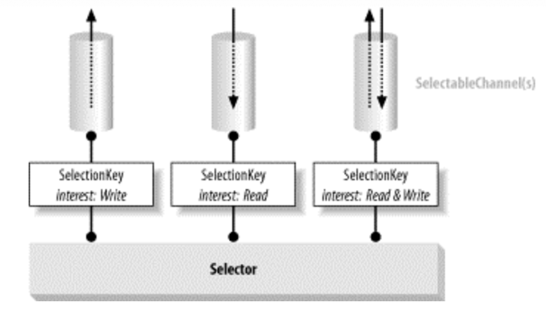

## Selector
Buffer 편에서도 보았듯이, java.nio 는 기존 Java I/O의 한계를 극복하기 위해서 탄생되었다. 
C/C++의 경우에는 이미 POSIX 계열 OS의 select()나 poll() 같은 시스템 호출로 멀티플렉싱을 구현하였지만 기존 Java I/O는 이를 사용할 수 없었다.

Selector는 멀티플렉싱 I/O를 가능하게 한다. 멀티플렉싱 I/O는 단일 스레드 또는 프로세스가 여러 I/O 작업을 모니터링하고, 준비된 작업에만 대한 처리를 수행하는 방식을 의미한다.

Selector는 여러 SelectableChannel 객체를 등록하고, 등록된 채널들 중 어떤 채널이 준비된 상태인지 확인하는 역할을 한다.
select() 메서드를 호출하면 Selector는 등록된 채널들을 확인하고, 준비된 채널들의 SelectionKey를 반환한다.

SelectionKey는 SelectableChannel과 Selector 간의 연결을 나타내는 키이다.
SelectionKey는 각 채널의 관심 작업(읽기, 쓰기 등)을 기억하며, 해당 채널이 현재 어떤 작업을 수행할 준비가 되었는지 모니터링한다.

SelectableChannel은 I/O 채널을 나타내는 추상 클래스이다. SocketChannel, ServerSocketChannel 등이 이를 구현한다.
SelectableChannel은 Selector와 함께 사용되어 특정 작업(읽기,쓰기 등)을 수행할 수 있는지 확인합니다.

멀티플렉싱 구현의 핵심은 준비된 상태의 채널을 쉽게 확인할 수 있다는 것에 있다. 이를 준비성 선택(readiness selection)이라고 한다.

준비성 선택은 언뜻보면 non-blocking 모드와 폴링으로 구현이 가능할 것 같지만 작업의 준비 여부를 확인하는 코드와 데이터를 처리하는 코드를 분리하기 어려울 수 있다.
또한, non-blocking 모드로 각 채널에 대해 직접 준비 여부를 물어보는 것은 많은 시스템 호출로 비용이 많이 드는 작업이다.

nio 이전에는 준비성 선택을 흉내내기 위해 각 소켓에 대한 각각의 스레드를 만들고 read() 메서드에서 데이터를 기다리도록 하는 방법이 사용되었다.
이렇게 하면 각 스레드가 소켓 모니터 역할을 수행하고 JVM의 스레드 스케줄러가 알림 메커니즘 역할을 수행한다.

Java NIO에서는 준비성 선택을 운영 체제에 위임하고, Selector 클래스를 통해 이용할 수 있다.
Selector는 여러 채널의 상태를 모니터링하고, 해당 채널이 준비 상태인 경우 알려줌으로써 효율적인 I/O 처리를 가능하게 한다.
이를 통해 다수의 클라이언트와 연결을 관리하고 데이터를 처리할 수 있다.
 


위 그림은 아래 코드로 표현할 수 있다.
```java
Selector selector = Selector.open();
channel1.register(selector, SelectionKey.OP_READ);
channel2.register(selector, SelectionKey.OP_WRITE);
channel3.register(selector, SelectionKey.OP_READ | SelectionKey.OP_WRITE);

// 채널이 준비될 때까지 최대 10초간 블록킹된다.
readyCount = selector.select(10000);
```
이 코드는 Selector를 생성한 다음, 각각 다른 관심사 집합을 가지는 기존의 세 개의 소켓 채널을 Selector에 등록한다.
selector.select(10000) 는 등록된 채널에서 관심 이벤트가 발생할 때까지 최대 10초간 블록킹된다.

아래는 Selector의 주요 API 목록이다.
```JAVA
public abstract class Selector implements Closeable {

	
    public static Selector open() throws IOException {
        return SelectorProvider.provider().openSelector();
    }

    public abstract boolean isOpen();
		
    public abstract SelectorProvider provider();

    public abstract Set<SelectionKey> keys();

    public abstract Set<SelectionKey> selectedKeys();

    public abstract int selectNow() throws IOException;

    public abstract int select(long timeout) throws IOException;
		
    public abstract int select() throws IOException;

    public abstract Selector wakeup();
		
    public abstract void close() throws IOException;
}
```

## SelectableChannel
```JAVA
public abstract class SelectableChannel
    extends AbstractInterruptibleChannel
    implements Channel
{

    public abstract SelectorProvider provider();

    public abstract int validOps();

    public abstract boolean isRegistered();

    public abstract SelectionKey keyFor(Selector sel);

	public abstract SelectionKey register(Selector sel, int ops) throws ClosedChannelException;
	
    public abstract SelectionKey register(Selector sel, int ops, Object att)
        throws ClosedChannelException;

}
```
Selector의 채널 등록은 SelectableChannel 의 register()로 할 수 있다.
register는 Selector 객체와 ops라는 정수 매개변수를 인자로 받는다.

ops 매개변수는 채널이 등록되는 관심 작업 집합을 나타낸다.
이 값은 채널의 준비 상태를 확인할 때 Selector가 확힌해야 하는 I/O 작업을 비트 마스크로 표현한 것이다.
구체적인 작업 비트는 SelectionKey 클래스의 public static 필드로 정의되어 있다.

JDK 1.4부터는 읽기(OP\_READ), 쓰기(OP\_WRITE), 연결(OP\_CONNECT), 수락(OP\_ACCEPT) 작업이 정의되어 있다.
각 채널마다 지원되는 작업이 있다. SocketChannel의 경우 accept 작업을 수행할 수 없다.
지원되지 않는 작업에 채널을 Selector에 등록하려고 하면 Exception이 발생한다. validOps() 메서드를 사용하면 해당 채널이 허용하는 작업 집합(비트 마스크)을 얻을 수 있다.

두번째 register() 메서드에는 att 라는 Objcet를 받는 것을 확인할 수 있다. 해당 객체 참조를 SelectionKey이 전달하고 attch()로 해당 참조를 다시 얻을 수 있다.

하나의 채널 객체는 여러 Selector에 등록될 수 있다. 채널이 현재 어떤 선택기에 등록되어 있는지 확인하려면 isRegistered() 메서드를 호출하면 된다.
이 메서드는 채널이 적어도 하나의 선택기에 등록되어 있는지 여부에 대한 정보를 제공하지만, 채널이 어떤 선택기에 등록되어 있는지에 대한 정보는 제공하지 않는다.

각 채널의 Selector와 채널 등록은 SelectionKey 으로 캡슐화된다. keyFor() 메서드는 특정 채널과 주어진 Selector에 연결된 SelectionKey를 반환한다.


## SelectionKey
SelectionKey는 특정 채널을 특정 Selector와 등록 관계를 나타내며, 해당 채널을 모니터링하고 제어할 수 있다.
아래는 SelectionKey의 주요 API와 설명이다. 
```JAVA
public abstract class SelectionKey {

	public static final int OP_READ;
	public static final int OP_WRITE;
	public static final int OP_CONNECT;
	public static final int OP_ACCEPT;

	public abstract SelectableChannel channel();

	public abstract Selector selector();

	public abstract void cancel();

	public abstract boolean isValid();

	public abstract int interestOps();

	public abstract void interestOps(int ops);

	public abstract int readyOps();

	public final boolean isReadable();

	public final boolean isWritable();

	public final boolean isConnectable();

	public final boolean isAcceptable();

	public final Object attach(Object ob);

	public final Object attachment();
	
}
```
#### channel()   
SelectionKey와 관련된 SelectableChannel 객체를 반환한다.

#### selector()   
SelectionKey와 관련된 Selector 객체를 반환한다.

#### cancel()   
Selector와 Channel 관계를 해지할 때 사용된다. 해당 선택 키가 무효화되고 연결이 해제된다.
다만, SelectionKey이 취소된다고 해도 Selector에 채널은 등록된 상태로 남아있다. 채널은 Selector의 다음 select() 메서드 호출 또는 진행 중인 select() 메서드 완료 시점에 해지된다.
채널이 취소된 SelectionKey와 함께 Selector 등록된 상태에서 해당 SelectionKey를 사용하려고 시도하면 CancelledKeyException이 발생한다.

#### isValid()   
키가 아직 유효한 등록을 나타내는지 확인한다. 채널이 닫히면 해당 채널과 관련된 모든 SelectionKey이가 자동으로 무효화 된다.

#### interestOps()
현재 SelectionKey의 관심 작업 집합을 반환한다. 이 값은 SelectableChannel.register 로 등록할 때 전달된 값이다.
인수있는 interestOps()를 호출하면 새로운 관심 작업 집합을 설정할 수 있다.

#### readyOps()
현재 선택 키와 관련된 채널에서 실제로 수행 가능한 I/O 작업의 집합을 반환한다.
이 집합은 최근 select() 메서드 호출로 결정된 것으로, 관심 작업 집합 중에서 실제로 수행 가능한 작업을 나타낸다.   

중요한 점은 readyOps()의 반환값은 절대적인 보장을 의미하는 것은 아니다.
readyOps은 Selector가 마지막으로 등록된 채널들의 상태를 확인한 시점에서의 정보를 담고 있기 때문이다.
따라서, 멀티스레딩 환경에서는 주의가 필요하다.


```java
int readyOps = key.readyOps();

if ((readyOps & SelectionKey.OP_READ) != 0) {
  key.channel().read (myBuffer);
}
```

#### isReadable()
isReadable(), isWritable(), isConnectable(), isAcceptable() 각 메서드는 채널이 각 작업에 대해 준비 상태인지를 검사하는 역할을 한다.
예를 들어 `key.isWritable()` 는 `(key.readyOps() & SelectionKey.OP_WRITE) != 0` 와 동일하다.

#### attach()
이 메서드는 SelectionKey에 첨부 객체를 설정할 수 있다. 일반적으로 핸들러 객체, 비즈니스 객체, 다른 채널 등과 관련짓는 데 사용할 수 있다.
SelectableChannel.register의 att 매개변수와 동일하게 사용된다.
```java
SelectionKey key = channel.register(selector, SelectionKey.OP_READ, myObject);
```
위의 코드는 아래 코드와 동일하다.
```JAVA
SelectionKey key = channel.register(selector, SelectionKey.OP_READ);
key.attach(myObject);
```

#### attachment()
이 메서드를 호출하면 SelectionKey에 첨부된 객체 핸들을 가져올 수 있다.
만약 첨부된 객체가 설정되지 않았거나 명시적으로 null이 지정되었다면 이 메서드는 null을 반환한다.


## Selector 동작원리
Selector는 등록된 채널들의 집합을 관리하며, 각 등록은 SelectionKey 객체로 캡슐화된다.
Selector 객체는 세 가지 종류의 키 집합을 유지한다.

- **Registered key set**은 Selector에 등록된 모든 키 집합을 나타낸다. keys() 메서드로 가져올 수 있다.   

- **Selected key set**은 등록된 키의 관심 작업 집합 중 적어도 하나의 작업에 대해 준비가 된 키 집합을 의미한다.
selectedKeys() 메서드로 가져올 수 있다.

- **Cancelled key set**은 cancel()로 무효환된 키들의 집합이다. 비공개로 유지되어 직접 접근할 수 없다.

Selector에서 select() 메서드를 호출하면 다음 세 단계가 수행된다.

#### 취소된 키 확인
취소된 키 집합을 확인한다. 취소된 키가 있다면 이들은 다른 두 키 집합(Registered key set, elected key set)에서 제거되고, 관련된 채널은 등록 해제된다.
이 부분은 SelectionKey의 cancel() 메서드에서 이미 설명했다.

#### 작업 관심 집합 확인
등록된 키 집합의 각 키의 작업 관심 집합을 조사한다.
이 시점 이후에 작업 관심 집합에 대한 변경 사항은 고려되지 않는다.

#### 채널 준비 상태 확인
OS에게 현재 채널의 작업 관심 상태를 확인하도록 요청한다.
이때 스레드는 현재 채널이 준비되지 않았다면 일정 시간 동안 blocking될 수 있다.
시스템 호출이 완료되면 채널의 준비 상태가 결정된다.

그 후, OS로부터 각 채널의 키에 대한 **준비된 집합(ready sets)**을 얻게 되는데, 각각의 키가 Selected key set에 포함되지 않으면 해당 키를 Selected key set 에 추가한다.

만약, 채널의 키가 Selected key set에 이미 포함되어 있다면, 현재 채널이 어떤 작업에(OP_XXXX) 준비되어 있는지를 나타내는 비트를 업데이트한다.

#### 취소된 키 재확인
**채널 준비 상태 확인**에서 스레드가 블록킹되어 시간이 많이 흐를 수 있다. 그 동안 SelectionKey가 취소될 수 있기 때문에 취소된 키를 재확인한다.

#### 결과값 리턴
select() 메서드로 반환되는 값은 **채널 준비 상태 확인**에서 준비된 집합(ready sets)이 수정된 키의 수를 나타낸다.
Selection key set 내의 모든 채널의 총 수가 아닌, select 메서드 호출 간에 준비된 채널의 수를 나타낸다.

예를 들어, 첫 번째 select() 호출에서 2개의 채널이 작업 준비 상태로 판단되면 반환값은 2개 된다.
두 번째 호출에서 1개의 추가 채널이 작업 준비 상태로 추가되면 반환값 1이 된다.
세 번째 호출에서 아무 채널도 변경사항이 없으면 반환값은 0이 된다.


Selector 클래스에는 세 가지 형태의 select() 메서드가 있다. 각각에 대해 알아보자.
```java
int n = selector.select();
```
인수없는 select() 는 준비된 채널이 생길 때 까지 블로킹된다. 따라서 반환값은 항상 0 보다 큰 값을 가진다.
만약, 다른 스레드에서 wakeup() 메서드를 호출하면 0이 반환될 수 있다.

```JAVA
int n = selector.select(100000);
```
다음은 long timeout 매개변수를 받는 select 이다. 준비된 채널을 확인하기 위해  최대 해당 시간만큼 대기할 수 있다.

```JAVA
int n = selector.selectNow();
```
non-blocking 모드의 select 메서드이다. 준비된 채널이 없으면 0을 반환한다.


## Selection 작업 중지하기

#### wakeup()
Selector 객체에 대해 wakeup() 메서드를 호출하면 해당 Selector에서 select() 작업이 진행 중이라면 0을 반환시킨다.
현재 select() 작업 중이 아니라면, 다음 select() 메서드를 호출할 때 selectNow()로 동작되어 즉시 반환된다. 그 후의 select 호출은 정상적으로 동작된다.

#### close()
Selector를 닫으면 현재 선택 작업 중인 스레드를 즉시 깨우고 해당 Selector와 관련된 리소스를 정리한다.

#### interrupt()
블로킹된 스레드의 interrupt() 메서드가 호출되면 해당 스레드의 "인터럽트 상태"가 설정된다.
스레드의 인터럽트 상태가 설정된 후에 해당 스레드가 채널에서 I/O 작업을 시도하면 해당 채널이 즉시 닫히고 스레드는 ClosedByInterruptException 과 같은 예외가 발생한다.
이런 경우에는 Thread.interrupted() 로 인터럽트 상태를 지울 수 있다.

## Selector 키 관리
Selector로 간단한 서버를 만들어보자. 클라이언트 요청을 accept 하고 클라이언트로부터 데이터를 읽을 수 있는 간단한 서버이다.
```JAVA
public class Example {

	public static void main(String[] args) {

		try {

			ServerSocketChannel serverChannel = ServerSocketChannel.open();
			ServerSocket server = serverChannel.socket();

			Selector selector = Selector.open();

			server.bind(new InetSocketAddress("localhost", 8080));

			serverChannel.configureBlocking(false);
			serverChannel.register(selector, SelectionKey.OP_ACCEPT);

			while (true) {
				int n = selector.select();

				if (n == 0) {
					continue;
				}

				Iterator it = selector.selectedKeys().iterator();

				while (it.hasNext()) {
					SelectionKey key = (SelectionKey) it.next();

					if (key.isAcceptable()) {
						System.out.println("클라이언트가 연결 요청하였습니다");
						registerChannel(selector, key);
					}
					
					if (key.isReadable()) {
						System.out.println("클라이언트가 데이터를 보내왔습니다");
					}
				}

			}


		} catch (IOException e) {
			e.printStackTrace();
		}

	}

	private static void registerChannel(final Selector selector, final SelectionKey key) throws IOException {
		ServerSocketChannel serverSocket = (ServerSocketChannel) key.channel();
		SocketChannel socket = serverSocket.accept();
		if (socket == null) {
			return;
		}
		socket.configureBlocking(false);
		socket.register(selector, SelectionKey.OP_READ);
		
	}

}
```
selector.select() 로 등록한 채널의 작업을 모니터링하고 아래 while 문 안에서 `key.isAcceptable()` 와 `key.isReadable()` 메서드를 통해,
accept 작업과 read 작업 각각에 대해 처리를 하는 코드를 확인할 수 있다. 

하지만, 이 코드는 심각한 문제를 가지고 있는데 서버를 띄우고 클라이언트에서 접속을 하고 데이터를 보내면 다음과 같은 내용을 출력한다.
```JAVA
클라이언트가 연결 요청하였습니다
클라이언트가 연결 요청하였습니다
클라이언트가 데이터를 보내왔습니다
```
클라이언트 1대만 접속했지만 `클라이언트가 연결 요청하였습니다` 메시지가 두 번 출력된다.
이는 **Selector 동작원리** 섹션에 **채널 준비 상태 확인** 에서 설명을 보면 알 사 있다.,
select() 메서드는 준비된 작업 집합을 Selected key set에 추가하고, 이미 존재하는 키면 준비 완료된 작업의 비트를 업데이트할 뿐 이다.
이는 별도로 SelectionKey를 제거하는 것 처럼 관리하지 않는다면 select() 연산의 결과는 계속 누적된다는 의미이다.
이를 그림으로 표현하면 아래와 같다.


Loop1 에서 클라이언트 요청이 허용 되면 SelectionKey의 OP\_ACCEPT 비트를 켠다.
Loop2 에서 클라이언트로부터 데이터를 읽을 수 있는 상태가 되면 OP\_READ 비트를 켠다.
OP\_READ 비트를 켠다고 OP\_ACCEPT 비트가 꺼지는 것은 아니다. 이 정보는 키 집합에서 해당 키가
제거될 때까지 키에 유지된다.

이는 등록된 채널의 현재 상태가 제대로 표시되지 않을 수 있으므로 번거러워 보일 수 있지만,
이는 의도된 설계로 프로그래머에게 많은 유연성을 제공하지만 키를 올바르게 관리하여 키의 상태 정보가 오래되지 않도록 보장하는 책임을 부여한다.

만약 프로그램이 원래 의도대로 동작하게 하기 위해서는 준비 완료된 키를 처리하고 **Selected key set** 에서 `it.remove()` 로 해당 키를 제거해줘야 한다.
해당 내용을 반영한 일반적인 Selector를 이용한 채널 관리는 모습은 아래 흐름을 가진다.

```JAVA
selector.select();

Iterator it = selector.selectedKeys().iterator();

while (it.hasNext()){
    SelectionKey key=(SelectionKey)it.next();

    if(key.isAcceptable()){
        registerChannel(selector,key);
        somethingCall();
    }

    if(key.isReadable()){
        registerChannel(selector,key);
        somethingCall();
    }

    it.remove();
}
```


## 정리
- Selector, SelectableChannel, SelectionKey는 Java NIO의 핵심 요소로, 고성능을 위한 Native I/O 작업을 처리하는 데 사용된다.
- SelectableChannel은 I/O 채널을 나타내는 추상 클래스로, SocketChannel, ServerSocketChannel 등이 이를 구현한다. Selector와 함께 사용하여 채널의 작업 상태를 모니터링하고 관리한다.
- SelectionKey: SelectableChannel과 Selector 간의 연결을 나타내며, 채널의 관심 작업과 현재 작업 준비 상태를 관리한다.
- Selector 동작 원리: Selector의 select() 메서드를 호출하면 채널 상태 확인, 작업 관심 집합 확인, 채널 준비 상태 확인 등의 단계를 수행한다
- 채널 등록 및 관리: select()는 결과를 SelectionKey에 누적시킨다. 이는 키 관리에 책임이 프로그래머에 있다.


## 참조
- Java NIO (Ron Hitchens)


