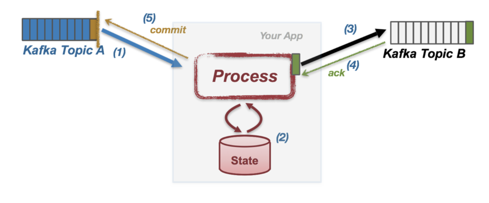
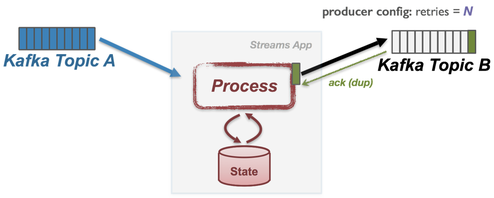

## 카프카 스트림즈란?

사용자가 Kafka에서 데이터를 실시간으로 처리하는 상태 저장 스트림 처리 애플리케이션을 구축할 수 있게 해준다.
Streams API로 개발된 애플리케이션은 이벤트 시간(즉, 데이터가 실제로 현실 세계에서 생성된 시점)을 기준으로 실시간 스트리밍 데이터를 처리하며, 늦게 도착하는 레코드도 지원한다.
이를 통해 데이터 처리를 신속하게 할 수 있으며, 탄력적으로 확장하고 분산 처리하며, 내결함성을 보장할 수 있다.

<!-- more -->

## 스트림 처리에서 정확히 한 번이란 무엇인가?

스트림 처리 애플리케이션은 연속적인 데이터 스트림을 처리하므로,'정확성'을 보장하는 것은 중요한 문제이다.
정확성을 보장하기 위해서는 입력 데이터 스트림의 각 레코드가 한 번만 처리되어야 한다는 조건이 항상 충족되어야한다.

이를 구체적으로 설명하자면, 스트림 처리 애플리케이션은 카프카 토픽에서 읽어들인 레코드들을 처리하는데, 각 레코드는 한 번만 처리되어야 한다.
이를 위해서 처리 로직은 읽기-처리-쓰기 패턴으로 구성되어야 한다.
각 레코드는 읽혀지고, 처리 로직에 따라 상태가 업데이트되며, 그에 따라 출력 레코드가 생성될 수 있다.

정확히 한 번이란, 입력 레코드의 처리 상태가 적절하게 업데이트되고, 출력 레코드가 정확히 한 번만 성공적으로 생성된 경우를 의미한다.
즉, 각 레코드는 중복 처리되지 않아야 하며, 정확히 한 번의 결과만 생성되어야 한다.

스트림 처리 애플리케이션이 단일 프로세스에서 실행되는 경우, 정확히 한 번을 유지하는 것은 상대적으로 쉽지만,
여러 프로세스가 병렬로 실행되는 클러스터 환경에서 이 보장을 유지하는 것은 더 복잡하다.
이러한 환경에서는 장애 상황이 발생할 가능성이 높아지기 때문에 정확히 한 번을 유지하는 것이 더 어려워진다.

## Exactly once의 어려움

카프카에서 저장된 스트리밍 데이터로 읽기-처리-쓰기 스트림 처리 애플리케이션을 구축하는 일반적인 프로그래밍 패턴은 다음과 같다.

- 입력 카프카 토픽에서 메시지 A를 가져온다 (예: 토픽 TA).
- 가져온 메시지 A에 대해 처리 함수 F를 실행하여 해당 데이터를 처리하고, 처리 결과를 상태 S에서 S'로 업데이트한다.
- 출력 메시지 B1부터 Bn까지 생성하여 출력 카프카 토픽으로 보낸다. (단일 토픽 TB로 가정하지만, 여러 토픽으로 쉽게 확장할 수 있다.)
- 전송된 출력 메시지 B1부터 Bn이 카프카 브로커로부터 승인될 때까지 기다린다.
- 처리된 메시지 A의 오프셋을 TA에 커밋하여 해당 메시지의 처리가 완료되었음을 나타내고, 커밋의 승인을 기다린다.

실제로 4)와 5) 단계는 입력 Kafka 토픽에서 가져온 각 메시지에 대한 루프 반복 내에서 실행되지 않을 수 있다.
이 단계들은 더 나은 성능을 위해 여러 메시지를 가져와서 처리한 후에만 호출된다.

오류가 발생하지 않는다면, 이 구현 패턴은 각 레코드의 처리 결과(상태 업데이트와 출력 메시지)가 정확히 한 번만 반영되도록 보장할 수 있습니다.

## 실패 시나리오 #1: 중복 쓰기

첫 번째 오류 시나리오는 4) 단계에서 발생한다.
이 상황에서는 TB 파티션의 리더 복제본을 호스팅하는 Kafka 브로커와 스트림 처리 애플리케이션 간에 네트워크 파티션이 발생한다고 가정한다.
이로 인해 메시지가 TB 파티션 로그에 성공적으로 추가된 후에도 브로커의 승인 응답이 전송되지 않아 애플리케이션은 응답을 기다리는 시간 초과를 경험하게 된다.

이러한 상황에서 애플리케이션은 네트워크 파티션으로 인해 메시지가 성공적으로 추가되었는지 확인할 수 없기 때문에 일반적으로 메시지 전송을 다시 시도한다(예: Java 생산자 클라이언트를 사용하는 경우, 생산자의 "재시도" 구성을 설정하여 이를 수행할 수 있음).
그러나 네트워크가 복구되면 재전송이 성공하더라도 동일한 출력 메시지가 출력 카프카 토픽에 여러 번 추가되어 "중복 쓰기"가 발생할 수 있다.

## 실패 시나리오 #2: 중복 처리

이제 5) 단계에서 메시지 A가 완전히 처리되어 애플리케이션 상태가 업데이트되고 출력 메시지가 성공적으로 전송되고 승인되었다고 해보자.
그러나 애플리케이션이 메시지 A의 처리 위치를 커밋하기 전에 오류가 발생하여 충돌이 발생하였다.

애플리케이션은 재시작할 때 실패한 지점에서 이전에 기억된 위치, 즉 커밋된 오프셋에서 처리를 다시 시작하려고 한다.
그러나 애플리케이션이 이전에 처리된 메시지 A의 오프셋을 커밋하지 못했기 때문에 A를 다시 가져오게 된다.
이렇게 되면 처리 로직이 다시 트리거되어 상태를 두 번 업데이트하고(예: S'에서 S''로) 출력 메시지도 두 번 생성된다.
결과적으로 애플리케이션 상태가 두 번 업데이트되고 출력 메시지도 두 번 전송되어 토픽 TB에 중복으로 추가된다.
예를 들어, 애플리케이션이 토픽 TA에 저장된 입력 데이터 스트림에서 실행 횟수를 계산하는 경우, 이 "중복 처리" 오류는 애플리케이션에서 잘못된 결과를 초래하는 초과 계산을 의미한다.

현재 많은 스트림 처리 시스템들은 "정확히 한 번만" 의미론을 제공한다고 주장하지만,
실제로는 사용자가 카프카와 같은 기본 소스 및 대상 스트리밍 데이터 저장 계층과 협력해야 한다.
이 계층은 단순히 블랙박스로 취급되기 때문에 이러한 실패 사례를 처리하지 않기 때문이다. 
따라서 애플리케이션 사용자 코드는 2단계 커밋 메커니즘을 통해 이러한 데이터 시스템과 조율하여 데이터 중복을 방지하거나 위에서 언급한 장애 시나리오에서 생성될 수 있는 중복 레코드를 처리해야 한다.

## Kafka Streams가 정확한 1회 처리를 보장하는 방법

카프카를 중심으로 구축된 읽기-처리-쓰기 스트림 처리 애플리케이션은 입력 카프카 토픽에서 읽은 각 메시지 A에 대해 트리거되는 함수 F로 추상화할 수 있다. F는 세 가지 주요 단계로 구성된다.

- 애플리케이션 상태를 S에서 S'로 업데이트한다.
- 결과 메시지 B1, ... Bn을 출력 카프카 토픽 TB에 쓴다.
- 입력 카프카 토픽 TA에 처리된 레코드 A의 오프셋을 커밋한다.
이러한 세 단계가 원자적으로 실행되어 모두 실행되거나 실행되지 않도록 보장하는 것은 일반적으로 스트림 처리 기술에서 어려운 작업이다.
그러나 카프카를 사용하면 이러한 어려움을 실제로 더 간단한 문제로 해결할 수 있다.

먼저, 아파치 카프카에서는 오프셋 커밋을 기록하기 위해 내부 카프카 토픽(오프셋 토픽)에 메시지를 작성한다.
따라서 소스 토픽에 대한 오프셋 커밋은 다른 메시지를 해당 카프카 토픽에 쓰는 것으로 직관적으로 이해할 수 있다.

두 번째로, 카프카 스트림에서는 상태 업데이트를 변경 캡처 메시지로 변환할 수 있다.
Kafka Streams 라이브러리는 모든 상태 저장소의 업데이트를 변경 로그 토픽이라는 특수 카프카 토픽으로 캡쳐한다.
각 저장소는 업데이트를 별도의 변경 로그 토픽에 보관하며, 해당 저장소에 업데이트가 적용될 때마다 변경 로그 토픽에 새로운 레코드로 전송된다.
이렇게 함으로써 변경 로그 토픽은 로드 밸런싱이나 장애 복구 등에 활용되어 다른 프로세서의 상태 저장소 복제에 사용될 수 있다.
이를 통해 스냅샷 S에서 S'로의 로컬 상태 저장소의 모든 업데이트는 Kafka 변경 로그에 저장된 상태 변경 메시지 시퀀스(S1, ... Sn)로 캡처된다.

따라서 위의 세 단계를 모두 다른 주제로 전송된 여러 레코드로 변환할 수 있으며, 트랜잭션 API를 활용하여 출력 토픽, 변경 로그 토큽, 오프셋 토픽으로 원자 단위로 전송되도록 보장할 수 있다.
이렇게 함으로써 카프카 스트림은 정확한 1회 처리를 보장할 수 있다.

보다 구체적으로, processing.guarantee가 정확히_한번으로 구성된 경우, Kafka Streams는 내부 임베디드 생산자 클라이언트에 트랜잭션 ID를 설정하여 idempotence 및 트랜잭션 메시징 기능을 활성화하고,
소비자 클라이언트를 읽기-커밋 모드로 설정하여 업스트림 생산자로부터 커밋된 트랜잭션의 메시지만 가져온다.

애플리케이션을 시작하면 스트림 작업이 초기화되고 처리를 시작할 준비가 되면 임베디드 트랜잭션 생산자가 첫 번째 트랜잭션을 시작한다.
그리고 애플리케이션이 현재 처리 상태를 커밋하려고 할 때마다 임베디드 트랜잭션 프로듀서를 사용해 소비자로부터 가져온 포지션 오프셋을 트랜잭션의 일부로 전송한 다음 현재 트랜잭션을 커밋하고 새 트랜잭션을 시작하려고 시도한다.

이제 트랜잭션 내에서 일시적인 네트워크 분할이 발생하여 전송된 레코드 중 하나라도 제시간에 승인을 받지 못한 경우,
동일한 트랜잭션 ID를 가진 스트림은 데이터를 다시 전송하려고 시도하는 경우가 있다.
하지만, 프로듀서 구성 enable.idempotence가 true로 설정된 경우 브로커는 중복 메시지를 수신하면 해당 레코드를 무시하고 클라이언트에 DUP 응답을 반환한다.

또한, 정상 처리 중 또는 커밋 단계에서 치명적인 오류가 발생하면 Kafka Streams는 예외를 발생시키기 전에 생산자가 진행 중인 트랜잭션을 중단하도록 허용한다.
이렇게 함으로써 스트림 애플리케이션 작업이 동일한 트랜잭션 ID로 다시 시작될 경우,
이 ID의 마지막 트랜잭션이 완료(커밋 또는 중단)되었고 변경 로그 주제, 오프셋 주제 및 출력 주제에 커밋된 모든 메시지가 동일한 트랜잭션(아래 그림에 표시된 황금색 막대)에서 나온 것임을 확신할 수 있다.

이 변경 로그 메시지 시퀀스를 재생하면 로컬 상태 저장소를 항상 S'까지 복원할 수 있다.
따라서 프로세서 상태가 복원되고 작업이 처리를 재개할 준비가 되면 해당 상태는 커밋된 오프셋 및 출력 메시지와 일관된 스냅샷이 되므로 정확히 한 번만 의미론이 보장된다.

## 스트림 성능에 미치는 영향

트랜잭션의 쓰기 증폭 비용은 일정하며 파티션 내에 쓰여진 메시지 수와 무관하다.
따라서 메시지 측면에서 트랜잭션이 클수록 상각 비용은 작아진다.
그러나 읽기 커밋 모드의 소비자는 트랜잭션이 커밋된 경우에만 트랜잭션의 메시지를 가져올 수 있기 때문에 트랜잭션이 클수록 엔드투엔드 처리 지연 시간도 길어진다.

커밋이 호출될 때마다 새로운 트랜잭션이 생성되기 때문에, 평균 트랜잭션 크기는 커밋 간격에 의해 결정되며,
동일한 수신 트래픽의 경우 커밋 간격이 짧을수록 트랜잭션이 더 작아진다.
따라서 사용자는 정확히 한 번을 사용하도록 설정할 때 commit.interval.ms 설정을 조정하여 처리량과 엔드투엔드 처리 지연 시간 간에 적절한 균형을 맞춰야 한다.

## 참조
[https://www.confluent.io/blog/enabling-exactly-once-kafka-streams/](https://www.confluent.io/blog/enabling-exactly-once-kafka-streams/)