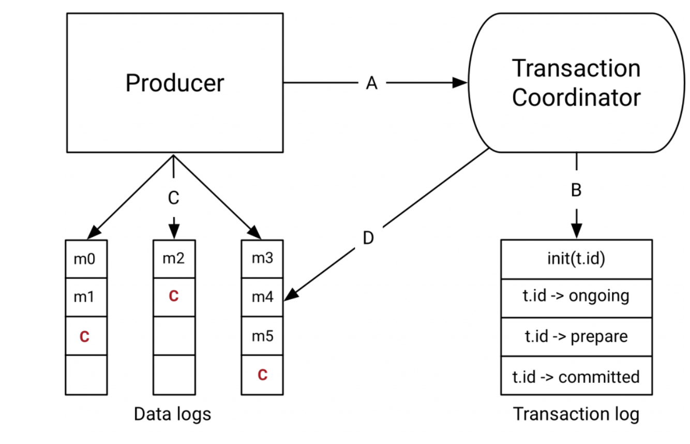

## 왜 트랜잭션인가?
웹 페이지 노출 스트림을 소비하고 웹 페이지당 총 조회 수를 생성하는 애플리케이션은 카운트에서 약간의 오류를 허용할 수 있다.
그러나 이러한 애플리케이션의 인기와 함께 더 강력한 의미론을 갖춘 스트림 처리 애플리케이션에 대한 수요도 증가했다.
예를 들어, 일부 금융 기관에서는 스트림 처리 애플리케이션을 사용하여 사용자 계정의 차변 및 대변을 처리한다.
이러한 상황에서는 처리 오류에 대한 허용 오차가 없기 때문에 모든 메시지가 예외 없이 정확히 한 번만 처리되어야 한다.

정확히 한 번만 처리한다는 것은 스트림 처리 애플리케이션이 메시지 A를 소비하고 메시지 B를 생성하여 B = F(A)가 되는 경우,
B가 성공적으로 생성된 경우에만 A가 소비된 것으로 간주하고 그 반대의 경우도 마찬가지라는 뜻이다.

하지만 바닐라 카프카 생산자와 소비자를 사용하여 스트림 처리 애플리케이션을 최소 1회 전송 의미론에 맞게 구성하면 정확히 1회 처리 의미론을 잃을 수 있다.
producer.send()는 내부 재시도로 인해 메시지 B에 대한 중복 쓰기를 초래할 수 있으며,
입력 메시지 A를 재처리하여 출력에 중복된 B 메시지가 작성되어 정확히 한 번만 처리한다는 의미론을 위반할 수 있다.
또한 분산 환경에서는 애플리케이션이 충돌하거나 더 심각한 경우 시스템의 나머지 부분과의 연결이 일시적으로 끊어져 새로운 인스턴스가 된다.
이때 여러 인스턴스가 동일한 입력 주제를 처리하고 동일한 출력 주제에 쓰면서 중복 출력이 발생하고 정확히 한 번만 처리하는 시맨틱을 위반할 수 있다.
이를 "좀비 인스턴스" 문제라고 부른다.

## 트랜잭션 의미론

### Atomic multi-partition writes

트랜잭션은 여러 개의 카프카 토픽과 파티션에 원자적 쓰기를 가능하게 한다.
트랜잭션에 포함된 모든 메시지가 성공적으로 쓰여질 수도 있고 그렇지 않을 수도 있다.
예를 들어, 처리 중 오류가 발생하면 트랜잭션이 중단될 수 있으며, 이 경우 소비자는 트랜잭션의 어떤 메시지도 읽을 수 없게 된다.

원자적 읽기-처리-쓰기 주기가 활성화되는 방법을 살펴보자.
이 주기는 애플리케이션이 토픽 파티션 tp0의 오프셋 X에서 메시지 A를 소비하고,
메시지 A에 대해 처리를 수행한 후 메시지 B를 토픽 파티션 tp1에 쓰는 경우를 한다.
이 주기는 메시지 A와 B가 함께 성공적으로 소비 및 게시된 것으로 간주되거나 전혀 그렇지 않은 경우에만 원자적이라고 한다.

메시지 A는 오프셋 X가 소비된 것으로 표시된 경우에만 토픽 파티션 tp0에서 소비된 것으로 된다.
이것을 오프셋 커밋이라고 하며, Kafka는 오프셋 커밋을 내부 Kafka 토픽에 기록한다.
메시지는 오프셋이 오프셋 토픽에 커밋된 경우에만 소비된 것으로 간주된다.

따라서 여러 토픽과 파티션에 걸친 원자적 쓰기는 오프셋 커밋을 통해 가능해진다.
오프셋 X를 오프셋 토픽에 커밋하고 메시지 B를 tp1에 쓰는 것은 단일 트랜잭션의 일부가 되므로, 원자적으로 처리한다.

### Zombie fencing
트랜잭션 생산자는 트랜잭션.id라는 고유 식별자를 할당받아야 한다.
이 식별자는 프로듀서 인스턴스를 다시 시작할 때 동일한 프로듀서를 식별하는 데 사용된다.

트랜잭션 API는 트랜잭션 생산자의 첫 번째 작업으로 트랜잭션.id를 Kafka 클러스터에 명시적으로 등록해야 한다고 요구한다.
이렇게 함으로써 Kafka 브로커는 주어진 transactional.id로 열려 있는 트랜잭션을 확인하고 완료할 수 있다.
또한 트랜잭션.id와 연결된 에포크를 시킨다. 에포크는 모든 트랜잭션.id에 대해 저장되는 내부 메타데이터이다.

에포크가 증가하면 트랜잭션 id가 같고 에포크가 오래된 모든 프로듀서는 좀비로 간주되어 차단되며,
해당 프로듀서의 향후 트랜잭션 쓰기가 거부된다. 이렇게 함으로써 좀비 인스턴스 문제를 해결할 수 있다.

### 트랜잭션 메시지 읽기

이제 트랜잭션 메시지를 읽을 때 제공되는 보장에 대해 알아보자.

Kafka 소비자는 트랜잭션이 실제로 커밋된 경우에만 트랜잭션 메시지를 애플리케이션에 전달한다.
다시 말해, 소비자는 진행 중인 트랜잭션의 일부인 트랜잭션 메시지를 전달하지 않으며 중단된 트랜잭션의 일부인 메시지도 전달하지 않는다.

이러한 보장은 원자 읽기에는 미치지 못한다는 점에 유의할 필요가 있다.
특히, 카프카 소비자를 사용하여 토픽의 메시지를 소비할 때, 애플리케이션은 이러한 메시지가 트랜잭션의 일부로 작성되었는지 여부를 알 수 없으므로 트랜잭션이 언제 시작되거나 종료되는지 알 수 없다.
또한 특정 소비자가 트랜잭션의 일부인 모든 파티션에 가입되어 있다는 보장이 없으며, 이를 발견할 방법이 없기 때문에 단일 트랜잭션의 일부였던 모든 메시지가 결국 단일 소비자에게 소비될 것이라고 보장하기 어렵다.

간단히 말해, 카프카는 소비자가 결국 커밋된 트랜잭션 메시지만 전달하도록 보장한다. 진행 중인 트랜잭션의 메시지는 보류하고 중단된 트랜잭션의 메시지는 필터링한다.

## Java의 트랜잭션 API

트랜잭션 기능은 서버 측 및 프로토콜 수준의 기능으로 주로 사용되며, Kafka의 트랜잭션 API는 이를 지원하는 모든 클라이언트 라이브러리에서 사용할 수 있다.
Java로 작성된 '읽기-처리-쓰기' 애플리케이션에서 Kafka의 트랜잭션 API를 사용하는 형태는 다음과 같다.

```java
KafkaProducer producer = createKafkaProducer(
  “bootstrap.servers”, “localhost:9092”,
  “transactional.id”, “my-transactional-id”);

producer.initTransactions();

KafkaConsumer consumer = createKafkaConsumer(
  “bootstrap.servers”, “localhost:9092”,
  “group.id”, “my-group-id”,
  "isolation.level", "read_committed");

consumer.subscribe(singleton(“inputTopic”));

while (true) {
  ConsumerRecords records = consumer.poll(Long.MAX_VALUE);
  producer.beginTransaction();
  for (ConsumerRecord record : records)
    producer.send(producerRecord(“outputTopic”, record));
  producer.sendOffsetsToTransaction(currentOffsets(consumer), group);  
  producer.commitTransaction();
}
```
1~5행은 구성을 지정하고 이를 initTransactions API에 등록하여 프로듀서를 설정한다.
producer.initTransactions()가 반환된 후, 동일한 transactional.id를 가진 다른 프로듀서 인스턴스로 시작된 모든 트랜잭션은 닫히고 펜싱된다.

7-10행은 KafkaConsumer가 입력 토픽에서 비트랜잭션 메시지 또는 커밋된 트랜잭션 메시지만 읽어야 한다고 지정한다.
스트림 처리 애플리케이션은 일반적으로 여러 읽기-처리-쓰기 단계로 데이터를 처리하며, 각 단계는 이전 단계의 출력을 입력으로 사용한다.
읽기-커밋 모드를 지정하면 모든 단계에서 정확히 한 번만 처리할 수 있다.

14~21행은 읽기-처리-쓰기 루프의 핵심을 보여준다. 일부 레코드를 소비하고, 트랜잭션을 시작하고, 소비된 레코드를 처리하고, 처리된 레코드를 출력 토픽에 쓰고, 소비된 오프셋을 오프셋 토픽으로 전송하고, 마지막으로 트랜잭션을 커밋하는 것이다.
위에서 언급한 보증을 통해, 오프셋과 출력 레코드가 원자 단위로 커밋될 것임을 알 수 있다.


## 트랜잭션 작동 방식




## 트랜잭션 코디네이터와 트랜잭션 로그

Kafka 0.11.0에서 도입된 트랜잭션 API와 함께의 구성 요소는 다이어그램의 오른쪽에 위치한 트랜잭션 코디네이터와 트랜잭션 로그이다.

트랜잭션 코디네이터는 모든 Kafka 브로커 내에서 실행되는 모듈로, 트랜잭션 처리를 조정한다.
트랜잭션 로그는 카프카의 내부 토픽으로, 각 코디네이터는 트랜잭션 로그의 일부 파티션을 소유하게 된다.
이때, 각 transactional.id는 간단한 해싱 함수를 통해 트랜잭션 로그의 특정 파티션에 매핑되어 정확히 하나의 코디네이터가 해당 트랜잭션 아이디를 소유하게 된다.

이런 방식으로 Kafka의 견고한 복제 프로토콜과 리더 선출 프로세스를 활용하여 트랜잭션 코디네이터가 항상 사용 가능하고 모든 트랜잭션 상태가 내구성 있게 저장되도록 보장한다.

트랜잭션 로그에는 트랜잭션의 최신 상태만 저장되며, 트랜잭션의 실제 메시지는 저장되지 않는다.
메시지는 실제 토픽 파티션에만 저장되고, 트랜잭션은 여러 상태 중 "진행 중", "커밋 준비 중", "완료됨" 등의 상태에 있을 수 있다.
트랜잭션 로그에는 이러한 상태와 관련된 메타데이터만 저장된다.

## 데이터 흐름

데이터 흐름은 크게 네 가지 유형으로 나눌 수 있다.

A: 생산자와 트랜잭션 코디네이터의 상호작용으로 실행되는 트랜잭션 과정

- initTransactions API를 통해 생산자가 트랜잭션 코디네이터에게 트랜잭션 ID를 등록한다
이때, 코디네이터는 해당 트랜잭션의 보류 중인 트랜잭션을 모두 종료하고 에포크를 업데이트하여 좀비를 차단한다. 이 작업은 프로듀서 세션당 한 번만 발생한다.
- 프로듀서가 트랜잭션에서 처음으로 파티션에 데이터를 전송하려고 할 때, 해당 파티션이 코디네이터에 먼저 등록된다.
- 애플리케이션이 commitTransaction 또는 abortTransaction을 호출하면 코디네이터에게 2단계 커밋 프로토콜을 시작하도록 요청한다.

B: 코디네이터와 트랜잭션 로그가 상호작용하는 트랜잭션 과정에서, 프로듀서는 위의 요청을 통해 코디네이터의 트랜잭션 상태를 업데이트 한다.
트랜잭션 코디네이터는 자신이 소유한 각 트랜잭션의 상태를 메모리에 보관하고, 트랜잭션 로그에 해당 상태를 기록한다(세 가지 방법으로 복제되므로 내구성이 있음).

C: 대상 토픽 파티션에 데이터를 쓰는 프로듀서는 코디네이터와 트랜잭션에 새 파티션을 등록한 후, 정상적으로 실제 파티션에 데이터를 전송한다.
이때, 몇 가지 추가 유효성 검사를 통해 생산자가 펜싱되지 않았는지 확인한다.

D: 토픽-파티션 상호작용에 대한 코디네이터 프로듀서의 커밋(또는 중단)이 시작되면, 코디네이터는 2단계 커밋 프로토콜을 시작한다.

첫 번째 단계에서 코디네이터는 내부 상태를 "prepare_commit"으로 업데이트하고 트랜잭션 로그에 이 상태를 업데이트한다.
이 작업이 완료되면 트랜잭션은 무슨 일이 있어도 커밋이 보장된다.

그런 다음 코디네이터는 트랜잭션의 일부인 토픽 파티션에 트랜잭션 커밋 마커를 기록하는 2단계를 시작한다.

이러한 트랜잭션 마커는 애플리케이션에 노출되지는 않지만, 읽기_커밋 모드의 소비자가 중단된 트랜잭션에서 메시지를 필터링하고 열려 있는 트랜잭션의 일부인 메시지(즉, 로그에는 있지만 트랜잭션 마커가 연결되어 있지 않은 메시지)를 반환하지 않기 위해 사용된다.

마커가 작성되면 트랜잭션 코디네이터가 트랜잭션을 "완료"로 표시하고 생산자는 다음 트랜잭션을 시작할 수 있다.

## 실제 트랜잭션
이제 트랜잭션의 의미와 작동 방식을 이해했으므로 트랜잭션을 활용하는 애플리케이션 작성의 실제 측면에 주목해보자.

트랜잭션 ID를 선택하는 방법은 좀비를 차단하는 데 중요한 역할을 한다.
그러나 프로듀서 세션 전반에서 일관성을 유지하면서 좀비를 적절히 차단하는 식별자를 유지하는 것은 약간 까다로운 작업이다.

좀비를 적절히 차단하기 위한 핵심은 읽기-프로세스-쓰기 주기의 입력 토픽과 파티션이 주어진 트랜잭션 ID에 대해 항상 동일한지 확인하는 것이다.
그렇지 않으면 일부 메시지가 트랜잭션에서 제공하는 펜싱을 통해 유출될 수 있다.

예를 들어, 분산 스트림 처리 애플리케이션에서 토픽 파티션 tp0이 원래 트랜잭션 ID T0에 의해 처리되었다고 가정해보자.
나중에 어느 시점에 트랜잭션이 다른 생산자에게 매핑될 수 있다면, T0과 T1 사이에는 펜싱이 존재하지 않게 된다.
따라서 tp0의 메시지가 재처리되어 정확히 한 번만 처리한다는 보장을 위반할 수 있다.

실제로는 입력 파티션과 트랜잭션 ID 사이의 매핑을 외부 저장소에 저장하거나 정적 인코딩을 해야한다.
Kafka Streams는 이 문제를 해결하기 위해 후자의 접근 방식을 선택한다.

## 트랜잭션의 성능 및 조정 방법

트랜잭션은 적당한 수준의 쓰기 증폭만 유발한다. 추가 쓰기는 다음과 같은 이유 때문이다.

- 각 트랜잭션마다 코디네이터에 파티션을 등록하기 위한 추가 RPC가 필요하다. 이는 일괄 처리되므로 트랜잭션의 파티션 수보다 RPC 수가 적다.
- 트랜잭션을 완료할 때, 트랜잭션에 참여하는 각 파티션에 하나의 트랜잭션 마커를 기록해야 한다.
트랜잭션 코디네이터는 동일한 브로커에 바인딩된 모든 마커를 단일 RPC에서 일괄 처리하므로 RPC 오버헤드를 절약할 수 있지만, 트랜잭션의 각 파티션에 대한 추가 쓰기를 피할 수는 없다.
- 마지막으로 트랜잭션 로그에 상태 변경 사항을 기록합니다.
여기에는 트랜잭션에 추가된 각 파티션 배치에 대한 쓰기, "prepare_commit" 상태, "complete_commit" 상태가 포함된다.
오버헤드는 트랜잭션의 일부로 기록되는 메시지 수와는 무관하다. 따라서 처리량을 높이려면 트랜잭션당 더 많은 수의 메시지를 포함시키는 것이 핵심이다.
실제로 최대 처리량으로 1KB 레코드를 생성하는 프로듀서의 경우, 100ms마다 메시지를 커밋하면 처리량이 3%만 저하된다.
더 작은 메시지나 더 짧은 트랜잭션 커밋 간격은 더 심각한 성능 저하를 초래할 수 있다.

트랜잭션 기간을 늘릴 때의 주요 단점은 엔드 투 엔드 지연 시간이 증가한다는 것이다.
트랜잭션 메시지를 읽는 소비자는 진행 중인 트랜잭션의 일부인 메시지를 전달하지 않는다는 것을 유의하자.
따라서 커밋 사이의 간격이 길어질수록 소비 애플리케이션이 더 오래 기다려야 하므로 엔드투엔드 지연 시간이 증가한다.

## 트랜잭션 소비자의 성능

트랜잭션 소비자는 생산자보다 훨씬 간단하다.

- 중단된 트랜잭션에 속한 메시지를 필터링한다.
- 진행 중인 트랜잭션의 일부인 트랜잭션 메시지를 반환하지 않는다.

따라서 트랜잭션 소비자는 read_committed 모드에서 트랜잭션 메시지를 읽을 때 처리량 저하가 나타나지 않는다.
이 주된 이유는 트랜잭션 메시지를 읽을 때 제로 카피 읽기를 보존하기 때문이다.

또한, 소비자는 트랜잭션이 완료될 때까지 기다리기 위해 버퍼링을 할 필요가 없다.
대신 브로커는 미체결 트랜잭션이 포함된 오프셋으로 진행하는 것을 허용하지 않는다.

## 결론
읽기-처리-쓰기 주기를 고려할 때, 이 게시물에서는 주로 읽기 및 쓰기 경로를 다루었으며 처리 자체는 블랙박스에 해당된다.
사실 처리 단계에서 수행할 수 있는 작업은 매우 많기 때문에 트랜잭션 API만으로는 정확한 1회 처리를 보장할 수 없다.
예를 들어, 처리가 다른 스토리지 시스템에 부작용을 일으키는 경우, 여기서 다루는 API로는 정확한 1회 처리를 보장하기에 충분하지 않다.

## 참조

[https://www.confluent.io/blog/transactions-apache-kafka/](https://www.confluent.io/blog/transactions-apache-kafka/)