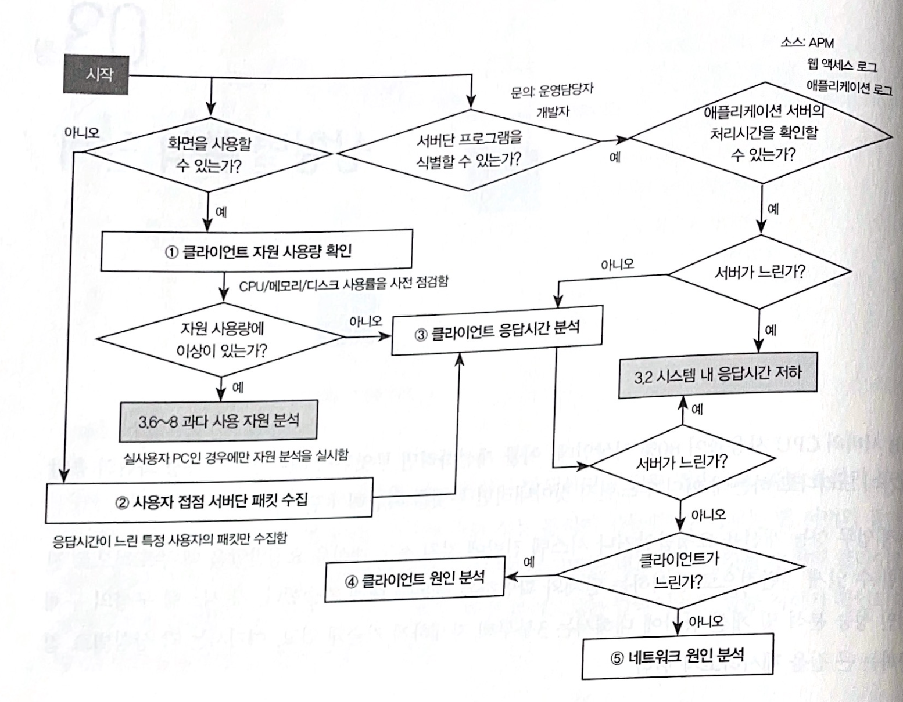
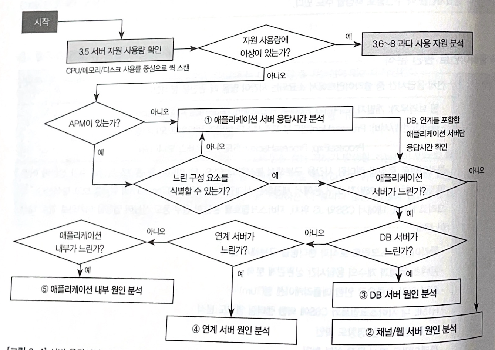
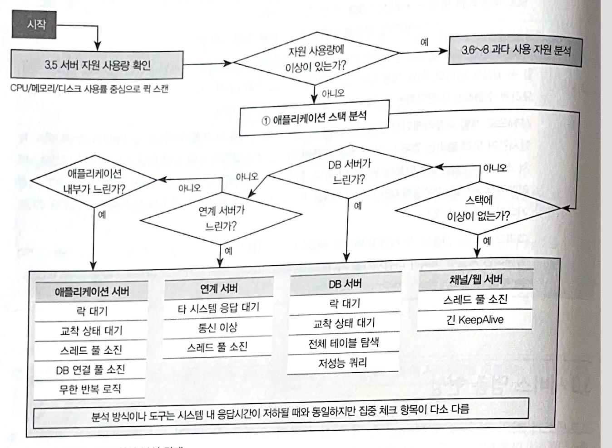
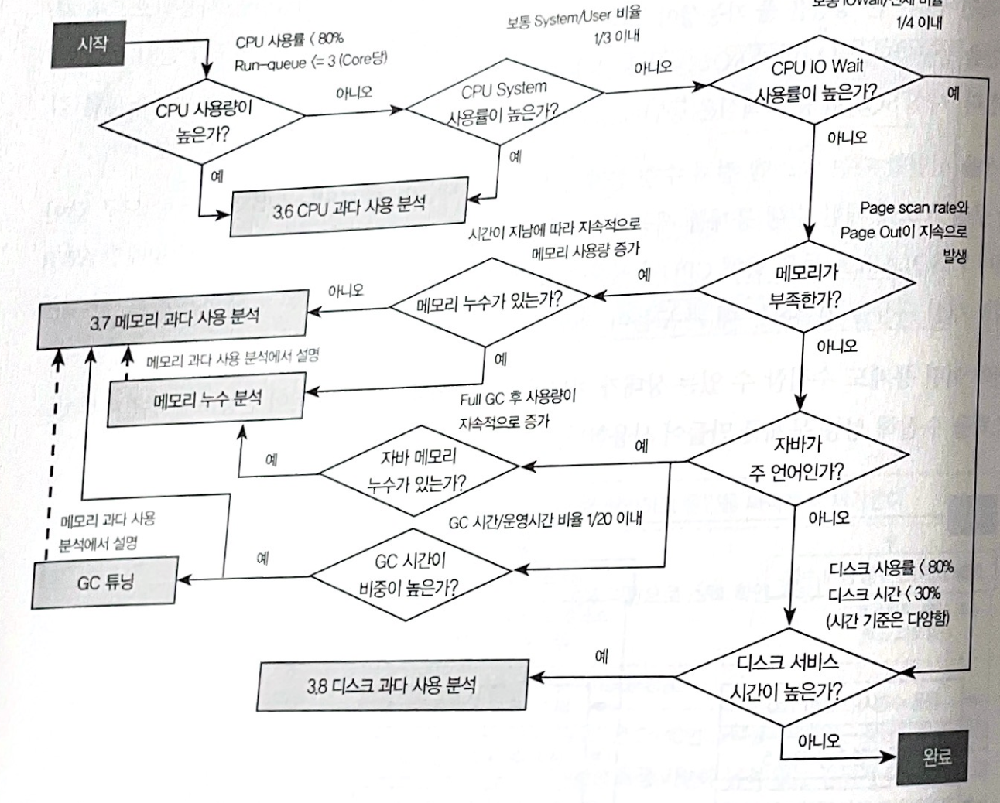
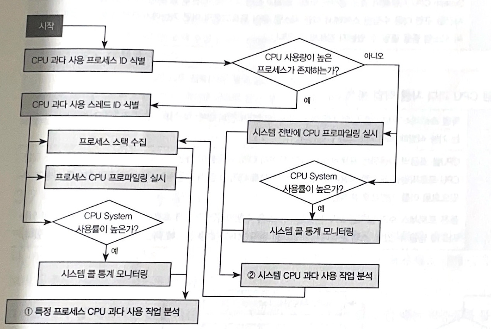
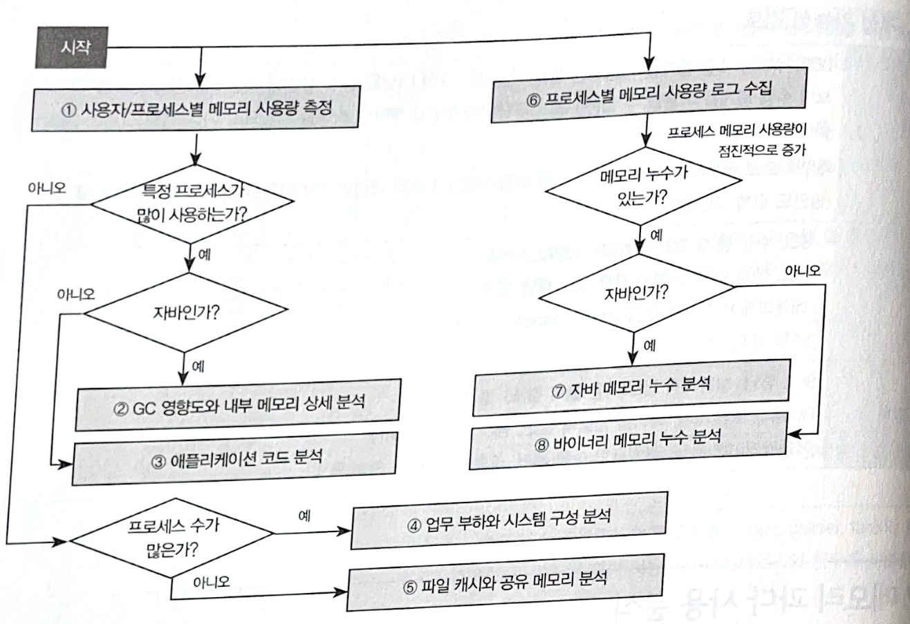
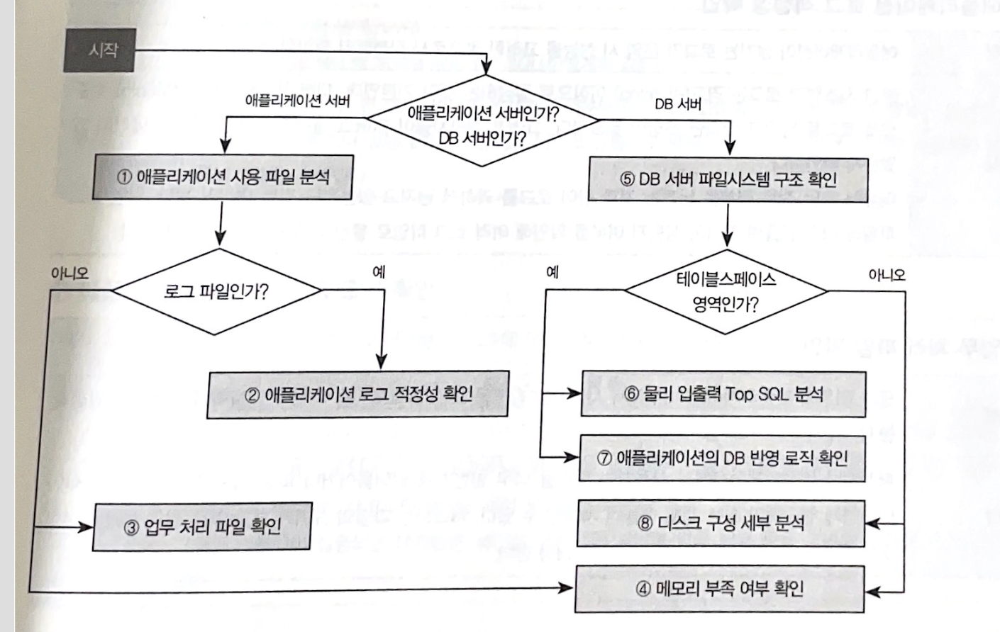

## 1장. 기본 자세

- 적극적이고 도전적인 자세를 갖춰라
- 다른 사람의 설명과 의견에 귀 기울여라
- 종합적인 시각을 가져라
- 실행하고 비교하라

<!-- more -->

## 2장. 성능 분석 시작하기

- 클라이언트부터 시작해 웹 서버, 애플리케이션 서버, DB 서버 등 여러 서버를 거쳐서 동작한다.
- 이런 구성에서 성능 저하가 발생했을 땐 네트워크를 기준으로 각 서버가 전체 응답시간에서 차지하는 비중을 분석해 영향도가 큰 집중 분석 대상을 선정하는 것 이다.
- 성능이 저하됐을 때 처리 지연이 발생한 위치가 대부분 시스템 내부인 경우가 많기 때문에 내부 처리시간이 사용자 체감 응답시간과 차이가 있는지 확인하는 것이 우선이다.

### 2.1 애플리케이션 서버 응답시간 분석

- 애플리케이션 서버 내부에서 세분화된 응답시간을 얻는 방법에는 세 가지가 있다.
  - **APM**
    - 가장 손쉽게 직관적인 데이터 수집이 가능, 단 프로파일링 설정이 많으면 APM 자체가 성능 저하의 원인이 되기도 한다.
  - **스택 수집**
    - 주기적으로 스택을 수십 회 이상 수집해서 분석하는 방법
    - 현재 통신 소켓을 읽거나 쓰고 있는 스택 하위에 있는 연계 인터페이스 메서드를 식별해 각 구성 요소 응답시간 비중을 분석할 수 있다.
  - **프레임워크 로깅**
    - 프레임워크 내부에서 각 구성 요소에서 소요된 처리시간을 서비스 요청 단위로 로깅하는 기능을 포함시키는 것이다.

### 2.2 클라이언트 응답시간 분석

- 클라이언트단 단에서 사용자 응답시간을 분석할 때 다음과 같이 나눠서 분석한다.
  - **클라이언트 처리시간, 네트워크 처리시간, 서버 처리시간 (+ DNS 룩업시간)**

## 3장. 상황별 분석 단계

### 3.1 화면 응답시간 저하

1. **클라이언트의 자원 사용량 확인**
  - 클라이언트 PC의 주요 자원이 화면을 테스트하는 데 영향을 줄 가능성이 있는지 확인한다.
  - 프로세스, 프로세스해커 등
2. **사용자 접점 서버단 패킷 수집**
  - 성능 저하가 특정 사용자에게 발생하지만 사용자 PC에서 직접 모니터링이 불가능한 경우 서버단에서 클라이언트 응답시간을 분석하기 위해 패킷을 수집한다.
  - tcpdump, 와이어샤크 등
3. **클라이언트 응답시간 분석**
  - 클라이언트 응답시간을 클라이언트, 네트워크, 서버 세 구간으로 나눠서 분석한다.
4. **클라이언트 원인 분석**
  - 클라이언트에서 소요되는 시간이 많은 경우 원인을 분석한다.
  - 클라이언트 스크립트 로직과 렌더링을 구분해서 분석
  - 콘텐츠 유형과 응답시간 상관관계 분석
  - 화면 처리 흐름으로 인한 애플리케이션 턴 수
  - HTML 내 자바스크립트와 CSS에 의한 렌더링 영향도 분석
  - 클라이언트 로킹 영향도 확인
  - 클라이언트 캐시 동작 여부 확인
  - 콘텐츠 구성 방식과 크기
5. **네트워크 원인 분석**
  - 전체 응답시간 중 네트워크에서 소요되는 시간이 많을 때 원인을 분석한다.
  - 전송 데이터 : 전송 데이터 크기, 콘텐츠 수, 전문 형태, 압축 여부
  - 통신 방식 : 프로토콜 네트워크 연결 유지 및 연결 수, 네트워크 턴 수
  - 통신 품질 : 패킷 왕복시간, 재전송, 전송 대역폭

### 3.2 시스템 내 응답시간 저하

1. **애플리케이션 서버 응답시간 분석**
  - 서버 내 애플리케이션 프로세스를 대상으로 스택을 분석한다.
  - 예를 들어 사용자 요청을 처리 중인 스택이 총 100개이고 그중 64개가 SQL을 수행 중이고, 20개가 로그 라면 SQL은 65%, 로깅은 20% 비중을 차지하고 있다고 불 수 있다.
  - 클라이언트 응답이 느린데 애플리케이션 서버 응답이 빠르다면 채널단이나 웹 서버가 느린것으로 판단할 수 있다.
2. **채널/웹 서버 원인 분석**
  - 웹 서버에서 애플리케이션 서버로 작업을 즉시 넘기지 못하는 원인을 찾는다.
  - 서비스 스레드 부족 같은 병목 발생 여부를 확인하고, 웹 서버와 애플리케이션 서버 간 인터페이스 항목과 방식에 대해 분석을 진행한다.
    - 병목발생 : 큐잉 여부, 작업 중인 스레드 수, 접속 클라이언트 수, 웹 KeepAlive 여부와 설정 시간
    - 인터페이스 : 웹 서버와 애플리케이션 서버 간 동작 분석, 콘텐츠 유형별 서비스 담당 서버 확인, 일부 애플리케이션 서버가 비정상적으로 동작할 경우 웹 서버 서비스 분해 확인
  - netstat, jstack, pstack 등
3. **DB 원인 분석**
  - SQL 응답시간이 느린 원인을 분석한다.
  - 락 대기 유무, 실행계획, 수행 통계를 바탕으로 원인 분석
  - 동작 중인 세션 : 현재 SQL을 수행 중인 세션의 상태(대기 이벤트)
  - 락 대기 : 수행 중인 SQL 간 락 영향도를 확인(락 트리)
  - 실행계획 : 저성능 SQL의 실행계획 및 실행 통계 확인
  - 수행 통계 : DB 운영 통계
4. **연계 서버 원인 분석**
  - 타 시스템 서비스를 호출하므로 이를 내부와 외부로 구분해 처리시간을 측정하는 것
5. **애플리케이션 내부 원인 분석**
  - 애플리케이션 내부 코드에서 발생한 성능 저하 원인을 분석할 때는 수집된 스택이 핵심 자료다.
  - 병목 빌셍 : 스레드 풀, DB 연결 풀 상태(부족 여부 확인)
  - 불필요한 작업 : 로깅과 모니터링, 환경 반복 로딩 등
  - 비효율적인 로직 : 업무 로직, 탐색 로직, 날짜/수치 연산 로직, 문자열 처리 로직
  - SQL 수행 패턴 분석 : 서비스당 SQL 수행 유형과 횟수, 바인딩 변수를 기준으로 한 반복 수행 여부 분석
  - SQL 수행로그, jstack, pstack, SDPA(분석)

### 3.3 서비스 멈춤 현상

- 프로세스가 멈춘 상태로 더 이상 사용자 요청을 처리하지 못하는 경우에도 자원 부족 여부를 먼저 확인한 후 애플리케이션 상태를 확인한다.
- 서버 자원은 CPU 사용량과 메모리 스와핑 여부를 확인한다.
- DB 서버는 데이터 캐시 영역이 스왑 영역으로 내라가면 급격한 성능 저하가 발생한다.
- 자바 프로세스는 연속 Full GC로 인해 멈춤 상태에 있을 수도 있으므로 GC 상태를 모니터링해야 한다.
- 자원에 문제가 없다면 애플리케이션 스택을 분석한다.
  - 락 영향도와 현재 수행중인 기능
  - 작업 스레드 소진 등

### 3.4 시스템 전반에 걸친 성능 개선

- 전체 수행시간이 긴 애플리케이션과 SQL이 시스템 자원을 가장 많이 사용한다고 볼 수 있기에 개선 효과도 크게 나ㅏ난다.
- 애플리케이션과 SQL 모두 수행 빈도와 총 수행시간이라는 두 가지 측면에서 비중이 가장 높은 것부터 개선 가능성을 검토한다.
  - 응용 수행시간 총합 Top 10
  - 응숑 수행 횟수 Top 10
  - SQL CPU 사용 총합 Top 10
  - SQL 수행시간 총합 Top 10

### 3.5 서버 자원 사용량 확인

### 3.6 CPU 과다 사용 분석

1. **특정 프로세스 CPU 과다 사용 작업 분석**
  - 특정 프로세스가 CPU를 많이 사용하게 만드는 기능과 소스코드를 식별해 개선 가능성을 검토한다.
2. **시스템 CPU 과다 사용 작업 분석**
  - CPU를 조금씩 사용하는 프로세스가 많이 모여서 CPU 사용률이 높은 경우에는 perf, caliper 와 같은 CPU 프로파일링 도구를 사용해 시스템 전반적으로 CPU를 많이 사용하는 라이브러리 함수를 식별할 수 있다.
3. **SQL 개선 가능성 검토**
  - SQL 튜닝 : 실행계획 검토(사용 블록 감소), 통계 생성
  - DB 튜닝 : DB 캐시, 테이블 입출력 분산, 동시 트랜잭션 확대
  - 애플리케이션 튜닝 : 불필요한 수행 제거, 조회 결과 캐시, SQL 통합
  - 오렌지 같은 SQL 튜닝 도구

### 3.7 메모리 과다 사용 분석

### 3.8 디스크 과다 사용 분석

## 4.개선 방향성

- 병렬/분산 처리
- 비동기 처리
- 캐시
- 집합 처리
- 오버헤드 제거
- 경합 제거
- SQL 개선
- 송수신 효율화
- 자원 사용 효율화
- 물리적인 자원 증설