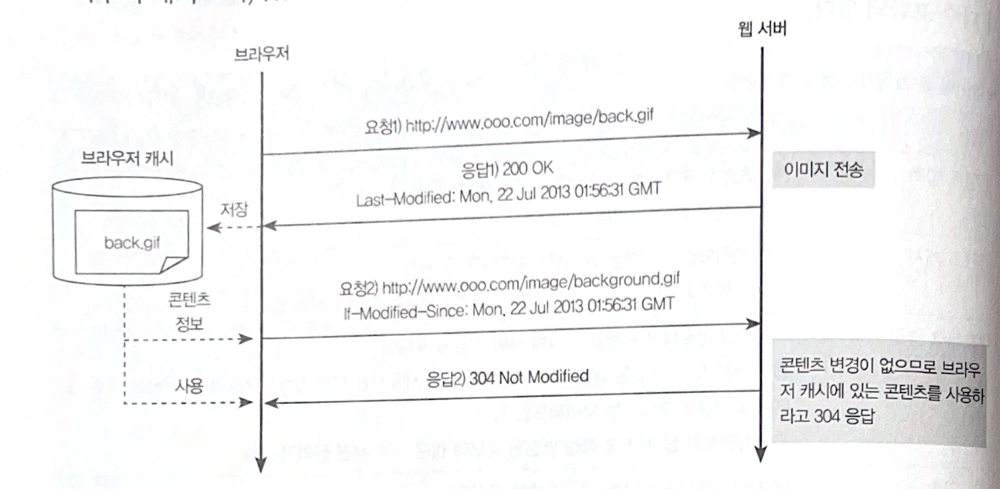
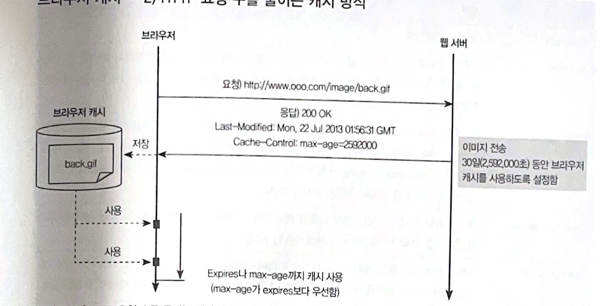

## 1. 기본 방향

## 2. HTTP의 이해

### 2.1 프로토콜 구조

- 기본적으로 클라이언트 서버 간에 요청과 응답이 1:1 구조를 띠고 있다.
- HTTP 요청/응답 모두 헤더와 본문으로 구성돼 있다.

<!-- more -->

### 2.2 HTTP 요청

- 요청은 헤더와 본문으로 나뉘고, 헤더는 다시 요청 라인과 MIME 헤더로 나뉜다.
- **요청 헤더**

```jsx
// 요청 라인
POST /board/new.jsp HTTP1.1

// MIME 헤더
Accept: image/jpeg, 
Accept-Language: ko-KR
User-Agent: Mozilla/4.0
Accept-Encoding: gzip, deflate
Connetion: Keep-Alive
Host: www.lgcns.com
Cookie: .lgcns.eh.......
```

- 요청 방식으로는 8가지가 있다.
  - `GET`, `POST`, `HEAD`, `DELETE`, `TRACE`, `OPTIONS`, `PUT`, `CONNECT`
- 요청 라인에는 URI 정보가 들어있다. `(/board/new.jsp)`
  - URI는 웹 서버에서 대상을 유일하게 인식할 수 있는 주소로서 콘텐츠의 위치와 명칭을 가르킨다.
- HTTP 버전으로는 `1.1`, `1.0` 등이 있다.

#### MIME 헤더

- 원래 전자우편의 인코딩 방식을 설명하는 표준 포맷이다.
- MIME 헤더 정보는 `“명칭: 값”` 형태로 이루어져 있다.
- HTTP 공통 MIME 헤더

| 헤더 | 설명 |
| --- | --- |
| Cache-Control | 캐시가 동작하는 조건을 지정하는 지시문이다. |
| Connection | 클라이언트 웹 서버 간 네트워크 연결 시에 대한 Keepalive 여부를 지정한다. |
| Date | 현재의 날짜와 시간을 표시 |
| Progma | 프락시에 대한 지시문으로 웹 서버에서는 무시된다. |

- HTTP 요청 전용 MIME 헤더

| 헤더 | 설명 |
| --- | --- |
| Accept | 응답으로 받을 수 있는 MIME 타입을 지정한다. */*는 모든 타입이 가능하다는 것을 의미 |
| Accept-Encoding | 클라이언트가 받을 수 있는 본문 인코딩 형태를 지정 |
| Accept-Language | 클라이언트가 우선적으로 지원하는 언어를 지정 |
| Authorization | URI에 클라이언트가 데이터에 접근할 수 있는 권한을 제공한다.
| Cookie | 서버에서 설정한 소량 데이터가 사용자 PC에 저장되어 요청 간에도 해당 데이터를 서버 측면에서 공유할 수 있는 기능을 수행한다. |
| Host | 호스트명과 URI의 포트 번호로 구성된다. |
| If-Modified-Since | URI가 이미 클라이언트 캐시에 있는 경우 해당 콘텐츠의 수정 시간을 서버에 보내서 웹 서버에서 클라이언트 캐시에 있는 콘텐츠 사용 여부를 판단할 수 있게 한다. |
| If-Unmodified_Since | If-Modified-Since와 반대로 동작한다. |
| If-Match | 존거부로 요청하는 것을 의미하며, 특정 Entity tags와 매치되게 한다. |
| If-None-Match | If-Match와 반대로 동작한다. |
| Referer | 요청된 URI를 참조하는 문서의 URI를 전달한다. |
| Range | 요청된 URI에 해당하는 콘텐츠 전체를 받지 않고 범위를 지정해 일부분만 받을 때 사용한다. |
| User-Agent | 클라이언트 브라우저에 대한 식별 정보를 전송한다. |

- 본문

```bash
board_id=12&op=list&index=1
```

### 2.3 HTTP 응답

- HTTP 응답은 헤더와 본문으로 나뉘고, 헤더는 다시 응답 라인과 MIME 헤더로 나뉜다.

### 2.4 데이터 송수신

- HTTP에서는 요청/응답에 본문이 없는 경우 `CRLF`가 2번 연속 반복될 때까지 전문을 읽으면 된다.
- 본문이 있는 경우에는 `Context-Length`나 `Chunked` 방식에 따라 본문 크기를 확인하고 데이터를 읽어낸다.

#### Context-Length 방식

- 헤더인 `Context-Length`에 본문의 크기를 바이트 단위로 기록해서 수신 측에서 본문의 크기를 알 수 있게 하는 방식이다.
- HTTP 헤더 정보를 만드는 시점에 본문 전체 크기를 알 수 있을 때 사용한다.

```bash
Content-Encoding: gzip
Content-Length: 14949 // 본문의 크기는 14949 바이트
```

#### Chunked 방식

- Chunked 방식은 HTTP 헤더인 Transfer-Encoding이 Chunked 값을 가지고 있다.
- HTTP 헤더 생성 시점에 본문의 크기를 알 수 없을 때 사용하는 방식이다.

```bash
// 헤더
Transfer-Encoding: chunked

// 본문
27B // 서브 블록 크기
{"status": N .... }
2B0 // 서브 블록 크기
....
0 // 블록의 마지막
```

## 3. 화면 응답시간 모니터링

### 3.1 화면 응답시간 모니터링 도구

- Fiddler, Dynatrace AJAX Edition, HttpWatch, FireBug, IE 개발자 도구, 크롬 개발자 도구 등

### 3.2 인터넷 익스플로러 프로파일링

### 3.3 피들러

### 3.4 HTTP 분석 접근

- 화면 응답시간이 Timeline 내에서 표시된 요청의 처리시간과 일치하는지 확인한다.
- Timeline 중 특별히 처리시간이 긴 요청이 존재하는지 확인한다.
- 각 요청에 대한 처리시간은 짧지만 요청 수 자체가 많아서 응답시간이 오래 걸리는지 확인한다.
- Timeline 상에서 요청 처리 중간 중간 처리가 없이 비어있는 긴 시간이 있는지 확인한다.
  - 중간의 빈 부분은 자바스크립트를 로딩하거나 수행하는 시간일 확률이 높다.
- 요청 목록에서 응답 코드가 200인지 304 Not Modified인지 확인해 캐시가 정상적으로 동작하는지 확인한다.
- 전체가 200 OK일 때의 전체 페이지 크기와 개별 요청의 콘텐츠 크기를 확인한다.

## 4. 웹 기반 시스템 성능 개선

### 4.1 화면 콘텐츠 구성

- 웹도 동적 컨텐츠나 서블릿 같은 애플리케이션 처리시간이 느린 경우가 많지만 이미지나 자바스크립트, CSS 같은 정적 콘텐츠 수가 많거나 크기나 커서 느린 경우도 있다.
- 화면 콘텐츠 구성 측면에서 접근하는 성능 개선은 크게 두 가지로 나뉜다.
  - 화면을 좀 더 간경하게 구성하거나 콘텐츠를 통합함으로써 콘텐츠 수를 줄인다.
  - 콘텐츠 크기를 줄임으로써 네트워크 전송시간을 개선하고 화면이 빠르게 로딩될 수 있게 한다.

#### 4.1.1 콘텐츠 수 축소

- 화면을 구성하는 콘텐츠 수가 많을수록 브라우저와 서버 간에 순차적으로 다운로드 하는 애플리케이션 턴이 많이 발생하여 성능 저하를 유발한다.
- 화면별 요청 수가 많을수록 응답 시간이 느리다.
  - 이미지를 이용한 화면 구성 최소화
    - 이미지 대신 CSS를 활용한다.
  - 맵을 이용한 URL 구성
    - 메뉴마다 개별 이미지를 사용하는 대신 한 개의 통합 이미지를 사용한다.
  - 이미지 스프라이트
    - 한 이미지 파일에 있는 여러 이미지를 개별 이미지 형태로 사용한다.
  - 자바 스크립트 통합
    - 자바스크립트 파일을 통합해 파일의 수를 줄임으로써 성능을 개선한다.
  - 사용하지 않는 콘텐츠 제거
    - CSS나 자바스크립트에서 화면마다 사용되지 않는 부분은 제거하여 최적화한다.

#### 4.1.2 크기별 이미지 준비

- 큰 이미지를 작은 이미지로 변환하는 오버헤드로 CPU 자원과 시간이 소요된다.
- 사진 목록 처럼 작은 이미지를 보여줄ㄷ 때는 해당 크기에 맞는 섬네일을 별로도 준비한다.

#### 4.1.3 이미지 콘텐츠 파일의 크기 축소

- 파일 크기가 큰 이미지를 사용하기보다 품질을 조정해서 크기를 줄일 이미지를 사용한다.

#### 4.1.4 CDN 사용

- CDN은 웹 서비스 제공자가 웹 서버에 있는 정적 컨텐츠를 인터넷 서비스 제공자 측에 설치된 CDN 서버에 미리 저장해두고 사용자에게 최적 경로로 컨텐츠를 제공하는 기술이다.
- 예를 들어, 사용자가 어떤 이미지를 다운로드 하기위해서는 서버 도메인명으로 IP 주소를 조회해 해당 서버로 접속하는 네트워크 연결이 선행돼야 한다.
- CDN을 이용하면 IP 주소 조회 서비스를 제공하는 대신 DNS 서버가 사용자가 위치한 지역에 가장 근접한 CDN 서버의 IP 주소를 보내준다.
- 동적 컨텐츠 역시 동일한 도메인을 사용하게 되면 CDN을 경유하게 되므로 동적 컨텐츠, 정적 컨텐츠 도메인을 분리해야 한다.

#### 4.1.5 텍스트 콘텐츠의 크기 축소

- 자바스크립트나 CSS 같은 텍스트 컨텐츠를 정리해서 크기를 줄여주는 도구를 사용한다.

#### 4.1.6 압축 적용

- 압축은 CPU 위주의 작업이기 때문에 웹 서버 자원에 여유가 있고 전체 응답시간에서 네트워크가 자치하는 비중이 높은 경우에 사용하는 것이 바람직하다.
- 압축 동작은 브라우저가 처리할 수 있는 압축 방식을 요청 헤더에 `Accept-Encoding: gzip, deflate`와 같이 담아서 서버로 전송한다.
- 아파치, nginx 등 범용 웹 서버에서는 모두 지원한다.

#### 4.1.7 웹 가속기

- 웹 가속기는 웹 서버 앞에 위치해 사용자 브라우저와의 통신을 최적화하는 역활을 수행한다.
  - 콘텐츠 압축
  - 콘텐츠 캐시
  - 네트워크 연결 관리
  - SSL 가속


### 4.2 캐시 동작

#### 4.2.1 브라우저 캐시

- 브라우저 캐시는 HTTP 응답 크기를 줄이는 방식과 HTTP 요청 수를 줄이는 방식이 있다.

#### HTTP 응답 크기를 줄이는 캐시 방식



- 정적 콘텐츠에 대해 HTTP 요청을 하면 웹 서버는 응답시 `Last-modified` 헤더 속성에 콘텐츠의 변경일자를 내려보낸다.
- 이후 동일한 콘텐츠에 대해 브라우저가 HTTP 요청을 할 때는 브라우저 캐시에 저장된 해당 콘텐츠의 변경일자 정보를 `If-Modified-Since` 속성에 붙여서 웹 서버로 보낸다.
- 웹 서버는 콘텐츠의 변경일자와 브라우저에 있는 콘텐츠 변경일자를 비교해 동일한 콘텐츠이면 브라우저 캐시를 사용하고 그렇지 않으면 새 콘텐츠를 다운로드 한다.

#### HTTP 요청 수를 줄이는 캐시 방식



- HTTP 요청 수를 줄이는 방식은 `Cache-Control` 속성을 이용해 HTTP 요청 자체를 하지 않도록 줄이는 방식이다.
- `Cache-Control` 의 max-age 설정을 통해 응답디 내려간 이후 일정 시간(max-age:초) 동안 서버에 HTTP 요청 자체를 하지 않게 할 수 있다.
- HTTP 요청 수 자체를 줄여서 성능 개선 효과는 크지만 해당 콘텐츠가 변경되더라도 일정 시간 동안은 갱신할 수 없다는 문제가 있다.

### 4.3 병렬/비동기 처리

#### 4.3.1 네트워크 연결 증가

- 브라우저는 한 페이지 내에서 한 도메인에 대해 네트워크 연결 개수가 제한돼 있다.
- 따라서 콘텐츠를 동시에 내려받을 수 있는 병렬 처리 갯수에 한계가 있다.
- 동일한 웹 서버에 대해 2개의 도메인을 구성하면 두 배까지 열 수 있다.
- 하지만 웹 서버 내 작업 스레드를 증가시켜 스레드 부족을 유발할 수 있으므로 스레드 수 설정을 증가시킬 필요가 있다.

#### 4.3.2 AJAX와 DOM을 이용한 비동기 처리

- AJAX와 DOM을 효과적으로 이용하면 서버 부하 감소뿐 아니라 클라이언트 측면의 성능 개선도 가능하다.
- **화면 내 일부분을 비동기 처리**
  - 통계 정보처럼 서버 처리시간이 길어지면 화면 전체가 늦게 완성됨으로써 성능 저하가 발생한다.
  - 해당 부분을 AJAX로 별도로 분리해서 비동기적으로 처리하면 응답 시간 개선에 도움이 된다.
- **트랜잭션의 비동기 분리**
  - 예전에는 목록 화면에서 한 건을 삭제하거나 새로 입력하면 목록 전체를 다시 조회해서 변경내역을 확인하는 것이 일반적
  - 현재는 입력, 수정, 삭제 같은 데이터 변경은 AJAX 로 처리하고, 목록에 변경하는 작업은 DOM 처리를 통해 수정한다.

### 4.4 기타 성능 개선

- CSS와 자바스크립트는 병렬 처리를 고려해서 배치한다.
- CSS는 HEAD 태그에 기술한다.
  - 스타일시트가 BODY에 있으면 모든 CSS가 다운로드될 때까지 브라우저는 렌더링을 미룬다.
- HTTP 요청은 하나의 패킷으로 처리한다.
- HTML 안의 CSS와 자바스크립트는 개별 파일로 처리한다.
  - HTML 렌더잉을 지연시켜 성능 저하가 유발된다.
- 이미지는 HTML에 크기를 명시한다.
- HTML의 일부 내용은 먼저 전송되도록 처리한다.
  - 애플리케이션이 완료되기 전에 응답 일부를 HEAD에 CSS나 자바스크립트를 포함시킬 수 있다.
- 애플리케이션 응답시간이 긴 경우 진행표시줄을 사용한다.
- CSS에 `@import`를 사용하지 않는다.

### 4.5 웹 서버 설정

#### 4.5.1 최대 병렬 처리수

- 애플리케이션 서버는 작업 스레드 풀을 필요 이상으로 크게 설정하면 DB 부하가 증가하고 애플리케이션 서버가 낼 수 있는 최대 성능을 넘어서는 동시 처리 요청이 들어오면 TPS는 증가하지 않으면서 응답시간만 증가한다.
- 반면 웹 서버는 CPU 자원에 대한 사용량보다는 네트워크 자원에 의존도가 높다.
  - 네트워크가 허용한다면 작업 스레드 수를 다소 높게 설정하는 편이 안정적이다.
- 웹 서버 스레드 풀 수를 설정할 때는 사용자 당 사용하는 스레드가 1개가 아니라는 점을 고려해야 한다.
- 콘텐츠 수가 많으면 한번에 2~4개까지 웹 서버와 연결을 맺을 수 있다.

#### 4.5.2 Keepalive

- Keepalive 설정을 활성화하면 한 번 연 네트워크 연결을 반복 사용해 콘텐츠를 내려받을 수 있다.
- 대부분 웹 서버에서는 기본적으로 Keepalive 가 활성화돼 있으며, nginx는 75초가 기본값이다.
- Keepalive는 성능 개선 요소지만 경우에 따라 성능을 악화시키는 요소로 작용하기도 한다.
- 아파치 웹 서버의 경우에는 Keepalive된 네트워크 연결 1개당 작업 스레드 1개씩 배정해서 작업한다.
  - 사용자가 다양하고 많은 환경에서 Keepalive를 높게 설정하면 웹 서비스를 처리 중인 스레드 수가 적더라도 Keepalive에 의해 여유 스레드 전체가 특정 사용자에 대해 대기하고 있는 상태가 될 수 있다.
  - 스레드풀에서 놀고 있는 스레드가 많더라도 해당 스레드 모두가 각기 담당하는 사용자 요청을 대기하고 있어 작업 배정이 안될 수 있다.
- Nginx는 이벤트 드리븐 아키텍처로 논블럭킹 입출력을 사용하기 때문에 더 적은 프로세스로도 더 많은 사용자를 처리할 수 있다.

## 5. 웹 서버 모니터링

### 5.1 웹 요청 응답시간 모니터링

- 애플리케이션 서버에 문제가 있었다면 해당 서버에서 서비스하는 URI에 집중적으로 성능 저하나 5xx HTTP 응답 코드가 타난다.
- 웹 서버 마다 처리시간을 액세스 로그에 남기는 방법이 있다.