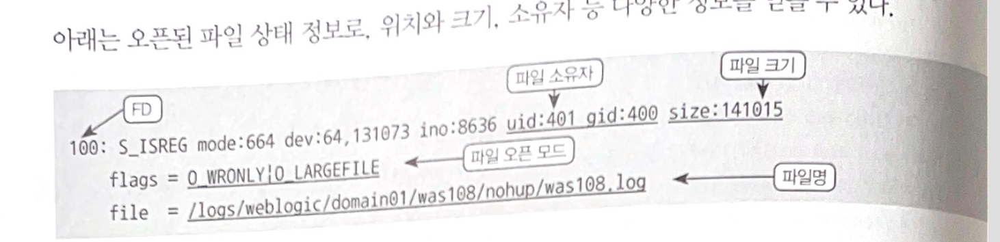
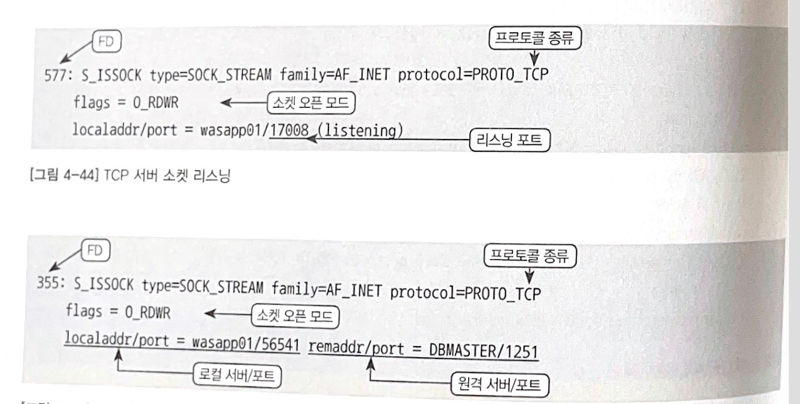

## 4부 - 프로세스 이해하기

## 1. 기본 방향

- 애플리케이션 최적화를 하기 위해서 프로세스의 동작 방식을 이해해야 한다.
- 프로세스 이해에 필요한 기본 지식으로 다음 세 가지가 있다.
  - **수행 중인 코드** : 프로세스가 현재 어떤 함수를 수행하고 있는가?
  - **통신/파일 상태** : 프로세스가 통신으로 연계된 서버는 어디고, 어떤 파일을 열고 있는가?
  - **통신/파일 간 동작 상태** : 연계 서버 또는 파일에 입출력이 얼마나 자주 그리고 오래 이루어지는가?
- 이번 장에서는 운영체제에서 제공하는 분석 명령어를 바탕으로 프로세스의 현재 상태와 동작을 이해하는 법과 개선 하는 방법을 습득한다.

<!-- more -->


## 2. 수행 중인 코드

### 2.1 스택에 대한 이해

- 현재 수행 중인 프로그램이 코드 중 어디를 수행하고 있는지 알고 싶을 때는 해당 프로그램의 스택 정보를 획득하면 알 수 있다.

```bash
leegisu> jstack 12341

Full thread dump OpenJDK 64-Bit Server VM (11.0.12+7-LTS mixed mode):

"http-nio-8080-Acceptor" #28 daemon prio=5 os_prio=31 cpu=0.55ms elapsed=23.70s tid=0x00007ff0a3232000 nid=0x14b03 runnable  [0x000000030b22f000]
   java.lang.Thread.State: RUNNABLE
        at sun.nio.ch.ServerSocketChannelImpl.accept0(java.base@11.0.12/Native Method)
        at sun.nio.ch.ServerSocketChannelImpl.accept(java.base@11.0.12/ServerSocketChannelImpl.java:533)
        at sun.nio.ch.ServerSocketChannelImpl.accept(java.base@11.0.12/ServerSocketChannelImpl.java:285)
        at org.apache.tomcat.util.net.NioEndpoint.serverSocketAccept(NioEndpoint.java:540)
        at org.apache.tomcat.util.net.NioEndpoint.serverSocketAccept(NioEndpoint.java:78)
        at org.apache.tomcat.util.net.Acceptor.run(Acceptor.java:129)
        at java.lang.Thread.run(java.base@11.0.12/Thread.java:829)
```

### 2.2 스택 정보를 이용한 성능 분석

- 스택 정보는 성능 저하나 멈춤 상태에서 프로세스를 분석하는 핵심 정보다.

#### 2.2.1 스택 대기 분석

- `- locked` 면 락을 잡았다는 의미
- `- waiting to lock` 은 다른 스레드가 사용할 락을 잡고 있어 대기하고 있다는 의미

#### 2.2.2 교착상태

#### 2.2.3 스택 성능 분석

### 2.3 스택 수집

- 자바 프로그램의 스택 정보 수집

```bash
jstack [pid] // [JDK HOME]/bin 디렉터리에 있음
kill -3 [pid] // 표준 출력으로 스레드 덤프를 출력
```

- 자바 힙 덤프 설정
  - 자바 프로세스에서 아래와 같이 설정이 추가돼 있으면 `kill -3` 시그널에서 힙 덤프가 생성된다.

```bash
-XX:+HeapDumpOnCtrlBreak
```

### 2.4 프로세스 스택 분석 도구

#### 2.4.1 환경설정

#### 2.4.2 주요 기능 설명

#### 2.4.3 SDPA를 이용한 성능 분석

## 3. 통신/파일 상태

### 3.1 파일 지시자의 이해





- 유닉스와 리눅스는 소켓이나 파일을 사용할 때 파일 지시자(FD)라는 것을 사용한다.
- 유닉스에서 파일 지시자는 파일 뿐만 아니라 디렉토리, 디바이스, 파이프, 네트워크 소켓, 유닉스 도메인 소켓 등에 접근할 떄도 사용된다.
- 유닉스 프로세스 FD 상태 정보는 pfiles ,lsof 명령을 통해 조회할 수 있다.

### 3.2 연계 통신/파일 상태 정보를 수집하는 방법

- `lsof -p [pid]` 로 대상 프로세스의 상태를 조회할 수 있다.

## 4. 통신/파일 간 동작

### 4.1 시스템 콜에 대한 이해

- 스택 정보와 통신/파일 상태 정보는 시점 정보이기 때문에 파일을 계속 열고 있지 않고 순간적으로 여닫는 경우는 잡히지 않을 수도 있다.
- 이러한 정보를 얻기 위해서는 시스템 콜을 모니터링 해야 한다.
- 유닉스나 리눅스는 C언어를 기반으로 개발되어 시스템 콜에 보이는 함수가 C로 개발된 시스템 라이브러리에서 제공되는 함수이다.

### 4.2 통신/파일 상태와 동작 연계 분석

### 4.3 스택 정보와 통신/파일 간 동작 연계 분석

### 4.4 통신/파일 간 동작 모니터링 방법

## 5. 기타

### 5.1 프로그램 소스코드 보기

### 5.2 바이너리 코어 덤프에서 자바 스택이나 힙 정보를 추출하는 방법

### 5.3 프로세스의 현재 작업 디렉터리를 확인하는 법

### 5.4 프로르램에서 사용하는 공유 라이브러리 확인

### 5.5 프로세스 생성 관계 보기

### 5.6 프로세스의 수행 환경 확인