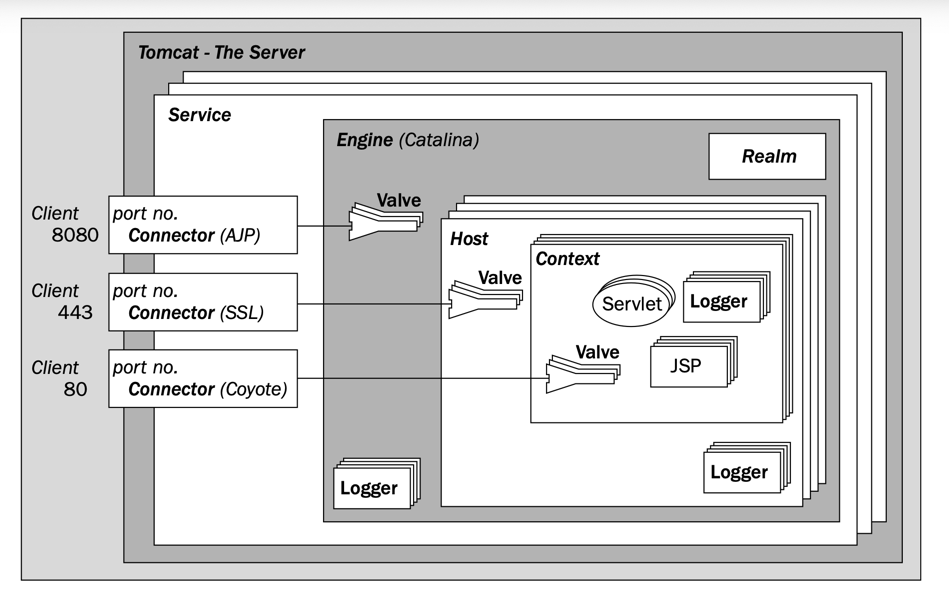
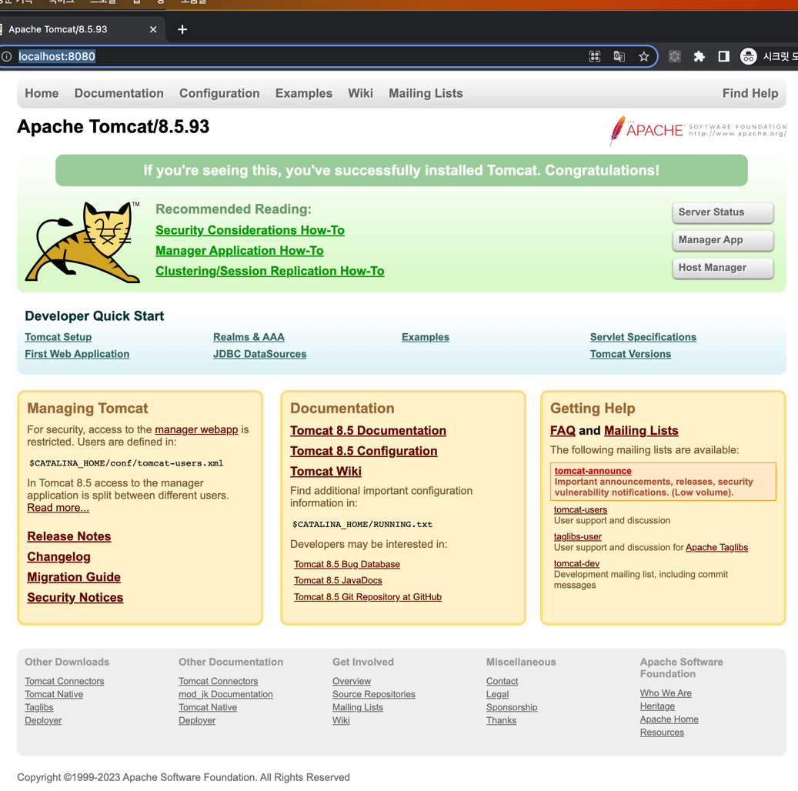
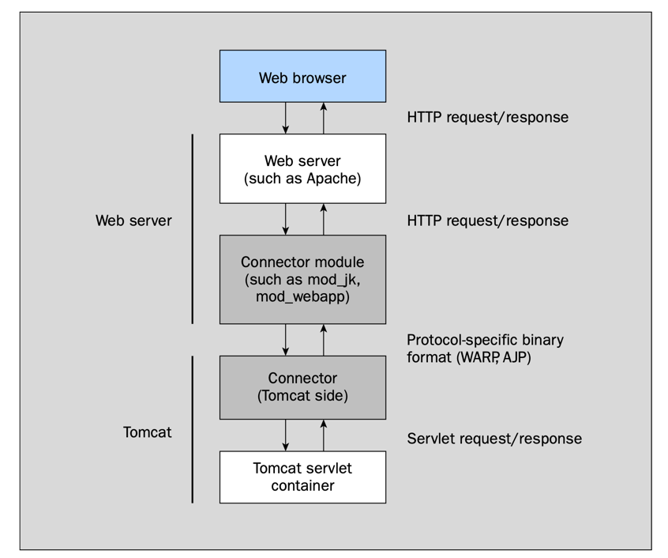
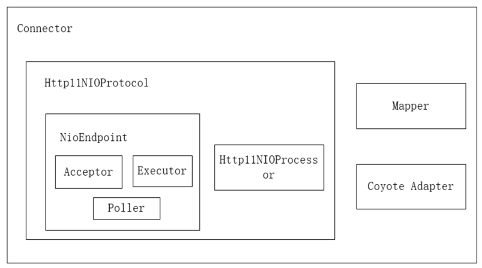

## Jakarta EE
Jakarta EE(Java EE)는 기업용 애플리케이션에 필요한 기능들의 사양을 정의해둔 명세서이다.
즉, 대규모 애플리케이션을 개발하는데 필요한 표준화된 Java API의 모음이라고 할 수 있다.
Java API의 특징은 API를 제공하는 구현 벤더와 분리되어 있기 때문에 API를 준수한다면 플러그 형태로 구현 벤더를 교체할 수 있다는 장점이 있다.
구체적으로는 JSP, Servlet, EJB, JMS, JMX, JTA 등 기업용 애플리케이션을 개발하고 실행하는 데 필요한 사양들을 명시하고 있다.
[여기서](http://java.sun.com/javaee/technologies/) Jakarta EE(Java EE) API의 전체 목록을 확인할 수 있다.
다양한 써드파티에서 Jakarta EE(Java EE) 스펙을 준수한 구현을 제공하는데 대표적으로 아래와 같은 벤더가 있다.
Jakarta EE(Java EE) 스펙을 완전히 구현한 것을 WAS(Web Application Server)라고 한다.
- JBoss(www.jboss.org)
- JOnAS(jonas.objectweb.org)
- Geronimo(geronimo.apache.org)

## Servlet
서블릿은 Jakarta EE API 중 하나로, Java 기술을 기반으로 한 웹 컴포넌트이다. Servlet은 서버 측에서 실행되는 Java 클래스로, 클라이언트의 요청을 처리하고 동적인 웹 페이지를 생성한다.
Jakarta EE(Java EE)의 Servlet 주요 스펙을 요약하면 다음과 같다. [Servlet 3.1 Spec docs](https://download.oracle.com/otn-pub/jcp/servlet-3_1-fr-eval-spec/servlet-3_1-final.pdf?AuthParam=1695794208_54642e957120d983f4ca811f71280a25)
- 요청/응답 모델: Servlet은 HTTP 요청을 받아 처리한 후, 응답을 반환하는 요청/응답 모델을 기반으로 한다.
- 생명주기 관리: Servlet은 특정 생명주기를 가진다. 주요 메소드로는 init(), service(), doGet(), doPost(), destroy() 등이 있다.
- 세션 관리: Servlet 스펙은 클라이언트 세션을 관리하기 위한 API를 제공한다.
- 컨텍스트 공유: ServletContext를 통해 애플리케이션 전체에 걸쳐 정보를 공유할 수 있다.
- 필터링: 필터를 사용하여 요청 및 응답에 대한 사전 및 사후 처리를 수행할 수 있다.
- 이벤트 리스너: 웹 애플리케이션의 생명주기 이벤트나 세션 생성/소멸 등의 이벤트에 대한 리스너를 정의할 수 있다.
- 멀티 스레딩: Servlet은 멀티 스레딩 환경에서 실행된다.
- 포워딩 및 리다이렉션: 요청을 다른 리소스로 포워딩하거나, 클라이언트에게 다른 URL로 리다이렉션 요청을 보낼 수 있다.
- 보안: Servlet 스펙은 선언적인 보안을 제공하여, 웹 리소스에 대한 접근 제어를 쉽게 구성할 수 있다.

## Servlet Containner
웹 서버나 애플리케이션 서버의 일부로서, 네트워크 서비스를 제공한다. 웹 애플리케이션의 생명 주기를 관리하며, 요청을 받아 처리하고, 웹 페이지의 동적인 내용을 생성하는 역할을 한다.
클라이언트가 웹서버에 HTTP 요청을 보내면, 서블릿 컨테이너가 이 요청을 받아서 요청 URL에 해당하는 서블릿에 전달하며, 서블릿 쓰레드가 사용자의 요청을 처리한 후 서블릿 컨테이너를 통해 응답을 반환한다.

## Tomcat
Tomcat은 Servlet 및 JSP 사양을 구현한 서블릿 컨테이너이다. JSP와 서블릿 처리, 서블릿의 수명 주기 관리, 요청 URL을 서블릿 코드로 매핑, HTTP 요청 수신 및 응답, 필터 체인 관리 등을 처리해준다. 톰캣은 Jakarta EE를 완전히 구현한 WAS는 아니고, JSP 와 Servlet 사양만 구현했기 때문에 Servlet Containner 또는 Web Container 라고 부른다.

## Tomcat Architecture



#### Server

Tomcat 웹 애플리케이션 서버 자체를 의미한다. 하나의 JVM 내에서 하나의 Server 인터턴스를 실행할 수 있다.
여러 개의 JVM 인스턴스를 실행한다면 여러 대의 Tomcat Server 인스턴스를 생성할 수 있는데
각각의 Server 인서턴스는 다른 네트워크 포트를 사용해야 충돌이 발생하지 않는다.

#### Service

톰캣 최상위 컴포넌트 중 하나로, container 와 Connector 를 하나로 묶는다. 일반적으로 하나의 Engine 타입의
컨테이너 하나와 여러 개의 Connector로 구성된다. Service는 여러 웹 애플리케이션을 관리하고 클라이언트의 요청을 처리하는 단위이다. 클라이언트가 요청을 하면 Connector가 요청을 받아, Engine(container)에게 전달한다.
Engine은 요청을 웹 애플리케이션으로 라우팅하고 결과를 반환한다.
각 Service는 이름이 부여되어 있어 로그 메시지를 통해 Service를 쉽게 식별할 수 있다.

#### Connectors

Connectors는 클라이언트의 웹 요청을 받아서 적절한 애플리케이션으로 전달하는 역할을 하는 컴포넌트이다.
이를 통해 HTTP, HTTPS 등 다양한 프로토콜과 포트를 사용하여 웹 애플리케이션에 접근할 수 있게 한다.
하나의 Engine은 여러 개의 Connectors를 설정할 수 있는데, 각 Connectors의 포트는 유일해야 한다.
기본 Connector는 Coyote이며 HTTP 1.1을 구현한다. 그 외에도 AJP, SSL Connector, HTTP 2.0 Connector 등이 있다.

#### Engine

Engine은 Tomcat 서버에서 가장 상위에 위치한 컨테이너이다.
Catalina 서블릿 엔진을 대표하고, HTTP 헤더를 분석하여 요청을 어느 가상 호스트나 컨텍스트로 전달할지 결정한다.
하나의 Engine 내에는 여러 Hosts가 포함될 수 있고, 각 Host는 여러 웹 애플리케이션을 나타낼 수 있다.
또한 Context는 단일 웹 애플리케이션을 나타낸다.

#### Realm

Realm은 사용자 인증과 권한을 부여하는 컴포넌트이다. Realm은 전체 엔진에서 공통적으로 적용되므로 엔진 내의 애플리케이션은
인증을 위한 Realm을 공유하게 된다.

#### Valves

Valves 요청과 응답을 가로채서 사전 처리를 할 수 있다. 이는 Servlet의 필터와 비슷하지만, Valves 톰캣 고유의 컴포넌트이다.
Hosts, contexts, Engine에 Valves를 포함시킬 수 있다. Valves는 엔진과 컨텍스트 사이, 호스트와 컨텍스트 사이, 컨텍스트와 웹 리로스 사이에서 요청을 가로챌 수 있다.
Request 헤더 및 쿠키 저장, Response 헤더 및 쿠기 등을 로깅 등에 사용된다.

#### Host

Host는 아파치 웹 서버의 가상 호스트와 유사하다. 하나의 물리적 서버에 여러 개의 웹 사이트를 호스팅할 수 있다.
Host는 보통 Engine 내에 위치해 Engine의 요청을 받아 해당 요청이 어느 Host로 전달될지 판단한다.

#### Context

Context는 웹 애플리케이션을 나타낸다. Engine이나 Host에게 애플리케이션의 루트 폴더 위치를 알려주는 등의 설정을 포함한다.
여러 Context가 하나의 호스트를 공유할 수 있다.

## server.xml

server.xml은 Tomcat 서버 구성 요소를 정의한다. Service, Connector, engine, Realm, Valve, Host 등의 구성이 포함된다.
tomcat이 설치된 conf 디렉토리에서 확인할 수 있다. tomcat 8 버전 기준으로 설치 후 기본 설정을 확인해보면 아래와 같다.

```xml
<?xml version="1.0" encoding="UTF-8"?>
<Server port="8005" shutdown="SHUTDOWN">
  <Listener className="org.apache.catalina.startup.VersionLoggerListener"/>
  <!--  ...-->

  <GlobalNamingResources>
    <Resource name="UserDatabase" auth="Container"
      type="org.apache.catalina.UserDatabase"
      description="User database that can be updated and saved"
      factory="org.apache.catalina.users.MemoryUserDatabaseFactory"
      pathname="conf/tomcat-users.xml"/>
  </GlobalNamingResources>

  <Service name="Catalina">

    <Connector port="8080" protocol="HTTP/1.1"
      connectionTimeout="20000"
      redirectPort="8443"
      maxParameterCount="1000"
    />

    <Engine name="Catalina" defaultHost="localhost">

      <Realm className="org.apache.catalina.realm.LockOutRealm">
        <Realm className="org.apache.catalina.realm.UserDatabaseRealm"
          resourceName="UserDatabase"/>
      </Realm>

      <Host name="localhost" appBase="webapps"
        unpackWARs="true" autoDeploy="true">

        <Valve className="org.apache.catalina.valves.AccessLogValve" directory="logs"
          prefix="localhost_access_log" suffix=".txt"
          pattern="%h %l %u %t &quot;%r&quot; %s %b"/>

      </Host>
    </Engine>
  </Service>
</Server>
```

server.xml 파일의 컴포넌트 구성은 아래와 같이 컴포넌트가 부모-자식 관계를 가지고 있는 것을 볼 수 있다.

```
Server
├── Listener (여러 개 존재 가능)
├── GlobalNamingResources
│   └── Resource (UserDatabase)
└── Service (Catalina)
    ├── Connector (port=8080, protocol=HTTP/1.1)
    └── Engine (Catalina)
        ├── Realm (LockOutRealm)
        │   └── Realm (UserDatabaseRealm)
        └── Host (localhost)
            └── Valve (AccessLogValve)
```

- Server: 최상위 컴포넌트로 서버의 전반적인 설정을 관리한다.
- Listener: 서버 라이프사이클 이벤트를 처리한다.
- GlobalNamingResources: 글로벌 네이밍 리소스, UserDatabase 같은 리소스 설정이 있다.
- Service: 하나 이상의 커넥터(Connector)와 하나의 엔진(Engine)을 가진다.
- Connector: HTTP 요청을 처리한다.
- Engine: 실제로 웹 애플리케이션을 처리하는 컴포넌트이다.
- Realm: 보안 관련 설정을 담당한다.
- Host: 가상 호스트 설정을 관리한다.
- Valve: 로깅이나 보안 등 추가적인 처리를 담당한다.

> Catalina라는 이름의 서비스에서 HTTP 1.1 프로토콜과 8080 포트 번호가 정의되어 있는 것을 볼 수 있다.
> 이 설정은 톰캣을 설치했을 때 기본으로 제공되는 소개 페이지를 호스팅하는 역할을 한다.



## web.xml

web.xml 파일은 톰캣에 웹 애플리케이션을 어떻게 배포하고 실행할지에 대한 기본 설정을 제공한다.
서블릿 사양에 따르면 모든 웹 애플리케이션에는 deployment descriptor(web.xml)가 포함되어야 한다.
만약 웹 애플리케이션마다 개별 배포 설명자를 가지고 있다면 해당 개별 설정이 web.xml 설정을 덮어씌운다.

아래와 같은 URL로 요청을 받으면 tomcat의 각 구성요소는 다음과 같은 흐름으로 처리한다.

```https://www.example.com/store/book/```

- https://: : Connector로 SSL 설정 (/conf/server.xml)
- www.example.com : Virtual host name (/conf/server.xml)
- /store : context path (Context Descriptor XML)
- /book : 서블릿 맵핑 (/WEB-INF/web.xml) 

위 URL의 프로토콜(https://) 부분이 먼저 서비스에서 분석되고 Coyote Connector가 요청을 엔진으로 전달된다.
다음으로, 엔진에서 호스트 이름(www.example.com)을 파싱하여 호스트 컴포넌트를 선택한다.
호스트는 배포된 웹 애플리케이션 컨텍스트(/store)에 대해 URL을 맵핑하고, 마지막으로 web.xml에 의해 서블릿 맵핑을 수행한다.

## Connector 아키텍처

Tomcat에는 Java로 작성된 org.apache.catalina.Connector 컴포넌트가
있다. [Connector](https://github.com/Oreste-Luci/apache-tomcat-8.0.26-src/blob/master/java/org/apache/catalina/connector/Connector.java) 종류에는 HTTP/HTTPS 호출을 위한
HTTP 1.1 커넥터, AJP(Apache JServ Protocol) 호출을 위한 AJP/1.3 커넥터가 있다. HTTP2 커넥터를 사용하기 위해서는 기존 HTTP 1.1 커넥터을 사용하고 HTTP2 UpgradeProtocol을 사용하면 된다.
설정 바식은 server.xml 파일의 Connector 태그 내에서 protocol 속성을 통해 설정할 수 있다.

- HTTP/1.1: org.apache.coyote.http11.Http11AprProtocol
- AJP/1.3: org.apache.coyote.ajp.AjpAprProtocol

### AJP 커넥터

AJP(Apache JServ Protocol)란, Tomcat과 다른 웹 서버 (예: Apache) 간에 통신을 최적화하기 위한 프로토콜이다. 웹 서버와 Tomcat 간에 통신이 필요할 때 AJP는 HTTP 프록시보다 더 빠른 성능을 제공한다. 그렇다면 어떻게 AJP는 HTTP보다
빠른 성능을 제공할까?

- 바이너리 포맷 사용: AJP13는 데이터 전송을 위해 바이너리 형식을 사용한다. 이전 버전인 AJP10과 AJP11은 텍스트 기반의 데이터 형식을 사용하였다. 바이너리 형식은 텍스트 형식보다 효율적으로 데이터를 인코딩하여 전송할 수 있다.
- 재사용 가능한 연결 및 영구적 연결: 웹 서버와 서블릿 컨테이너 간의 통신은 네트워크 소켓을 통해 이루어진다. 이 연결은 여러 요청 및 응답에 대해 재사용할 수 있어 핸드쉐이크에 필요한 추가적인 시간이 절약할 수 있다.
- 바이너리 인코딩: AJP는 HTTP 명령 및 헤더에 대한 바이너리 인코딩을 정의한다. 예를 들어, HTTP의 'GET' 명령은 AJP에서는 단일 바이트 값인 2로 표현된다. 이러한 바이너리 인코딩은 데이터의 크기를 줄이고 전송 속도를 높인다.



### HTTP Connector

HTTP Connector는 HTTP 프로토콜을 구현하는 Java 클래스이다. HTTP Connector는 서블릿 및 JSP에 대한 요청 이외에도 정적 컨텐츠 리소스에 대한 요청에도 응답한다.
HTTP Connector는 HTTP 요청을 구문 분석하고 Tomcat 서블릿 엔진에 전달하는 코드가 있다.
HTTP Connector 종류에는 HTTP/1.1 커넥터, NIO HTTP 커넥터, 네이티브 코드에 최적화된 APR HTTP 커넥터 등이 존재한다.
이 컴포넌트는 서버의 특정 TCP 포트번호에서 연결을 대기(listen)한다.
하나의 서비스 내에 여러 Connector 들이 구성될 수 있고, 요청을 Engine에게 전달하여 응답을 반환한다.
Connector 설정은 아래와 같은 server.xml에서 xml 태그로 설정할 수 있다.

```XML
<Connector port=”8080”
 protocol=”HTTP/1.1”
 maxThreads=”150”
 connectionTimeout=”20000”
 redirectPort=”8443” />
```   
  
HTTP 1.1 Connector의 동작방식은 공식문서에 잘 설명되어있다. 동시에 받은 요청이 현재 사용 가능한 worker 스레드보다 많으면, 설정된 최대치(maxThreads 속성의 값)까지 추가 스레드가 생성된다.
더 많은 동시 요청이 오게되면, 현재 연결 수가 maxConnections에 도달할 때까지 Tomcat은 새로운 연결을 accept한다.
연결은 Connector가 생성한 서버 소켓에서 연결을 처리할 스레드가 사용 가능해질 때까지 대기큐에 머물게 된다. maxConnections에 도달하면, 운영 체제는 추가 연결을 큐에 넣는다. 이 때, 운영 체제에서 제공하는 연결 큐의 크기는 acceptCount 속성으로 정의할 수
있다. 운영 체제 큐가 가득 차면, 추가 연결 요청이 거부되거나 timeout이 발생하게 된다.
스프링을 사용하면 로그에 **http-nio-8080-exec-?** 라는 Worker 스레드 이름을 볼 수 있는데, 이 Worker 스레드풀을 초기화하는 로직이 아래와 같다.

```JAVA
// https://github.com/apache/tomcat/blob/main/java/org/apache/tomcat/util/net/AbstractEndpoint.java
public void createExecutor(){
    internalExecutor=true;
    TaskQueue taskqueue=new TaskQueue();
    TaskThreadFactory tf=new TaskThreadFactory(getName()+"-exec-",daemon,getThreadPriority());
    executor=new ThreadPoolExecutor(getMinSpareThreads(),getMaxThreads(),60,TimeUnit.SECONDS,taskqueue,tf);
    taskqueue.setParent((ThreadPoolExecutor)executor);
}
```

`executor = new ThreadPoolExecutor(getMinSpareThreads(), getMaxThreads(), 60, TimeUnit.SECONDS,taskqueue, tf)` 라인을 보면 Executor 구현체로 ThreadPoolExecutor을 사용하는 것을
볼 수 있다.
ThreadPoolExecutor 동작은 [여기](https://px201226.github.io/java-concurrency-executor/)에 정리해둔 내용이 있으니 참고하자.
ThreadPoolExecutor 기본 동작은 내부 Queue가 꽉 차지 않는 이상 corePoolSize를 늘리지 않는데, 공식문서에서 유휴 스레드가 없으면 스레드를 생성한다는 내용과 차이점이 있다. 이 점은 생성자로 주입한 TaskQueue 의 구현을 보면 이해할 수 있다.   

```JAVA
// https://github.com/apache/tomcat/blob/main/java/org/apache/tomcat/util/threads/TaskQueue.java
public class TaskQueue extends LinkedBlockingQueue<Runnable> {

	@Override
	public boolean offer(Runnable o) {
		//we can't do any checks
		if (parent == null) {
			return super.offer(o);
		}
		//we are maxed out on threads, simply queue the object
		if (parent.getPoolSizeNoLock() == parent.getMaximumPoolSize()) {
			return super.offer(o);
		}
		//we have idle threads, just add it to the queue
		if (parent.getSubmittedCount() <= parent.getPoolSizeNoLock()) {
			return super.offer(o);
		}
		//if we have less threads than maximum force creation of a new thread
		if (parent.getPoolSizeNoLock() < parent.getMaximumPoolSize()) {
			return false;
		}
		//if we reached here, we need to add it to the queue
		return super.offer(o);
	}
}
```

TaskQueue는 톰캣에서 LinkedBlockingQueue를 확장한 큐로 BlockingQueue::offer 메서드를 오버라이딩한다.
offer 메서드의 내용을 살펴보면 현재 스레드 풀의 크기가 최대 스레드풀 크기가 동일하면 작업을 큐에 추가한다.
그렇지 않다면 제출된 작업 수가 현재 스레드 풀보다 작은 경우, 즉 유휴 스레드가 있는 경우 작업을 큐에 추가한다.
그것도 아니라면 현재 풀 사이즈가 maximum 풀사이즈보다 작으면 false를 반환하여 새로운 스레드를 생성한다.
아래는 HTTP Connector를 구성하는 속성들이다.
자세한 내용은 [여기서](https://tomcat.apache.org/tomcat-8.5-doc/config/http.html) 확인할 수 있다.   


| 속성명                  | 설명                                                                                                                                                                                                                                                                                                                                                             |
|----------------------|----------------------------------------------------------------------------------------------------------------------------------------------------------------------------------------------------------------------------------------------------------------------------------------------------------------------------------------------------------------|
| maxConnections       | 서버가 한 번에 수용하고 처리할 수 있는 최대 연결 수. 이 숫자에 도달하면 서버는 추가로 한 개의 연결을 수용하지만 처리하지는 않는다. 이 추가 연결은 처리 중인 연결 수가 maxConnections 아래로 떨어질 때까지 차단된다. 제한에 도달했을 때 운영 체제는 여전히 acceptCount 설정을 기반으로 연결을 수락할 수 있다. NIO 및 NIO2의 경우 기본값은 10,000이다. APR/native의 경우 기본값은 8,192이다. NIO/NIO2에만 해당되는데, 이 값을 -1로 설정하면 maxConnections 기능이 비활성화되고 연결이 계산되지 않는다.                                 |
| acceptCount          | maxConnections에 도달했을 때 들어오는 연결 요청에 대해 운영 체제에서 제공하는 대기열의 최대 길이. 운영 체제는 이 설정을 무시하고 대기열에 다른 크기를 사용할 수 있다. 이 큐가 가득 차면 운영 체제에서 추가 연결을 거부하거나 타임아웃이 발생한다. 기본값은 100                                                                                                                                                                                                    |
| maxKeepAliveRequest  | 이 속성은 HTTP 요청의 "keep-alive" 동작을 제어하며 지속적인 연결(즉, 동일한 HTTP 연결을 통해 여러 요청을 보낼 수 있게 함)을 가능하게 한다. 서버에서 연결이 닫힐 때까지 파이프라인화할 수 있는 요청의 최대 수를 지정한다. maxKeepAliveRequest의 기본값은 100이며, 1로 설정하면 HTTP keep-alive 동작과 파이프라인화가 비활성화된다.                                                                                                                                          |
| maxSpareThreads      | maxSpareThreads 속성은 사용되지 않는 스레드의 최대 수를 제어한다. Tomcat이 사용되지 않는 것들을 중지하기 전에 허용될 수 있는 스레드의 최대 수다. maxSpareThreads의 기본값은 50이다.                                                                                                                                                                                                                                      |
| minSpareThreads      | minSpareThreads 속성은 커넥터가 초기화될 때 시작되는 스레드의 최소 수를 지정한다. minSpareThreads의 기본값은 4다.                                                                                                                                                                                                                                                                                |
| maxThreads           | 이 속성은 이 커넥터가 요청을 처리하기 위해 생성되는 스레드의 최대 수를 지정한다. 이는 차례로 커넥터가 처리할 수 있는 동시 요청의 최대 수를 지정한다. maxThreads의 기본값은 200 스레드다.                                                                                                                                                                                                                                              |
| socketBuffer         | 소켓 출력 버퍼링에 사용될 버퍼의 크기(바이트 단위)를 지정한다. 소켓 버퍼의 사용은 성능을 향상시킨다. 기본적으로 9,000 바이트 크기의 버퍼가 사용되며, socketBuffer를 -1로 설정하면 버퍼링이 꺼진다.                                                                                                                                                                                                                                      |
| tcpNoDelay           | 이 속성이 true로 설정되면, TCP_NO_DELAY 네트워크 소켓 옵션이 활성화된다. 기본값은 true다.                                                                                                                                                                                                                                                                                                  |
| connectionLinger     | 이 Connector에서 사용하는 소켓이 닫혔을 때 얼마 동안 대기할지 정하는 초 단위의 시간이다. 기본값은 -1로 설정되어 있어서 소켓 지속 기능이 비활성화된다.                                                                                                                                                                                                                                                                    |
| connectionTimeout    | 이 Connector는 연결을 수락한 후 요청 URI 줄이 제시될 때까지 얼마 동안 기다릴지를 밀리초 단위로 정한다. -1을 사용하면 시간 제한이 없다는 의미다. 기본값은 60000(즉, 60초)이지만 Tomcat에 포함된 표준 server.xml에서는 이 값을 20000(즉, 20초)으로 설정한다는 것을 주의하라. disableUploadTimeout이 false로 설정되지 않으면, 요청 본문(있는 경우)을 읽을 때 이 시간 제한도 사용된다.                                                                                                     |
| keepAliveTimeout     | 이 Connector는 다른 HTTP 요청을 기다리기 전에 연결을 닫을 때까지 얼마 동안 기다릴지를 밀리초 단위로 정한다. 기본값은 connectionTimeout 속성에 설정된 값을 사용한다. -1 값을 사용하면 시간 제한이 없다는 의미다.                                                                                                                                                                                                                        |
| maxKeepAliveRequests | 서버에 의해 연결이 닫힐 때까지 파이프라인에 넣을 수 있는 HTTP 요청의 최대 수를 정한다. 이 속성을 1로 설정하면 HTTP/1.0 지속 연결과 HTTP/1.1 지속 연결 및 파이프라이닝이 모두 비활성화된다. -1로 설정하면 파이프라인 또는 지속 연결 HTTP 요청의 수에 제한이                                                                                                                                                                  없다. 지정되지 않으면 이 속성은 100으로 설정된다. |

## HTTP NIO Connector

HTTP Connector에는 내부 프로토콜에 따라 크게 3가지 프로토콜 구현체가 존재한다.
BIO Connnector는 Tomcat 8.0부터 삭제되어 여기서는 NIO Connector 중심으로 알아본다.

| 이름            | 설명                                                                                                                           |
|---------------|------------------------------------------------------------------------------------------------------------------------------|
| BIO Connector | Tomcat 7의 기본 Connector (org.apache.coyote.http11.Http11Protocol)<br/>Java Blocking API를 사용하여 구현                              |
| NIO Connector | Tomcat 8 이후 기본 Connector (org.apache.coyote.http11.Http11NioProtocol)<br/> Java NIO API를 사용하여 구현                             |
| APR Connector | APR 라이브러리를 사용해 더 나은 성능의 Connector (org.apache.coyote.http11.Http11AprProtocol)<br/>JNI(Java Native Interface) 라이브러리를 사용하여 구현 |

### Http11NioProtocol

Java Non-Blocking IO의 핵심은 Selector를 이용한 채널 관리이다.
관심있는 채널(요청, 읽기, 준비완료 등)에 Selector에 등록하고 싱글 스레드가 Selector를 폴링하여 준비된 채널에 대해 지정된 콜백을 실행하여 작업을 처리한다.
HTTP NIO Connector 도 위와 같은 방식으로 이벤트를 처리하고 있으며, 아래 그림과 아키텍처를 가진다.   



#### Acceptor

Acceptor 스레드는 serverSocket.accept() 로 소켓 연결을 하고 반환된 SocketChannel 을
Tomcat의 NioChannel로 캡슐화한다. NioChannel은 다시 PollerEvent로 래핑되고 이벤트 큐에 등록한다.
Acceptor 스레드는 소켓 연결 수락에 대한 이벤트를 생성하는 생성자 스레드를 의미한다.

#### Poller

Non Blocking IO 처리의 핵심인 이벤트 루프 로직이 포함되어 있다. Poller는 이벤트 큐에서 PollerEvent를 소비한다.
PollerEvent 에서 꺼낸 Channel을 Selector에 등록하고 Selector는 읽을 수 있는 소켓을 순회하며 해당 소켓을 Worker 스레드에 전달한다.

#### Executor(Worker Thread)

Worker 스레드에서는 Poller로부터 소켓을 받아 SocketProcessor 객체로 캡슐화하고 Http11NioProcessor에서 CoyoteAdapter를 호출한다.
스프링 로그에 출력되는 `http-nio-8080-exec-?` 가 바로 이 Worker 스레드를 의미한다.
CoyoteAdapter는 Connector와 Container(Engine) 사에에 다리 역할을 한다. 요청의 매개 변수를 파싱하고 해당 context를 찾아 Engine에게 전달한다.
Engine은 요청을 처리하여 반환값을 반환한다.


### 요청 플로우

### 1. [Acceptor Thread] serverSock.accept()로 연결을 수락한다.

```JAVA
public class NioEndpoint extends AbstractJsseEndpoint<NioChannel, SocketChannel> {

	@Override
	protected SocketChannel serverSocketAccept() throws Exception {
		SocketChannel result = serverSock.accept();

		// Bug does not affect Windows platform and Unix Domain Socket. Skip the check.
		if (!JrePlatform.IS_WINDOWS && getUnixDomainSocketPath() == null) {
			SocketAddress currentRemoteAddress = result.getRemoteAddress();
			long currentNanoTime = System.nanoTime();
			if (currentRemoteAddress.equals(previousAcceptedSocketRemoteAddress) &&
					currentNanoTime - previousAcceptedSocketNanoTime < 1000) {
				throw new IOException(sm.getString("endpoint.err.duplicateAccept"));
			}
			previousAcceptedSocketRemoteAddress = currentRemoteAddress;
			previousAcceptedSocketNanoTime = currentNanoTime;
		}

		return result;
	}
}
```

### 2. [Acceptor Thread] 생성된 소켓을 PollerEvent로 Poller 이벤트 큐에 등록

```JAVA
public class NioEndpoint extends AbstractJsseEndpoint<NioChannel, SocketChannel> {

	@Override
	protected boolean setSocketOptions(SocketChannel socket) {
		NioSocketWrapper socketWrapper = null;
		try {

			//...
			NioSocketWrapper newWrapper = new NioSocketWrapper(channel, this);

			socketWrapper = newWrapper;

			//...
			poller.register(socketWrapper);
			return true;
		} catch (Throwable t) {
			//...
		}
		return false;
	}

	public void register(final NioSocketWrapper socketWrapper) {
		socketWrapper.interestOps(SelectionKey.OP_READ);//this is what OP_REGISTER turns into.
		PollerEvent pollerEvent = createPollerEvent(socketWrapper, OP_REGISTER);
		addEvent(pollerEvent);
	}

}        
```

### 3. [Poller Thread] 이벤트 큐를 돌면서 SocketChannel.register()로 Selector에 소켓 채널을 등록

```JAVA
public class Poller implements Runnable {

	public boolean events() {
		boolean result = false;

		PollerEvent pe = null;
		for (int i = 0, size = events.size(); i < size && (pe = events.poll()) != null; i++) {
			result = true;
			NioSocketWrapper socketWrapper = pe.getSocketWrapper();
			SocketChannel sc = socketWrapper.getSocket().getIOChannel();
			int interestOps = pe.getInterestOps();
			if (sc == null) {
				log.warn(sm.getString("endpoint.nio.nullSocketChannel"));
				socketWrapper.close();
			} else if (interestOps == OP_REGISTER) {
				try {
					sc.register(getSelector(), SelectionKey.OP_READ, socketWrapper);
				} catch (Exception x) {
					log.error(sm.getString("endpoint.nio.registerFail"), x);
				}
			}
			//..
		}

		return result;
	}
}
```

### 4. [Poller Thread] 무한 루프를 돌면서, selector.select() 로 이벤트 수신, processKey()로 이벤트 처리

```JAVA
public class Poller implements Runnable {

	@Override
	public void run() {
		// Loop until destroy() is called
		while (true) {

			boolean hasEvents = false;

			try {
				if (!close) {
					hasEvents = events();
					if (wakeupCounter.getAndSet(-1) > 0) {
						// If we are here, means we have other stuff to do
						// Do a non blocking select
						keyCount = selector.selectNow();
					} else {
						keyCount = selector.select(selectorTimeout);
					}
					wakeupCounter.set(0);
				}


			} catch (Throwable x) {
				// ... 
			}

			Iterator<SelectionKey> iterator =
					keyCount > 0 ? selector.selectedKeys().iterator() : null;

			// Walk through the collection of ready keys and dispatch
			// any active event.
			while (iterator != null && iterator.hasNext()) {
				SelectionKey sk = iterator.next();
				iterator.remove();
				NioSocketWrapper socketWrapper = (NioSocketWrapper) sk.attachment();
				// Attachment may be null if another thread has called
				// cancelledKey()
				if (socketWrapper != null) {
					processKey(sk, socketWrapper);
				}
			}


		}

	}
}
```

### 5. [Poller Thread] SelectionKey에 따라 SocketProcessor를 구성하고, Worker 스레드에 요청 제출

```JAVA
public abstract class AbstractEndpoint<S, U> {

	public boolean processSocket(SocketWrapperBase<S> socketWrapper, SocketEvent event, boolean dispatch) {

		//...
		SocketProcessorBase<S> sc = null;

		if (sc == null) {
			sc = this.createSocketProcessor(socketWrapper, event);
		} else {
			sc.reset(socketWrapper, event);
		}

		Executor executor = this.getExecutor();
		if (dispatch && executor != null) {
			executor.execute(sc);
		} else {
			sc.run();
		}

		return true;

	}
}
```

### 4. [WorkerThread] CoyoteAdapter로 요청 위임 및 컨테이너로 요청 전달

```JAVA
// SocketProcessor.java
getHandler().process(socketWrapper,SocketEvent.OPEN_READ);

// AbstractProcessorLight.java
		state=service(socketWrapper); // 요청 위임

// Http11Processor.java
		getAdapter().service(request,response); // CoyoteAdapter로 요청 위임  

// CoyoteAdapter.java
		connector.getService().getContainer().getPipeline().getFirst().invoke(request,response); // 컨테이너로 요청 전달
```

## 참조
- https://tomcat.apache.org/tomcat-8.5-doc/config/http.html
- https://download.oracle.com/otn-pub/jcp/servlet-3_1-fr-eval-spec/servlet-3_1-final.pdf?AuthParam=1695794208_54642e957120d983f4ca811f71280a25
- https://velog.io/@jihoson94/BIO-NIO-Connector-in-Tomcat
- https://www.programmersought.com/article/90283888271/
- Pro apache tomcat 6