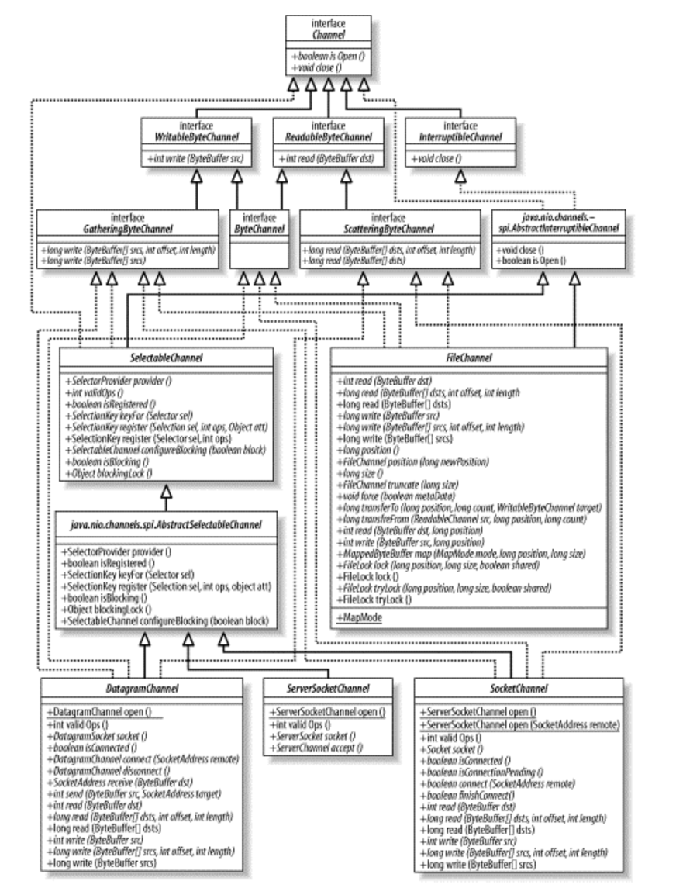

## Channel

Channel은 파일이나 소켓과 같은 엔티티 간에 데이터를 효율적으로 전송하는 통로이다.
채널은 일반적으로 운영체제의 파일 디스크립터나 핸들러와 일대일 관계를 가진다.
채널은 Java의 플랫폼 독립성을 유지하면서도 운영 체제의 네이티브 I/O 기능에 대한 추상화를 제공한다.   
아래 그림은 Channel 클래스의 상속관계를 나타낸다.

계층구조 상단에 WritableByteChannel과 ReadableByteChannel 인터페이스를 보게 되면 채널은 바이트 버퍼에 대해서만
작동한다는 것을 짐작할 수 있다. 이는 운영체제의 저수준 I/O가 바이트 단위로 수행하기 때문이다.