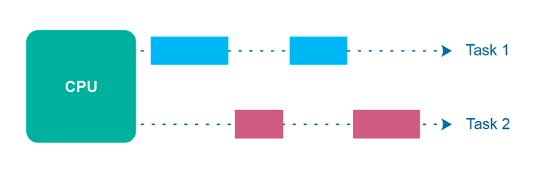

## 재고 관리로 보는 동시성 문제
동시성(Concurrency)란 시간분할(Time sharing)을 통하여 여러 일을 처리하는 것 처럼 보여지게 하는 기법을 의미한다.
동시에 실행된다는 것과는 다르며, 단일 CPU 코어에서 작업이 빠르게 전환되면서 동시에 실행되는 것처럼 보일 수 있다.

동시성 작업의 첫번째 문제점은 경쟁 조건(Race Condition)이 발생한다는 것이다. 임계영역(Critical section)의 코드를 여러 스레드에서 실행
여러 스레드가 동일한 리소스에 액세스하고 하나 이상의 스레드가 리소스에 쓰는 경우에만 발생한다.
여러 스레드가 동일한 리소스를 읽기만 한다면 경쟁 조건이 발생하지 않는다. 

경쟁 조건

## 동시성과 락
### 전통적인 동시성 관리, 고유락(Intrinsic Lock)

### 고유락(Intrinsic Lock)의 문제점

## Lock-Free 알고리즘

## Compare And Swap(CAS) 알고리즘
